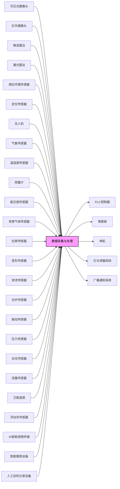
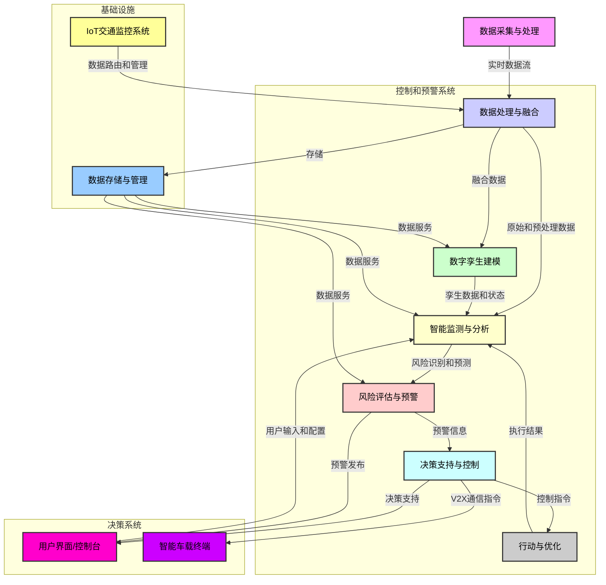

# **中国城市主干道与公路交通风险智能监控和预警系统**

- [**中国城市主干道与公路交通风险智能监控和预警系统**](#中国城市主干道与公路交通风险智能监控和预警系统)
  - [**I. 引言：中国道路交通安全预警的背景与重要性**](#i-引言中国道路交通安全预警的背景与重要性)
    - [**A. 城市主干道与公路的定义及交通特性**](#a-城市主干道与公路的定义及交通特性)
    - [**B. 交通安全风险预警的意义与目标**](#b-交通安全风险预警的意义与目标)
  - [**II. 道路交通风险预警分类体系**](#ii-道路交通风险预警分类体系)
    - [**A. 风险评估与分级标准（可能性与后果严重程度）**](#a-风险评估与分级标准可能性与后果严重程度)
    - [**B. 城市主干道常见风险事件分类**](#b-城市主干道常见风险事件分类)
    - [**C. 公路（含高速公路）常见风险事件分类**](#c-公路含高速公路常见风险事件分类)
  - [**III. 风险预警系统中的关键传感器技术及其应用**](#iii-风险预警系统中的关键传感器技术及其应用)
    - [**A. 交通流状态检测传感器**](#a-交通流状态检测传感器)
    - [**B. 环境条件监测传感器**](#b-环境条件监测传感器)
    - [**C. 基础设施结构健康监测传感器**](#c-基础设施结构健康监测传感器)
    - [**D. 综合与集成应用**](#d-综合与集成应用)
  - [**IV. 近年中国高概率与高危害交通事件分析**](#iv-近年中国高概率与高危害交通事件分析)
    - [**A. 交通事故**](#a-交通事故)
    - [**B. 自然灾害对道路的影响**](#b-自然灾害对道路的影响)
    - [**C. 交通拥堵**](#c-交通拥堵)
  - [**V. 结论与展望**](#v-结论与展望)
    - [**A. 主要结论包括：**](#a-主要结论包括)
    - [**B. 未来展望与建议：**](#b-未来展望与建议)
      - [**相关国标**](#相关国标)
      - [**引用的资料**](#引用的资料)

**变更历史**
| 日期时间     | 类型   | 作者   | 描述                  |
| ----------- | ------ |------- | --------------------- |
| 2025-06-17  | 增     | Capric | 分类、传感器、参考资料  |
| 2025-06-18  | 增     | Capric | 相关国标、产品目录、图表 |

**产品目录**
| 类型            | 名称                      | 厂商                                                                                                                | 
| -------------- | -------------------------- |-------------------------------------------------------------------------------------------------------------------- |
| 目标检测、追踪  | 可见光摄像头              | 微创、海康、大华、宇视、天地通、华为                                                                                     |
| 目标检测、测温  | 红外摄像头                | 海康、高德、大恒、Allied Vision、Blue Vision、Xenics                                                                   |  
| 车流检测、测距  | 微波雷达                  | 博世、大陆、海拉、德尔福、富士通天、电装                                                                                 |
| 车流检测、测距  | 激光雷达                   | 禾赛科技、速腾聚创、Luminar、法雷奥                                                                                    |
| 交通流状态检测  | 感应环路传感器             | 安森美、意法、德仪、博世、科锐、TE、村田、多维                                                                           |
| 自动巡检        | 无人机                    | 大疆、Parrot、昊翔、道通、亿航、航天彩虹、中科遥感                                                                       |
| 环境条件监测    | 天气和环境传感器           | 周边气象站、Vaisala、Murata、TDK、Honeywell                                                                            |
| 温度测量        | 温湿度传感器              | 三星、芯科、广濑、华灿天禄、兴飞、士兰微                                                                                 |
| 雨量测量        |  雨量计                   | 北京华益瑞、万象环境、天泽科技、北京精诚华泰、云蓝风汇                                                                    |
| 能见度测量      | 能见度检测仪               | 山东天格光电、潍坊瑞格、富奥通、Campbell、Enviro、Young、Belfort                                                        |
| 有害气体浓度监测 | 有害气体浓度传感器         | 深传感、格林杜尔、博纳德、汉威、炜盛、Honeywell、西门子、MSA、City、FIGARO、安费诺                                        |
| 基础设施监测    | 位移传感器                 | MTS、科陆电子、炜衡、航天科技、TE、巴鲁夫、施克、倍加福                                                                  |
| 基础设施监测    | 变形传感器                 | 柯力传感、中航电测、威世、HBM、梅特勒-托利多、富林泰克、NMB                                                              |
| 基础设施监测    | 渗流传感器                 | Honeywell、西克、倍加福、艾默生、WIKA、ABB                                                                             |
| 基础设施监测    | 光纤传感器                 | 基恩士、松下、欧姆龙、西克、邦纳、倍加福、劳易测、理工光科                                                                |
| 基础设施监测    | 振动传感器                 | 上海振动器厂、上海航振、上海瑞鸿、北京华兴、泰隆电子、贸泽电子                                                             |
| 基础设施监测    | 压力传感器                 | 麦克传感、华天科技、苏州明皜、中航电测、上海芯敏、东方万和、Honeywell、西克、博世                                           |
| 基础设施监测    | 水压传感器                 | 佛山普量、佛山天华、佛山贺迪、深圳泰科芯元、格林福                                                                        |
| 基础设施监测    | 流量传感器                 | 川仪、威尔泰、E+H、艾默生、科隆、西门子、ABB、OMEGA、Honeywell、欧姆龙                                                    |
| 基础设施监测    | 卫星遥感                   | 中国航天、中国空间技术研究院、上海航天技术研究院、中国东方红卫星、中国卫星、四维图新、中科星图、航天宏图、北京揽宇方圆、长光卫星 |
| 基础设施监测    | 高精准定位器               | 司南导航、和芯星通、北方华创、南方测绘、六分科技、u-blox、世导通、大疆D-RTK                                                 |
| 智能系统        | 浮动车传感器               | 博世、森萨塔、恩智浦、英飞凌、TDK                                                                                        |
| 智能系统        | AI智能视频终端             | 微创、商汤、海康、大华                                                                                                  |
| 智能系统        | AI智能体分析               | 中交路桥科技、扣子、文心智能、司马诸葛、智谱清言、腾讯元器、LinkAI                                                         |
| 智能系统        | IoT交通监控系统            | Digi International、研华、华为、中兴、海康、大华                                                                         |
| 智能系统        | 城市安全风险综合监测预警平台 | 赛飞特、辰安科技、泰策科技、万宾科技                                                                                     |
| 智能系统        | 数据服务层                 | 数据库厂商                                                                                                             |
| 智能系统        | 智能交通决策支持系统        | 华为、商汤、久其软件、北京京东世纪                                                                                       |
| 智能系统        | 车路协同技术               |  百度、大唐高鸿、北京千方、北京万集、华为、江苏雷科防务、深圳金溢、图达通智能、海康、中国汽车工程研究院                        |
| 智能系统        | 智能路侧设备               | 同车路协同技术厂商                                                                                                      |
| 智能系统        | 智能车载设备               | 新能源汽车厂商、辅助驾驶厂商                                                                                            |
| 智能系统        | 数字孪生公路               | 超图软件、神州数码、亚信、GIS厂商                                                                                       |

**数字孪生公路 —— 智能监测、预警、决策系统**

## **I. 引言：中国道路交通安全预警的背景与重要性**

### **A. 城市主干道与公路的定义及交通特性**

中国的道路交通系统复杂而庞大，其中城市主干道、公路、高速公路扮演着至关重要的角色，承载着巨大的客货运流量。对这三类道路进行精准的交通安全风险预警，对于保障公众生命财产安全、提升交通效率具有深远意义。

**城市主干道**，作为连接城市主要组团的核心动脉，其首要功能是保障交通的安全与畅通 1。在规划与设计层面，城市主干道需与国土空间规划相协调，并根据实际交通量和特性进行精细化设计 1。为确保交通流的连续性和安全性，主干路两侧通常不宜设置吸引大量车流和人流的公共建筑物出入口；在特殊情况下，此类出入口应被引导至辅路，并确保辅路车辆能够安全地进出主线 1。在具体的道路设计中，强调线型顺畅、坡度平缓、路基稳定以及排水良好，同时需妥善处理与相交道路、广场及沿线建筑物的平顺衔接 2。交通信号控制系统，包括单点控制、线控（干路协调控制）和面控（区域协调控制），通过联动机制有效提升了整条干路乃至整个区域的通行能力 2。此外，道路交通标线必须具备卓越的昼夜可视性、防滑性和耐久性，并与路面紧密结合，以提供清晰的交通指引 2。在交通性干道上禁止路边停车的规定，旨在最大程度地保障道路通行能力和交通安全 2。

城市主干道的这些定义和设计原则，清晰地体现了在复杂城市环境中对交通流量最大化和安全优先的关注。对不同道路使用对象（如机动车与非机动车）进行物理分隔，严格控制出入口，以及禁止路边停车，都是为了减少交通摩擦点和潜在的冲突区域。这表明，城市主干道的风险预警系统必须高度精细化，重点关注由高密度、多模式交通互动引发的动态、局部威胁。例如，行人与车辆的冲突、因局部事件导致的交通流突变以及需要动态调整信号以管理拥堵的情况，都要求预警系统能够实时感知并迅速响应。城市环境的复杂性要求预警系统具备更强的适应性和集成能力，以实现精准的风险识别和预警。

**公路**，作为广义道路范畴的一部分，与城市街道、胡同、公共广场等共同构成了供车辆和行人通行的场所 3。在公路通行中，车辆和行人必须各行其道，借道通行时应优先让本道车辆或行人通行，并普遍遵循右侧通行原则 3。交通信号系统，包括指挥灯、车道灯、人行横道灯、交通指挥棒和手势信号，均设有明确的通行规则以规范交通行为 3。针对特定通行情况，如进出非机动车道、通过铁路道口、急弯路、窄路、窄桥、掉头、转弯、下陡坡，以及在雾、雨、雪、沙尘、冰雹等能见度低于50米或冰雪、泥泞路面行驶时，均有严格的减速、让行等安全规定 4。

**高速公路**作为公路的特殊类型，对其通行有着更为严格的限制。行人、非机动车、拖拉机、轮式专用机械车、铰接式客车、全挂拖斗车以及设计最高时速低于70公里的机动车均被禁止进入高速公路 4。同时，高速公路设有严格的最高（120公里/小时）和最低（60公里/小时）车速限制 4。这些针对高速公路的严格规定，特别是对特定车辆类型的禁行和速度限制，是应对高速行驶所带来风险的直接体现。高速行驶环境下，任何突发情况或驾驶失误都可能导致严重后果，因此设计的目的是最大限度地减少不可预测的互动，并维持可预测的交通流。这与城市道路固有的多样化互动形成了鲜明对比。因此，高速公路的风险预警系统必须优先关注与高速相关的危险，如突然制动、车道偏离、多车碰撞，以及影响高速安全的环境条件，如低能见度或湿滑路面。预警信息需要更远的传播距离，以确保驾驶员有足够的反应时间。

中国道路交通安全法律法规体系的完善，体现在《中华人民共和国道路交通安全法》及其修订中，该法旨在维护道路交通秩序，预防和减少交通事故，保护人身安全和财产安全，并提高通行效率 5。这部法律明确了车辆驾驶人、行人、乘车人以及与道路交通活动有关的单位和个人都必须遵守的规则 5。交通信号的全国统一实行，以及对交通信号灯、交通标志、交通标线设置的严格要求，都为智能交通系统的监测、执法和优化提供了基础 5。这表明，有效的早期预警系统并非仅仅是技术部署，而是与这些既定法规的遵守和执行紧密相连，并从中获得其有效性。它们在法律框架内充当实时执法和指导的补充层。

### **B. 交通安全风险预警的意义与目标**

交通安全风险预警的核心目标是“以人为本、预防为先、防御为主、处置迅速”，旨在最大程度地保障公众生命安全、系统设施安全以及系统运转稳定 6。具体而言，其目标包括实现及时预警、稳固防御、高效联动和有效处置 6。

在**风险分类与评估**方面，中国交通运输行业已建立了统一的风险评估标准。风险可能性被划分为极高、高、中等、低、极低五个级别，而后果严重程度则分为特别严重、严重、较严重、不严重四个级别 7。风险等级（D）由风险事件发生的可能性（L）和后果严重程度（C）两个指标决定，即D \= L \* C，并据此将风险划分为重大、较大、一般、较小四级 7。这种量化评估方法使得风险评估更加科学和客观。此外，风险源的分级可以采用定性与定量相结合的方法，例如LEC方法，并结合专家打分和历史事件统计等定性方法来评估事件发生的概率，同时利用历史同类事件的最大值等定量方法来评估危害程度 8。

这种对风险评估进行分级和量化（D=L\*C）的标准化方法，标志着中国在交通安全管理方面正从被动响应转向主动预防。这种转变超越了仅仅对事故做出反应，而是积极地识别、评估和减轻风险，在事故发生之前采取干预措施。风险辨识要素的全面性，涵盖了从业人员的安全意识和技能、设施设备的可靠性、安全生产规章制度、管理机构和机制，以及外部危害因素及其应对措施 8，进一步强调了对安全问题的整体性考虑。这表明，风险管理是一个持续的、动态的过程，需要不断的数据收集和分析能力。早期预警系统不仅仅是触发警报，更重要的是提供基于对风险可能性和影响的深刻理解而得出的可操作情报。这还意味着一个持续的反馈循环，通过历史数据不断完善未来的风险评估。

预警内容的制定也十分具体，应明确风险类型、位置、危害、影响范围、致险因素、可能发生的风险事件及后果，以及安全防范与应急措施 7。警示方式多样，包括物理隔离、标志标牌、语音提醒和人工干预等 7。警示对象则涵盖单位工作人员和社会公众 7。

这种对风险可能性和后果严重程度进行多层次分类的精细化评估，使得对风险的理解更为细致入微。这种精细度直接决定了预警的严重程度和所需响应的强度。例如，“重大风险源”会触发特定的、严格的管理协议，包括专门的应急预案（“一源一案”）和定期的专家评估 8。这在风险评估的精确性与安全干预的适当性之间建立了明确的因果关系。因此，早期预警系统的有效性与其风险评估的准确性和精细度直接相关。这需要来自各种传感器的高质量实时数据，以及复杂的分析模型来准确判断可能性和严重性，从而优化资源分配，避免误报和遗漏关键事件。

## **II. 道路交通风险预警分类体系**

### **A. 风险评估与分级标准（可能性与后果严重程度）**

中国交通运输行业在安全生产风险管理方面，已建立了标准化、量化的风险评估体系。该体系将风险事件发生的可能性和后果严重程度进行分级，并通过风险等级（D）等于可能性（L）乘以后果严重程度（C）的公式（D=L\*C）进行量化评估 7。可能性统一划分为极高、高、中等、低、极低五个级别，而后果严重程度则统一划分为特别严重、严重、较严重、不严重四个级别 7。这种方法使得风险评估更加科学、客观，为风险管理提供了明确的量化依据。

这种通过分层分类和量化公式（D=L\*C）对风险评估进行规范化的做法，标志着从主观定性评估向更客观、数据驱动方法的重大转变。同时，对重大风险源的动态评估与改进机制也至关重要。重大风险源需要单独建档，并每月至少更新一次监测数据或状态 8。此外，在风险等级确定后，应按年度或在发生风险事件后一个月内组织专家对风险源管控措施进行评估和改进 8。这表明风险管理并非一次性任务，而是一个持续动态的过程，需要不断适应和调整。这种量化和动态的方法为优先安排安全投资和干预措施提供了坚实的基础。它通过将重点放在最关键的风险上，实现了更好的资源分配，并允许对安全举措的绩效进行长期衡量。

这种数据驱动的评估和定期更新要求，也为问责制和持续改进创造了明确的路径。生产经营单位有责任对重大风险源进行登记建档、监测管控并制定应急预案；未按规定报备或迟报瞒报的，以及风险管控不力导致风险事件发生的，都将受到监督检查和督促整改 8。当风险评估是数据驱动并定期更新时，识别不合规或无效控制措施变得更加容易，从而可以进行有针对性的改进。这突显了传感器和数据平台在为有效风险治理提供必要输入以及培养持续安全改进文化方面的关键作用。

### **B. 城市主干道常见风险事件分类**

城市主干道作为城市交通的重要组成部分，其风险事件类型多样，主要源于驾驶行为、行人行为以及基础设施状况。

在**驾驶行为**方面，车辆在运行状态下，除了正常的超车、变道、跟驰及减速等驾驶行为外，风险驾驶行为如急加速、急减速、急并道等，是城市道路交通事故的重要诱因 9。这些风险驾驶行为会显著增加碰撞的可能性，对交通安全构成直接威胁。

**行人相关**风险在城市主干道上尤为突出。行人选择在非指定人行横道处横穿马路，尤其是在公交站附近，为了逃票或节省时间直接跳上或跳下公交站台并横穿公交车道，是常见的安全隐患 10。这种行为直接将行人置于与车辆冲突的危险境地，是导致城市交通事故的重要因素。

**基础设施**相关风险也不容忽视。城市道路可能存在路面裂隙导致路基破坏的风险，以及道路标线可视性差等问题，这些都可能影响行车安全 2。更深层次的风险来自城市生命线工程，例如燃气管网泄漏、供水管网泄漏、城市内涝、道路坍塌和桥梁病害等 11。这些生命线工程的故障或异常，会直接对城市主干道的安全运行造成影响，甚至引发大规模的交通中断或次生灾害。例如，燃气管网泄漏和沼气浓度监测是依据《城镇燃气设计规范》进行的，在高压、次高压管线和人口密集区中压主干管线，利用视频、振动等监测手段进行管线施工破坏风险监测 11。城市排水管网及其附属设施的安全运行风险监测，主要关注排水防涝、控源截污、空间燃爆等重要参数，并依据《城镇排水管道检测与评估技术规程》进行感知 11。

城市主干道所面临的风险，是人类行为因素（如危险驾驶、行人违规）与基础设施脆弱性（如道路/桥梁损坏、公用事业故障）相互作用的体现。与高速公路不同，城市环境具有高密度、多样的道路使用者和复杂且可能老化的基础设施网络，使得这两个领域之间的互动成为主要的风险来源。因此，城市主干道的早期预警系统必须整合多模式感知技术，以同时捕捉动态的人类行为和静态/动态的基础设施状况。这需要先进的视频分析技术来检测行为，以及结构健康监测和公用事业网络感知技术。有效的预警必须是即时的和局部化的。对于行为风险，这可能涉及车载警报或路边智能显示屏。对于基础设施风险，则需要快速检测和立即的封闭/改道措施。

### **C. 公路（含高速公路）常见风险事件分类**

公路，特别是高速公路，由于其高速度、高流量的特性，其风险事件呈现出特定模式，主要涉及事故形态、肇事原因、特殊风险源以及环境因素影响。

在**事故形态**方面，高速公路交通事故主要表现为追尾碰撞、单车撞固定物和侧翻事故。其中，多车追尾碰撞所占比例超过半数，是高速公路最常见的事故类型 12。单车事故中，车辆撞击中央分隔带护栏或冲出路侧撞击路侧护栏是最常见的类型 13。这些事故形态直接反映了高速公路环境下的高速度动态特性。

**主要肇事原因**方面，疲劳驾驶、超速行驶和违法停车是导致高速公路追尾事故的主要因素 14。营运客车肇事导致的特大道路交通事故呈增多趋势，其中超速行驶是主要原因，部分车辆还存在超员问题 14。这些人为因素在高速环境下被放大，导致了严重的连环事故，尤其涉及商业客运车辆时，后果更为严重。

**特殊风险源**也需要特别关注。危险货物运输车辆因其运输货物的易燃易爆等理化特性，一旦发生交通事故，后果将极其严重，因此其比例因素被纳入风险评估体系中 13。

**环境因素**对公路交通安全风险评估具有显著的时效性影响。路面状况变化、路侧新增建筑物、新增开口或交通安全设施出现破损等公路基础条件的动态变化，以及交通运行条件的变化，都会对风险评估结果产生较大影响，并引发新的评估需求 13。此外，恶劣气候条件，如阴雨雪雾天气，是导致事故增多的重要因素，根据统计，31.2%的道路交通事故发生在这些天气条件下 14。

高速公路追尾碰撞、单车撞固定物和侧翻事故的**普遍性**，直接反映了高速行驶环境的特点。在较高速度下，疲劳驾驶、超速行驶和违法停车等人为错误会产生放大效应，导致严重的多车事故，尤其当涉及商业客运车辆时。这表明，高速公路的早期预警系统必须优先关注实时速度监测、驾驶员行为分析（如疲劳检测）和快速事件检测，并结合即时、远距离的预警，以确保驾驶员有足够的反应时间。

高速公路风险评估的“**时效性**”以及路面状况、路侧结构、新增开口或受损安全设施等因素的变化，都凸显了道路物理状态及其即时环境是动态风险因素。同样，互通立交出入口作为风险点的明确提及，表明运营设计要素至关重要。这要求高速公路的早期预警系统对道路基础设施的物理完整性和交通运营环境（如出口处的排队、突然减速）进行持续、动态的监测。这需要一个由各种传感器组成的网络，能够检测细微的变化，并将其输入到动态风险评估模型中。

## **III. 风险预警系统中的关键传感器技术及其应用**

现代道路交通安全预警系统正日益依赖于先进的传感器技术，以实现对交通流、环境条件、基础设施健康状况以及车辆行为的全面感知。这些传感器通过实时数据采集，为风险评估、预警发布和应急响应提供了关键支撑。

### **A. 交通流状态检测传感器**

交通流状态检测是交通安全预警的基础，其目的是实时获取车辆数量、速度、密度、拥堵程度等关键信息。

* **1. 感应环路传感器**：作为传统的交通流检测手段，感应环路传感器安装在路面下方，通过检测车辆经过时产生的磁场变化来判断车辆的存在，从而计算交通流量和速度 16。它们在检测车辆通过方面具有较高的准确性，但其固定安装的特性限制了其覆盖范围和灵活性。  
* **2. 雷达和激光雷达传感器**：这些非接触式传感器能够精确测量车速、检测交通密度并识别道路上的潜在危险 16。激光雷达（LiDAR）在远距离、大范围探测方面表现出色，尤其对于L4/L5级自动驾驶汽车的感知辅助至关重要，但其高昂的成本是其大规模部署的挑战 17。雷达传感器则在恶劣天气条件下（如雨雪大雾）具有较好的穿透性，能够保持较高的监测准确率 18。  
* **3. 智能摄像机和闭路电视（CCTV）**：智能摄像机和CCTV系统被广泛应用于实时监控交通流量和检测事故 16。结合人工智能（AI）技术，智能摄像机能够实现对全量交通对象的检测，并适配多种道路场景，为L4级自动驾驶汽车提供感知辅助 19。它们不仅能识别车辆和行人，还能通过视频分析自动识别道路裂缝、桥梁裂纹等基础设施病害，从而提供早期预警 20。  
* **4. 浮动车传感器**：浮动车传感器（或称浮动车数据采集）利用安装在车辆上的全球定位系统（GPS）接收机或电子标签设施，实时采集车辆的位置、瞬时速度、特定路段的行程时间和行程速度等交通参数 21。这些数据通过车载无线通信装置传输到交通数据处理中心，形成“浮动车消息”，为交通管理中心提供实时路况信息 21。这种方式能够提供大范围、动态的交通流数据，尤其在没有固定传感器的路段具有显著优势。  
* **5. AI智能视频终端**：这些终端将智能算法与前端设备相结合，能够在设备端完成数据的解算、处理和分析，实现可视化的灾害监测预警 22。例如，AI蜂鸟视频识别系统已被应用于高速公路改扩建工程，辅助管理人员进行安全监管，弥补了施工点分散、巡查范围广导致的监管空白 23。

交通流状态检测设施通常采用非接触式检测模式，并具备多车道覆盖能力（单检测器可覆盖不少于4条车道），运行速度测量范围广（5km/h～200km/h），以及较高的车型分类准确度（优于90%）和断面交通量准确度（不小于85%） 24。这些技术共同构成了交通流感知的核心，为交通态势监测、拥堵预警和事故溯源研判提供了基础数据 25。

### **B. 环境条件监测传感器**

恶劣天气和环境变化是道路交通安全的重要影响因素，因此，环境条件监测传感器在风险预警系统中扮演着不可或缺的角色。

* **1. 天气和环境传感器**：这些传感器能够监测路况，如温度、雨量、雾气或沙尘等，这些因素都可能直接影响交通安全和通行能力 4。例如，在能见度低于50米时，车辆需要减速通过 4。  
* **2. 雨量计**：安装雨量计可实时监测降雨量，以便随时了解现场实时及累计降雨情况，从而提前采取相应的预防和补救措施 22。在降雨量达到一定程度时，预警界面会显示红色，及时提醒当班人员进行处理 22。  
* **3. 能见度检测设施**：视频监测设施通常具备能见度检测功能，要求在光照度不低于0.1Lux的情况下，能见度测量值域为10m～5000m，测量准确率不低于85% 24。这对于雾、霾等低能见度天气下的行车安全至关重要。  
* **4. 有害气体浓度和温度传感器**：在城市道路隧道内，易涝点、有害气体浓度和温度的实时监测对于保障隧道安全至关重要 11。这些传感器可以科学设置报警阈值，一旦超限即自动启动报警，并进行研判预警 11。  
* **5. 温湿度传感器**：在某些特定场景，如隧道或特定基础设施中，温湿度传感器可以按一定密度（如200米布设一个点位）进行部署，以监测环境变化对结构或设备的影响 26。

这些环境传感器的数据与交通流数据相结合，能够实现对恶劣天气条件下行车风险的动态诱导，从而缓解交通拥堵并提升运行效率 27。

### **C. 基础设施结构健康监测传感器**

道路基础设施的结构健康状况直接关系到交通安全，特别是桥梁、隧道和边坡等关键结构。

* **1. 位移、变形、渗流传感器**：这些传感器用于监测边坡的位移、变形、渗流等关键参数，以便及时发现潜在的滑坡风险 18。一旦监测数据超出预设安全阈值，系统会立即启动报警机制 28。光纤传感器因其监测范围广、无需供电、抗干扰能力强、寿命长且适用于恶劣环境等优点，被广泛应用于边坡区域的应力应变、震动、倾角、加速度、湿度等参数的实时在线监测 18。  
* **2. 振动传感器**：在隧道结构监测中，振动传感器结合其他多传感器数据融合，可以克服单一传感器预警的局限性，显著降低虚警或漏警的发生 29。在桥梁监测中，车载智能系统可以基于车辆振动信息识别路面与桥梁损伤 22。  
* **3. 压力传感器**：智能预警螺母内部安装有压力传感器，当桥梁抱箍金属螺母松动退丝时，会触动触点按钮，使螺母闪烁发光，起到安全警示作用 22。  
* **4. 水压/流量传感器**：在城市供水管网中，对管道流量、压力、漏水声波等监测指标数据进行集成处理，实时感知供水管网运行状态，科学设置报警阈值，对爆管和路面塌陷风险进行研判预警 26。在互通立交水泵自动化监测平台中，水位传感器和流量计用于远程实时监测井水水位和水泵运行情况 22。  
* **5. 卫星遥感（InSAR技术）**：利用卫星雷达InSAR技术进行地质灾害隐患排查、早期识别与预警，可以实现对高速公路路基、边坡毫米级形变的监测，将防灾关口前移 22。北斗卫星高精准定位功能可实现对监测体的毫米级监测 22。  
* **6. AI智能体分析**：中交路桥科技的AI智能体能够分析传感器数据、图片、文本报告，自动评估结构健康状态，识别道路裂缝、桥梁裂纹等异常，并结合历史数据预测桥梁疲劳寿命、路基塌方风险、隧道坍塌概率，自动生成安全警报 20。

这些结构健康监测技术，特别是多传感器数据融合和AI分析的应用，能够实现对基础设施的实时在线监测和智能化自动预警，提高运维管养的智能化水平，并指导预防性养护决策 29。

### **D. 综合与集成应用**

现代交通安全预警系统并非单一传感器的堆砌，而是多源异构数据的融合与智能化处理。物联网（IoT）技术在其中发挥核心作用，通过整合设备和传感器，构建互联的交通监控系统，从而提高流动性和安全性 16。

* **1. IoT交通监控系统**：通过工业蜂窝路由器提供通信骨干网，智能摄像机、雷达和激光雷达传感器、感应环路传感器、GPS设备以及天气和环境传感器等收集实时数据 16。这些信息被输入中央平台，利用分析和人工智能实时优化交通流量，例如根据实时情况调整交通信号配时 16。  
* **2. 城市安全风险综合监测预警平台**：该平台通过风险监测感知层实现对城市生命线、公共安全、生产安全和自然灾害等风险的全方位、立体化感知 31。它充分依托住建、城管、交通等行业主管部门以及燃气、供水公司等社会企业建设的城市安全感知网，构建从气象、地质、环境到地下、地上基础设施等物联感知为一体的立体化监测网 31。  
* **3. 数据服务层**：该层实现各行业领域城市安全风险监测感知数据的全面汇聚与处理，包括数据汇聚、存储、治理、计算和城市安全专题数据库的建设 31。通过大数据存储技术，实现结构化、半结构化以及非结构化数据的存储，并建立数据全生命周期管理机制 31。  
* **4. 智能交通决策支持系统**：该系统汇集了传感器技术、信息处理技术、数据库技术、智能控制技术、计算机通讯技术、网络技术以及交通工程学等多种高新技术 32。它能够通过不同渠道发布交通信息，将实时和预测的交通状况上传至互联网地图，并发布至智能手机和个人导航设备 32。  
* **5. 车路协同与自动驾驶**：车路协同技术通过在道路端部署传感器（如ETC门架系统、通信基站、摄像机、雷达、气象检测器、无人机等），补充车载传感器的感知能力，降低单车成本，并提升自动驾驶的整体效率和安全性 17。这包括实时更新的高精地图、智能交通信号灯等 35。智能路侧设备（RSU）和智能车载设备（OBU）是C-V2X技术的核心组件，实现车路之间可靠的高速数据通信，支持车速引导、道路危险提示等V2X应用 19。  
* **6. 数字孪生公路**：通过推动公路基础设施全要素、全周期数字化，建设监测、调度、管控、应急、服务一体的智慧路网云控平台，最终目标是实现安全、便捷、高效、绿色、经济的实体公路和数字孪生公路两个体系 33。

这些技术的综合应用，使得交通管理部门能够实时掌握城市运行情况，及时响应和处理问题，提高交通管理水平 30。例如，北京智能交通综合管理中心通过物联网技术实现了对城市道路的实时监管，对拥堵路段实施控制，并在高峰时段及时分流车流，缓解交通拥堵 30。

## **IV. 近年中国高概率与高危害交通事件分析**

对近年来中国道路交通高概率和高危害事件的分析，有助于更精准地部署预警系统和制定干预策略。这些事件主要包括交通事故、自然灾害对道路的影响以及交通拥堵。

### **A. 交通事故**

中国作为名副其实的汽车大国，机动车保有量和驾驶人数量庞大，道路交通安全问题日益突出 36。

* **1. 总体事故数据**：2018年，全国发生交通事故244,937起，导致63,194人死亡，直接财产损失达13.85亿元 36。这意味着平均每8分钟就有1人因车祸死亡 36。交通事故对儿童和青少年的生命安全构成严重威胁，道路交通伤害是儿童的第二大伤害死因 36。  
* **2. 事故高发路段**：国道是事故高发路段，占比达38.11%；其次是省道（30.37%）和高速公路（13.75%） 36。这表明尽管高速公路有严格的通行规定，但其事故发生率依然不低，且一旦发生事故，后果往往更为严重。  
* **3. 主要肇事原因**：除了酒驾醉驾、“三超一疲劳”（超速、超载、超员、疲劳驾驶）等违法违规行为外，一些不文明驾驶行为也严重威胁道路安全 36。公安部数据显示，疲劳驾驶、超速行驶、违法停车是导致高速公路追尾事故的主要原因 14。营运客车肇事导致的特大道路交通事故增多，其中超速行驶是主要原因，部分肇事营运客车还存在超员问题 14。农村地区小型汽车事故比例上升，主要原因包括违法载人、超载等违法装载以及无证驾驶 14。  
* **4. 恶劣气候影响**：恶劣气候条件下的事故增多，31.2%的道路交通事故发生在阴雨雪雾天气条件下 14。这强调了环境监测在预警系统中的重要性。  
* **5. 车型特点**：汽车发生的交通事故和导致的死亡人数最高 36。2018年，小客车肇事导致的死亡人数占总数的59%，这与小客车保有量快速增长并突破2亿辆，占机动车总量61%的现状相关 38。

这些数据表明，交通事故在中国道路交通安全领域具有高概率和高危害性。事故的发生与多种因素耦合作用，包括驾驶行为、车辆类型、道路环境以及天气条件 12。因此，预警系统需要综合考虑这些因素，实现多维度的风险识别和预警。

### **B. 自然灾害对道路的影响**

中国是世界上受自然灾害影响最严重的国家之一，自然灾害频繁发生，对道路交通造成严重影响 39。

* **1. 主要灾害类型**：中国面临的主要灾害性天气包括旱灾、洪灾、寒潮、台风等 40。此外，地震、崩塌、滑坡、泥石流等地质灾害也频繁发生，尤其是在占国土面积60%以上的山地、丘陵和高原地区 39。  
* **2. 2023年灾情特点**：2023年全国自然灾害呈现“北重南轻”的时空分布不均格局 41。  
  * **暴雨洪涝与地质灾害**：华北、东北地区遭受严重暴雨洪涝灾害，海河流域发生特大洪水，松花江流域汛情严重，造成京津冀、黑龙江、吉林等地重大人员伤亡和财产损失 41。西南、西北等局地山洪地质灾害多点散发，四川、重庆、陕西等地人员伤亡较大 41。这些灾害直接导致道路中断、损毁，严重影响交通通行。  
  * **台风影响**：2023年台风生成和登陆个数偏少但登陆强度偏强。超强台风“杜苏芮”带来极端强降雨，引发局地山洪和城市内涝，并北上造成华北、黄淮、东北多地极端强降雨和严重洪涝灾害 41。台风“苏拉”和“海葵”也给华南地区带来大范围强降雨，多地降水突破历史极值 41。这种级别的降雨无疑会对道路造成严重影响，包括积水、冲毁和路面损坏。  
  * **地震影响**：2023年甘肃积石山6.2级地震造成甘肃、青海两省重大人员伤亡，并导致大量房屋受损，基础设施也受到破坏，其中必然包括道路 41。山东平原5.5级地震也造成部分基础设施受损 41。  
  * **低温雨雪冰冻**：12月中旬山西等地发生的低温雨雪冰冻灾害，对群众生产生活造成较大影响，这类天气条件下道路通常会变得湿滑或结冰，导致通行困难甚至中断 41。  
* **3. 道路影响**：上述自然灾害事件通常导致道路封闭、损坏和交通中断 41。例如，山洪和地质灾害（如滑坡、泥石流）会直接破坏或堵塞道路 41。

自然灾害对道路交通的影响是巨大的，且具有不可预测性。因此，道路交通安全预警系统必须将气象、水文和地质灾害监测深度集成，以实现对潜在灾害的早期识别和预警，从而为道路管理部门提供充足的响应时间，进行交通分流、疏导或封闭，最大程度地减少人员伤亡和财产损失。

### **C. 交通拥堵**

交通拥堵不仅降低了通行效率，也增加了交通事故的风险，并影响应急救援的及时性。

* **1. 总体趋势**：2022年，中国城市整体交通拥堵情况有所改善，报告调查的100个城市中，超过80%的通勤高峰交通拥堵指数同比下降，平均降幅为5.62% 42。贵阳的拥堵指数降幅最大，达到16.91% 42。然而，这种改善很大程度上归因于疫情多发导致的车辆流量减少 42。进入2023年2月，随着社会经济活动的恢复，城市道路再次开始拥堵 42。  
* **2. 拥堵城市排名**：重庆在2022年再次位居拥堵榜首，其通勤高峰期实际行驶速度为29.84公里/小时，信号灯路口平均延误时间为40.06秒 42。北京常年位居拥堵榜第二位 42。2022年，上海、杭州、长春、南京、广州、西安、沈阳、武汉等城市也位列全国十大拥堵城市 42。  
* **3. 通勤时间与距离**：北京和重庆在平均通勤耗时方面也位居前两位 42。2022年，北京是唯一一个平均单程通勤时间超过40分钟的城市，且其平均通勤距离最长，达到11.32公里 42。  
* **4. 2023年运行状态**：2023年，36个主要城市高峰期平均运行速度为20.3公里/小时，较2022年下降2.4公里/小时，总体处于中度拥堵状态 43。92%的城市（33个）速度在18-25公里/小时之间，处于中度拥堵状态 43。兰州、北京、广州则呈现严重拥堵态势（平均速度低于18公里/小时） 43。周末高峰时段交通状况明显好于工作日高峰 43。

交通拥堵的加剧，直接增加了城市道路的事故风险，并降低了应急车辆的通行效率。因此，交通预警系统不仅要识别事故本身，还要对拥堵状况进行实时监测和预测，以便及时进行交通疏导和信息发布，缓解拥堵，从而间接降低事故发生概率。

## **V. 结论与展望**

中国在城市主干道和公路交通安全预警方面，已构建了多层次、多维度的体系，并取得了显著进展。该体系的核心在于以人为本的预防理念，通过精细化的风险评估、多样化的传感器应用以及对高概率和高危害事件的深入分析，旨在最大程度地保障公众生命安全和交通系统稳定运行。

### **A. 主要结论包括：**

1. **风险管理趋于量化与动态化**：中国交通安全风险评估已从定性描述向定量分析转变，通过可能性与后果严重程度的量化分级，实现了对风险的精准识别和评估。重大风险源的动态监测和定期专家评估机制，体现了风险管理持续改进的理念。这为交通安全领域的投资和干预提供了明确的优先次序，并能有效衡量安全举措的成效。  
2. **传感器技术是预警系统基石**：各类传感器在交通安全预警中发挥着不可替代的作用。交通流状态检测传感器（如雷达、激光雷达、智能摄像机、浮动车数据）提供了实时交通态势信息；环境条件监测传感器（如气象检测器、雨量计、能见度检测设施）应对恶劣天气影响；基础设施结构健康监测传感器（如振动、位移、压力传感器、卫星遥感）则保障桥梁、隧道、边坡等关键结构的安全。  
3. **多源数据融合与AI赋能**：物联网技术将各类传感器数据汇聚，通过大数据分析和人工智能算法，实现了对交通流、环境、基础设施、车辆行为等多维信息的融合处理和智能预警。车路协同（V2X）和数字孪生等先进理念的引入，进一步提升了交通系统的感知、决策和控制能力，为自动驾驶和智慧公路建设奠定了基础。  
4. **高风险事件特征明确**：交通事故高发，疲劳驾驶、超速、违法停车是主要肇事原因，营运客车和小型汽车事故突出。自然灾害（洪涝、台风、地震、地质灾害、低温雨雪冰冻）对道路的影响日益显著，导致交通中断和基础设施损毁。交通拥堵常态化，尤其在特大城市，不仅降低效率，也增加了事故风险。这些明确的风险特征为预警系统的设计和优化提供了精准靶向。

### **B. 未来展望与建议：**

尽管取得了显著进展，中国道路交通安全预警系统仍面临挑战，如传感器技术在极端天气和复杂路况下的性能瓶颈、高昂的部署成本、法规的滞后性以及公众对新技术的信任度不足 35。数据质量和标准化问题，以及缺乏清晰的商业模式，也制约了智慧交通的全面发展 44。

为应对这些挑战并进一步提升道路交通安全水平，建议：

1. **深化技术创新与融合**：持续投入研发，提升传感器在恶劣环境下的感知能力和精度。推动人工智能、大模型和深度学习算法在交通感知、决策规划中的应用，增强系统对复杂场景的理解和应对能力 35。加速车路协同技术普及，实现道路基础设施的智能化升级，例如实时更新的高精地图和智能交通信号灯 35。  
2. **完善标准体系与法规框架**：建立健全统一的数据标准和规范，确保多源异构数据的可靠性和互操作性 44。出台统一的自动驾驶法律框架，明确事故责任划分和数据隐私保护规范，降低企业合规成本，增强公众对技术的信心 35。  
3. **推动商业模式创新与规模化应用**：探索可持续的商业模式，特别是运营模式，以支持智慧交通基础设施的长期发展和维护 44。鼓励通过规模化生产和供应链优化降低智能交通设备的制造成本，使其更具经济可行性 35。  
4. **加强多部门协同与信息共享**：建立跨行业、跨区域的交通运输运行监测、行政执法和应急指挥体系，提升基于大数据的决策和监管水平 46。推动交通管理部门与气象、地质、应急管理等部门的数据共享和协同联动，实现全灾种、全流程的风险监测预警 26。  
5. **提升公众安全意识与技术接受度**：通过广泛的科普宣传和试点项目推广，增进公众对智能交通技术优势的全面了解，提升其对自动驾驶和智能交通系统的接受度 35。

通过持续的技术创新、政策完善和多方协同，中国有望全面实现公路数字化转型，建成安全、便捷、高效、绿色、经济的实体公路和数字孪生公路两个体系，为建设交通强国提供坚实支撑 34。

#### **相关国标**

| 风险分类领域      | 国家标准名称                         | 标准号                      |
| ---------------- | ----------------------------------- | --------------------------- |
| 雾/高速气象预警    | 雾天安全控制；雾天通行预警分级        | GB/T 31445‑2015；31444‑2015 |
| 气象数据与格式     | 交通气象预报格式；高速公路交通数据规范 | GB/T 27967‑2024；30679‑2014 |
| 碰撞后果严重度评估 | 交通事故严重度测量方法                | GB/T 39424.2‑2020          |
| 交通标志/标线     | 道路交通标志和标线                    | GB 5768‑2009/5768.2‑2022   |
| 燃气管网风险分级   | 油气管道安全隐患分级导则              | GB/T 34346‑2017            |
| 基础设施监测与预警 | 机械安全风险预警分级                  | GB/T 41344.3‑2022         |
| 特殊气象风险      | 海雾预警等级                         | GB/T 44950‑2024            |
| 城市主干道设计标准 | 城市道路交通工程项目规范              | GB 55011‑2021              |
| 汽车功能安全      | 道路车辆功能安全系列                  | GB/T 34590.9‑2022 等       |

#### **引用的资料**

1. 城市道路交通规划及路线设计标准, 访问时间为 六月 17, 2025， [http://www.jsfzzx.com/x/x\_upfile/202208/2022081110053350058.pdf](http://www.jsfzzx.com/x/x_upfile/202208/2022081110053350058.pdf)  
2. 城市交通 \- 交通学院- 大连理工大学, 访问时间为 六月 17, 2025， [https://trans.dlut.edu.cn/eco\_its/Urban\_Planning/csjt.htm](https://trans.dlut.edu.cn/eco_its/Urban_Planning/csjt.htm)  
3. 中华人民共和国道路交通管理条例-中国法律检索系统 \- 北大法宝, 访问时间为 六月 17, 2025， [https://law.pkulaw.com/chinalaw/3743.html](https://law.pkulaw.com/chinalaw/3743.html)  
4. 中华人民共和国道路交通安全法实施条例\_\_增刊2019·1国务院公报, 访问时间为 六月 17, 2025， [https://www.gov.cn/gongbao/content/2019/content\_5468932.htm](https://www.gov.cn/gongbao/content/2019/content_5468932.htm)  
5. 中华人民共和国道路交通安全法【2021年修订】, 访问时间为 六月 17, 2025， [https://jtgl.beijing.gov.cn/jgj/jgxx/flfg/fl/205308/index.html](https://jtgl.beijing.gov.cn/jgj/jgxx/flfg/fl/205308/index.html)  
6. 一、综合交通枢纽在城市中的功能定位与影响力, 访问时间为 六月 17, 2025， [https://www.transportation.gov/sites/dot.gov/files/docs/17%20HurricanseTyphoons%20Multimodal%20Hubs%20Safety%20Management%20China%20-%20Mandarin.pdf](https://www.transportation.gov/sites/dot.gov/files/docs/17%20HurricanseTyphoons%20Multimodal%20Hubs%20Safety%20Management%20China%20-%20Mandarin.pdf)  
7. 公路水路行业安全生产风险辨识评估管控基本规范（试行） \- 交通运输部, 访问时间为 六月 17, 2025， [https://xxgk.mot.gov.cn/jigou/aqyzljlglj/202006/P020200623751692880984.pdf](https://xxgk.mot.gov.cn/jigou/aqyzljlglj/202006/P020200623751692880984.pdf)  
8. 交通运输安全生产重大风险源分类分级规定 \- 政府信息公开, 访问时间为 六月 17, 2025， [https://xxgk.mot.gov.cn/2020/jigou/aqyzljlglj/202006/P020200623750563182268.doc](https://xxgk.mot.gov.cn/2020/jigou/aqyzljlglj/202006/P020200623750563182268.doc)  
9. 交通流运行状态下道路交通风险评价方法 \- 汉斯出版社, 访问时间为 六月 17, 2025， [https://www.hanspub.org/journal/paperinformation?paperid=68910](https://www.hanspub.org/journal/paperinformation?paperid=68910)  
10. 公交优先系统中的交通安全 \- 世界资源研究所, 访问时间为 六月 17, 2025， [https://wri.org.cn/sites/default/files/2022-01/traffic-safety-on-bus-priority-systems-CN.pdf](https://wri.org.cn/sites/default/files/2022-01/traffic-safety-on-bus-priority-systems-CN.pdf)  
11. 应急管理部公报第33期2022-05-26, 访问时间为 六月 17, 2025， [https://www.mem.gov.cn/gk/tzgg/yjglbgg/202205/P020220526548290066156.pdf](https://www.mem.gov.cn/gk/tzgg/yjglbgg/202205/P020220526548290066156.pdf)  
12. 高速公路交通事故影响因素分析及防控策略 \- 汉斯出版社, 访问时间为 六月 17, 2025， [https://www.hanspub.org/journal/paperinformation?paperid=49047](https://www.hanspub.org/journal/paperinformation?paperid=49047)  
13. 公路交通安全风险评估技术规范, 访问时间为 六月 17, 2025， [https://www.rioh.cn/module/download/downfile.jsp?classid=0\&filename=6ac7c63f35754b9a9c4f47905b5330eb.pdf](https://www.rioh.cn/module/download/downfile.jsp?classid=0&filename=6ac7c63f35754b9a9c4f47905b5330eb.pdf)  
14. 上半年全国道路交通事故情况-公安部网站, 访问时间为 六月 17, 2025， [https://www.mps.gov.cn/n6557558/c3618823/content.html](https://www.mps.gov.cn/n6557558/c3618823/content.html)  
15. 今年以来全国道路交通事故情况-公安部网站, 访问时间为 六月 17, 2025， [https://www.mps.gov.cn/n2253534/n2253535/c4124493/content.html](https://www.mps.gov.cn/n2253534/n2253535/c4124493/content.html)  
16. IoT 如何监控车辆交通的12 个真实案例 \- Digi International, 访问时间为 六月 17, 2025， [https://zh.digi.com/blog/post/iot-monitor-traffic](https://zh.digi.com/blog/post/iot-monitor-traffic)  
17. 车路云一体化，打造中国智慧交通新范式, 访问时间为 六月 17, 2025， [https://pdf.dfcfw.com/pdf/H3\_AP202406171636481481\_1.pdf](https://pdf.dfcfw.com/pdf/H3_AP202406171636481481_1.pdf)  
18. “揭榜挂帅”！千方科技边坡健康监测解决方案入选交通运输部榜单, 访问时间为 六月 17, 2025， [https://www.ctfo.com/newsDetails?id=1898](https://www.ctfo.com/newsDetails?id=1898)  
19. 智慧高速-解决方案 \- 百度地图智慧交通, 访问时间为 六月 17, 2025， [https://jiaotong.baidu.com/highway/](https://jiaotong.baidu.com/highway/)  
20. DeepSeek爆火！看公路交通领域如何借势开启智能变革？ \- 浙江交通, 访问时间为 六月 17, 2025， [http://jtyst.zj.gov.cn/art/2025/3/10/art\_1229003857\_59040714.html](http://jtyst.zj.gov.cn/art/2025/3/10/art_1229003857_59040714.html)  
21. 智慧高速公路建设指南（暂行） \- 浙江交通, 访问时间为 六月 17, 2025， [https://jtyst.zj.gov.cn/module/download/downfile.jsp?classid=0\&filename=8c41e60cac934c03bf382609e85dbfbc.pdf](https://jtyst.zj.gov.cn/module/download/downfile.jsp?classid=0&filename=8c41e60cac934c03bf382609e85dbfbc.pdf)  
22. 2024年交通运输行业科技兴安和安全宣教“创新案例”简介之三 ..., 访问时间为 六月 17, 2025， [https://td.gd.gov.cn/gkmlpt/content/4/4443/post\_4443099.html](https://td.gd.gov.cn/gkmlpt/content/4/4443/post_4443099.html)  
23. 2024年交通运输行业科技兴安和安全宣教“创新案例”简介之二 ..., 访问时间为 六月 17, 2025， [https://td.gd.gov.cn/gkmlpt/content/4/4443/post\_4443098.html](https://td.gd.gov.cn/gkmlpt/content/4/4443/post_4443098.html)  
24. 公路网运行监测技术规范, 访问时间为 六月 17, 2025， [https://www.rioh.cn/attach/-1/2007201356221493384.pdf](https://www.rioh.cn/attach/-1/2007201356221493384.pdf)  
25. 交通大数据接口服务(Web服务API) \- 百度专网地图(DuGIS), 访问时间为 六月 17, 2025， [https://dugis.baidu.com/trafficapiservice/](https://dugis.baidu.com/trafficapiservice/)  
26. 城市安全风险综合监测预警平台建设指南（试行）, 访问时间为 六月 17, 2025， [http://www.mem.gov.cn/gk/zfxxgkpt/fdzdgknr/202110/P020220113535676317439.docx](http://www.mem.gov.cn/gk/zfxxgkpt/fdzdgknr/202110/P020220113535676317439.docx)  
27. 数字交通“十四五”发展规划, 访问时间为 六月 17, 2025， [https://www.mot.gov.cn/zhuanti/shisiwujtysfzgh/202201/P020220112576470472593.pdf](https://www.mot.gov.cn/zhuanti/shisiwujtysfzgh/202201/P020220112576470472593.pdf)  
28. 数据“大脑” 安全“云眼” 自助通行铁建高速首个一次性建成智慧运营系统投用, 访问时间为 六月 17, 2025， [https://www.mot.gov.cn/jiaotongyaowen/202409/t20240930\_4157247.html](https://www.mot.gov.cn/jiaotongyaowen/202409/t20240930_4157247.html)  
29. “全智云”隧道结构智能监测预警系统 \- 浙江交通, 访问时间为 六月 17, 2025， [http://jtyst.zj.gov.cn/module/download/downfile.jsp?classid=0\&filename=52ed2b3c33744e329a85853f3e66343c.pdf](http://jtyst.zj.gov.cn/module/download/downfile.jsp?classid=0&filename=52ed2b3c33744e329a85853f3e66343c.pdf)  
30. 物联网技术在智慧城市管理中的应用探究 \- 智慧芽, 访问时间为 六月 17, 2025， [https://www.zhihuiya.com/newknowledge/info\_3670.html](https://www.zhihuiya.com/newknowledge/info_3670.html)  
31. 城市安全风险综合监测预警平台建设指南（试行）：聚焦城市生命线、公共安全、生产安全、自然灾害4大领域，系统总体设计“感、传、知、用”“五层两翼”总体框架– 智慧城市行业分析, 访问时间为 六月 17, 2025， [https://www.smartcity.team/solutions/industrysolution/%E5%9F%8E%E5%B8%82%E5%AE%89%E5%85%A8%E9%A3%8E%E9%99%A9%E7%BB%BC%E5%90%88%E7%9B%91%E6%B5%8B%E9%A2%84%E8%AD%A6%E5%B9%B3%E5%8F%B0%E5%BB%BA%E8%AE%BE%E6%8C%87%E5%8D%97/](https://www.smartcity.team/solutions/industrysolution/%E5%9F%8E%E5%B8%82%E5%AE%89%E5%85%A8%E9%A3%8E%E9%99%A9%E7%BB%BC%E5%90%88%E7%9B%91%E6%B5%8B%E9%A2%84%E8%AD%A6%E5%B9%B3%E5%8F%B0%E5%BB%BA%E8%AE%BE%E6%8C%87%E5%8D%97/)  
32. 中国人工智能系列白皮书----智能交通, 访问时间为 六月 17, 2025， [https://en.caai.cn/index.php?s=/home/file/download/id/39.html](https://en.caai.cn/index.php?s=/home/file/download/id/39.html)  
33. 交通运输部关于推动交通运输领域新型基础设施建设的指导意见\_国务院部门文件 \- 中国政府网, 访问时间为 六月 17, 2025， [https://www.gov.cn/zhengce/zhengceku/2020-08/06/content\_5532842.htm](https://www.gov.cn/zhengce/zhengceku/2020-08/06/content_5532842.htm)  
34. 交通运输部关于推进公路数字化转型加快智慧公路建设发展的意见 ..., 访问时间为 六月 17, 2025， [https://xxgk.mot.gov.cn/jigou/glj/202309/t20230920\_3922478.html](https://xxgk.mot.gov.cn/jigou/glj/202309/t20230920_3922478.html)  
35. 智慧驱动未来：高级别自动驾驶的现状、挑战与趋势 \- 天下专栏, 访问时间为 六月 17, 2025， [https://column.chinadaily.com.cn/a/202501/21/WS678f48d9a310be53ce3f2bd7.html](https://column.chinadaily.com.cn/a/202501/21/WS678f48d9a310be53ce3f2bd7.html)  
36. 每8分钟就有1人死于车祸！交通事故率最高的是这些行为 \- 新华网, 访问时间为 六月 17, 2025， [http://www.xinhuanet.com/politics/2020-12/02/c\_1126809938.htm](http://www.xinhuanet.com/politics/2020-12/02/c_1126809938.htm)  
37. 去年我国共发生25.5万起道路交通事故，造成6万余人死亡 \- 新浪新闻, 访问时间为 六月 17, 2025， [https://news.sina.com.cn/o/2024-12-02/doc-incyasqh5267371.shtml](https://news.sina.com.cn/o/2024-12-02/doc-incyasqh5267371.shtml)  
38. 公安部新闻发布会通报我国道路交通安全整体形势及风险隐患排查情况, 访问时间为 六月 17, 2025， [https://www.gov.cn/xinwen/2019-01/30/content\_5362446.htm](https://www.gov.cn/xinwen/2019-01/30/content_5362446.htm)  
39. 透视中国自然灾害区域分异规律与区划研究, 访问时间为 六月 17, 2025， [https://www.dlyj.ac.cn/CN/10.11821/dlyj201708001](https://www.dlyj.ac.cn/CN/10.11821/dlyj201708001)  
40. 中华人民共和国气候变化第四次国家信息通报 \- UNFCCC, 访问时间为 六月 17, 2025， [https://unfccc.int/sites/default/files/resource/China\_NC4\_Chinese.pdf](https://unfccc.int/sites/default/files/resource/China_NC4_Chinese.pdf)  
41. 国家防灾减灾救灾委员会办公室应急管理部发布2023年全国自然灾害 ..., 访问时间为 六月 17, 2025， [https://www.mem.gov.cn/xw/yjglbgzdt/202401/t20240120\_475697.shtml](https://www.mem.gov.cn/xw/yjglbgzdt/202401/t20240120_475697.shtml)  
42. 2022年，谁是“堵城”？ \- 证券时报, 访问时间为 六月 17, 2025， [https://www.stcn.com/article/detail/807451.html](https://www.stcn.com/article/detail/807451.html)  
43. 四维图新助力2024年度《中国主要城市道路网密度与运行状态监测 ..., 访问时间为 六月 17, 2025， [https://www.navinfo.com/gongsixinwen/546](https://www.navinfo.com/gongsixinwen/546)  
44. 数实融合推进智慧高速公路建设, 访问时间为 六月 17, 2025， [http://paper.chinahightech.com/pc/attachment/202304/17/a5f51521-8c19-4194-9a14-6f6f4bb61bc2.pdf](http://paper.chinahightech.com/pc/attachment/202304/17/a5f51521-8c19-4194-9a14-6f6f4bb61bc2.pdf)  
45. 2024年中国智慧交通发展趋势报告, 访问时间为 六月 17, 2025， [https://pdf.dfcfw.com/pdf/H3\_AP202501031641523365\_1.pdf?1735914463000.pdf](https://pdf.dfcfw.com/pdf/H3_AP202501031641523365_1.pdf?1735914463000.pdf)  
46. 交通运输部办公厅关于印发推进智慧交通发展行动计划（2017-2020年）的通知, 访问时间为 六月 17, 2025， [https://xxgk.mot.gov.cn/jigou/zhghs/202006/t20200630\_3319779.html](https://xxgk.mot.gov.cn/jigou/zhghs/202006/t20200630_3319779.html)