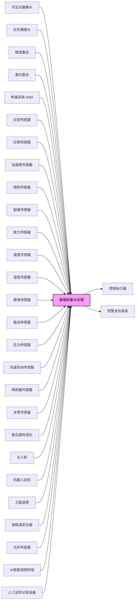
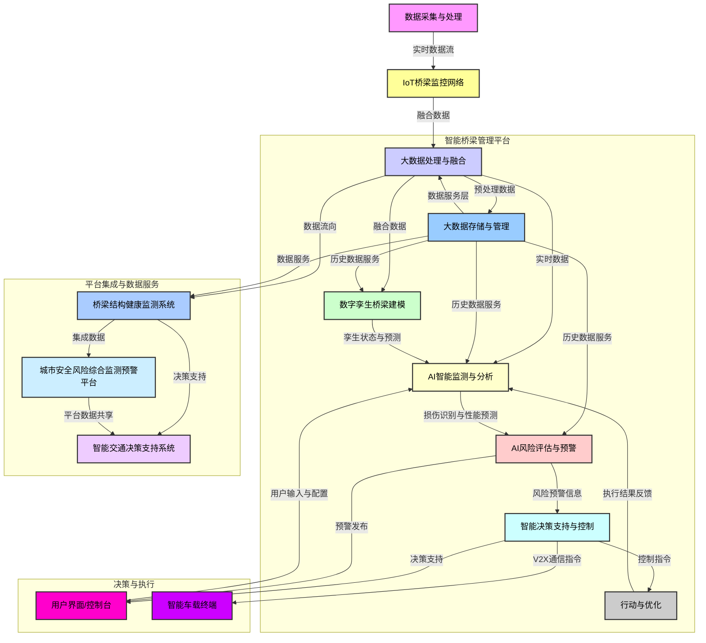

# **桥梁风险智能监控和预警系统**

- [**桥梁风险智能监控和预警系统**](#桥梁风险智能监控和预警系统)
  - [**I. 引言**](#i-引言)
    - [**1.1 项目背景与目标**](#11-项目背景与目标)
    - [**1.2 桥梁在交通网络中的重要性**](#12-桥梁在交通网络中的重要性)
    - [**1.3 文档目的与范围**](#13-文档目的与范围)
  - [**II. 桥梁概述与分类**](#ii-桥梁概述与分类)
    - [**2.1 桥梁定义与功能**](#21-桥梁定义与功能)
    - [**2.2 桥梁分类标准**](#22-桥梁分类标准)
      - [**2.2.1 按结构受力特点分类**](#221-按结构受力特点分类)
      - [**2.2.2 按建筑材料分类**](#222-按建筑材料分类)
      - [**2.2.3 按桥梁跨径分类**](#223-按桥梁跨径分类)
      - [**2.2.4 按使用功能分类**](#224-按使用功能分类)
    - [**2.3 不同类型桥梁的结构特点与适用性**](#23-不同类型桥梁的结构特点与适用性)
  - [**III. 桥梁风险识别与评估**](#iii-桥梁风险识别与评估)
    - [**3.1 桥梁主要风险类型**](#31-桥梁主要风险类型)
      - [**3.1.1 结构与材料退化风险**](#311-结构与材料退化风险)
      - [**3.1.2 运营荷载风险**](#312-运营荷载风险)
      - [**3.1.3 环境与自然灾害风险**](#313-环境与自然灾害风险)
      - [**3.1.4 人为因素与施工质量风险**](#314-人为因素与施工质量风险)
    - [**3.2 桥梁风险评估方法与等级划分**](#32-桥梁风险评估方法与等级划分)
      - [**3.2.1 定性与定量评估**](#321-定性与定量评估)
      - [**3.2.2 风险发生可能性与后果严重程度**](#322-风险发生可能性与后果严重程度)
      - [**3.2.3 风险等级确定标准**](#323-风险等级确定标准)
  - [**IV. 桥梁监测预警系统设计**](#iv-桥梁监测预警系统设计)
    - [**4.1 系统总体架构**](#41-系统总体架构)
      - [**4.1.1 感知采集子系统**](#411-感知采集子系统)
      - [**4.1.2 数据传输与处理子系统**](#412-数据传输与处理子系统)
      - [**4.1.3 数据存储与管理子系统**](#413-数据存储与管理子系统)
      - [**4.1.4 评估与决策子系统**](#414-评估与决策子系统)
    - [**4.2 关键监测参数与传感器选型**](#42-关键监测参数与传感器选型)
      - [**4.2.1 环境参数监测**](#421-环境参数监测)
      - [**4.2.2 外部荷载监测**](#422-外部荷载监测)
      - [**4.2.3 结构响应监测**](#423-结构响应监测)
      - [**4.2.4 隐蔽病害与特殊监测技术**](#424-隐蔽病害与特殊监测技术)
    - [**4.3 数据采集、传输与存储**](#43-数据采集传输与存储)
    - [**4.4 智能分析与预警机制**](#44-智能分析与预警机制)
      - [**4.4.1 人工智能 (AI) 在损伤识别与性能预测中的应用**](#441-人工智能-ai-在损伤识别与性能预测中的应用)
      - [**4.4.2 数字孪生 (Digital Twin) 技术在运维决策中的应用**](#442-数字孪生-digital-twin-技术在运维决策中的应用)
      - [**4.4.3 预警阈值设定与报警机制**](#443-预警阈值设定与报警机制)
  - [**V. 桥梁风险监测预警系统实施与管理**](#v-桥梁风险监测预警系统实施与管理)
    - [**5.1 系统建设与供应商选择**](#51-系统建设与供应商选择)
    - [**5.2 运营维护与数据应用**](#52-运营维护与数据应用)
    - [**5.3 相关标准与规范**](#53-相关标准与规范)
      - [**5.3.1 设计规范**](#531-设计规范)
      - [**5.3.2 施工规范**](#532-施工规范)
      - [**5.3.3 检测与评定规范**](#533-检测与评定规范)
      - [**5.3.4 养护与维护规范**](#534-养护与维护规范)
      - [**5.3.5 结构健康监测与风险评估规范**](#535-结构健康监测与风险评估规范)
  - [**结论**](#结论)
      - [**引用的资料**](#引用的资料)

**变更历史**
| 日期时间     | 类型   | 作者   | 描述                  |
| ----------- | ------ |------- | --------------------- |
| 2025-06-18  | 增     | Capric | 分类、传感器、参考资料  |
| 2025-06-19  | 增     | Capric | 相关国标、产品目录、图表 |

**产品目录**
|  参数           | 类型             |  关键特性                     |  厂商                                                                                |
| -------------- | ---------------- |------------------------------|------------------------------------------------------------------------------------- |
| 交通荷载监测    | 可见光摄像头              | 目标检测、追踪；AI分析；适配多种道路场景 | 微创、海康、大华、宇视、天地通、华为 |
| 交通荷载监测    | 红外摄像头                | 目标检测、测温；恶劣天气穿透性好 | 海康、高德、大恒、Allied Vision、Blue Vision、Xenics |
| 交通荷载监测    | 微波雷达                  | 车流检测、测距；恶劣天气穿透性好 | 博世、大陆、海拉、德尔福、富士通天 |
| 交通荷载监测    | 激光雷达                  | 车流检测、测距；远距离、大范围探测；L4/L5自动驾驶感知辅助 | 禾赛科技、速腾聚创、Luminar、法雷奥 |
| 交通荷载监测    | 称重系统（WIM）           | 实时获取过往车辆轴重、总重和车速；识别超载车辆；高/中低速动态称重 | 梅特勒托利多（Mettler Toledo） |
| 结构响应监测    | 应变传感器                | 测量桥梁构件应变；反映材料受力状态；电阻式、振弦式、光纤式 | HBM、HBM FiberSensing、HEIDENHAIN |
| 结构响应监测    | 位移传感器                | 监测桥梁各部位相对或绝对位移（如挠度、支座位移、伸缩缝位移）；线性、角位移；接触式、非接触式 | TE Connectivity |
| 结构响应监测    | 加速度传感器              | 测量振动响应；分析动力特性、模态参数；识别异常振动；MEMS技术；高精度、低功耗 | Micromega Dynamics、Jewell Instruments、BeanDevice、NXP（恩智浦） |
| 结构响应监测    | 倾斜传感器                | 监测桥梁结构倾斜角度变化；发现不均匀沉降或倾覆风险；双轴、MEMS技术；高精度 | POSITAL（博思特）、RION、Jewell Instruments、Wuxi Bewis Sensing Tecnology LLC、TE Connectivity、MicroStrain |
| 结构响应监测    | 裂缝传感器                | 监测裂缝产生、发展和宽度变化；评估损伤程度；集成多维监测 | 中海达（Zhonghaida）、HEIDENHAIN |
| 结构响应监测    | 索力传感器                | 监测斜拉桥、悬索桥拉索力；评估索结构承载状态；频率法、电磁测力 | Screening Eagle（巡鹰智检）、压电式加速度传感器厂商、电磁测力仪器厂商 |
| 结构响应监测    | 温度传感器                | 监测结构内外温度；分析温度对变形应力影响；RTD、数字式；高精度、响应快 | TE Connectivity、纳芯微（Novos |
| 结构响应监测    | 湿度传感器                | 监测结构内外湿度；评估对材料耐久性（如钢筋锈蚀）影响；薄膜电容式、长期稳定性 | Vaisala（维萨拉）、SmartSolo Scientific（面元科学仪器） |
| 结构响应监测    | 腐蚀传感器                | 直接或间接监测钢筋/钢结构腐蚀状态；评估腐蚀风险；半电池电位法 | Screening Eagle（巡鹰智检）、深圳市驷远科技有限公司、中衡港科（深圳）科技有限公司、北京耐久伟业科技有限公司 |
| 结构响应监测    | 振动传感器                | 监测结构振动；早期发现异常；多传感器数据融合 | 上海振动器厂、上海航振、上海瑞鸿、北京华兴、泰隆电子 |
| 结构响应监测    | 压力传感器                | 监测桥梁特定部位压力；如智能螺母、基础压力 | 麦克传感、华天科技、苏州明皜、中航电测、上海芯敏、东方万和、Honeywell、西克、博世 |
| 环境荷载监测    | 风速风向传感器            | 监测桥梁区域风速风向；分析风荷载、风振响应；超声波技术 | SmartSolo Scientific（面元科学仪器）、DEIF（丹控电气） |
| 环境荷载监测    | 降雨量传感器              | 实时监测降雨量；评估洪水、冲刷、桥面湿滑风险；压电式、称重式；高精度 | 南方卫星导航（SouthGNSS）、HACH（哈希） |
| 环境荷载监测    | 冰雪传感器                | 监测桥面结冰/积雪情况；评估路面摩擦系数；GPR技术 | Sensoft |
| 环境荷载监测    | 能见度检测仪              | 监测桥面能见度；用于雾、霾等低能见度天气行车安全；视频监测功能 | 山东天格光电、潍坊瑞格、富奥通、Campbell、Enviro、Young、Belfort |
| 辅助监测与巡检  | 无人机                    | 高效率、高分辨率视觉检查；发现表面病害；AI算法识别；数据采集 | 大疆、Parrot、昊翔、道通、亿航、航天彩虹、中科遥感 |
| 辅助监测与巡检  | 机器人巡检                | 对桥梁结构进行自动化巡检；高效率、高安全性；可达人工难触及区域 | 主流机器人厂商、智能巡检系统集成商 |
| 辅助监测与巡检  | 卫星遥感                  | 毫米级形变监测（InSAR）；大范围、非接触、全天候、高精度；宏观形变监测 | 中国航天、中国空间技术研究院、上海航天技术研究院、中国东方红卫星、中国卫星、四维图新、中科星图、航天宏图、北京揽宇方圆、长光卫星 |
| 辅助监测与巡检  | 高精准定位器               | 桥梁结构毫米级高精度定位监测；基于北斗/GNSS技术 | 司南导航、和芯星通、北方华创、南方测绘、六分科技、u-blox、世导通、大疆D-RTK |
| 辅助监测与巡检  | 光纤传感器                 | 空间连续监测（分布式）；抗电磁干扰、耐腐蚀、防水、寿命长；应变、温度、裂缝、振动监测 | 基恩士、松下、欧姆龙、西克、邦纳、倍加福、劳易测、理工光科 |
| 智能系统与平台  | AI智能视频终端             | 智能算法与前端设备结合；设备端数据解算、处理、分析；可视化灾害监测预警 | 微创、商汤、海康、大华 |
| 智能系统与平台  | AI智能分析                | 分析传感器数据、图片、文本报告；自动评估结构健康状态；识别异常；预测寿命；生成警报 | 中交路桥科技、扣子、文心智能、司马诸葛、智谱清言、腾讯元器、LinkAI |
| 智能系统与平台  | IoT桥梁监控系统            | 整合设备和传感器；构建互联交通监控系统；提高流动性和安全性 | Digi International、研华、华为、中兴、海康、大华 |
| 智能系统与平台  | 桥梁结构健康监测系统        | 集成传感器、数据采集、传输、存储、分析、预警一体化解决方案 | 中路高科交通检测检验认证有限公司、北京华力创通科技股份有限公司、SmartSolo Scientific（面元科学仪器）、Kistler（奇石乐）、Applus+、Keller Group plc、Encardio Rite |
| 智能系统与平台  | 城市安全风险综合监测预警平台 | 风险监测感知层；全方位、立体化感知城市生命线、公共安全、生产安全和自然灾害等风险 | 赛飞特、辰安科技、泰策科技、万宾科技 |
| 智能系统与平台  | 数据服务层                 | 各行业领域监测感知数据汇聚、处理；数据存储、治理、计算；城市安全专题数据库建设 | 数据库厂商 |
| 智能系统与平台  | 智能交通决策支持系统        | 汇集多种高新技术；实时和预测交通状况发布；优化交通流量 | 华为、商汤、久其软件、北京京东世纪 |
| 智能系统与平台  | 数字孪生桥梁               | 桥梁基础设施全要素、全周期数字化；虚拟模型与实体映射；模拟、预测、运维决策 | 超图软件、神州数码、亚信、GIS厂商 |

**数字孪生桥梁 —— 智能监测、预警、决策系统**

## **I. 引言**

### **1.1 项目背景与目标**

桥梁作为现代交通网络中的关键组成部分，其安全与稳定运行对于社会经济发展至关重要。中国在过去四十年的改革开放中，桥梁工程取得了举世瞩目的成就，已建成桥梁数量庞大，截至2017年底已超过83万座，并在世界各类桥梁排名中占据主导地位，被誉为“桥梁大国” 1<color>。然而，伴随桥梁数量的快速增长和服役年限的延长，现有桥梁面临着日益严峻的挑战。这些挑战主要源于复杂的自然环境、不断增长的交通荷载、材料老化以及结构疲劳等多种因素的耦合作用 3<color>。

在役桥梁长期暴露于复杂环境中，易出现裂缝、剥落、变形等病害，这些问题若未能及时发现和处理，可能导致结构耐久性、安全性及使用功能下降，甚至引发灾难性事故，造成严重的人员伤亡和经济损失 3<color>。传统的桥梁检测方法，如人工巡检，往往存在空间局限性，难以实现对大型复杂桥梁的全覆盖、实时监测，尤其对于隐蔽部位的病害更是力不从心 6<color>。

鉴于此，本文件旨在提出一套全面的桥梁风险监测预警系统设计方案。该系统的核心目标是通过集成先进的传感技术、数据处理分析能力和智能预警机制，实现对桥梁健康状况的实时、精准掌握，早期识别潜在风险，评估结构完整性，预测性能发展趋势，并为桥梁的科学养护管理提供决策支持 6<color>。通过构建此系统，旨在提升桥梁基础设施的长期安全性和运营效率，确保交通网络的持续畅通与韧性。

中国桥梁建设的辉煌成就，使其在数量和质量上都实现了飞跃，但同时也带来了未来大规模桥梁资产管理和风险控制的巨大需求。这种从“建设者”向“管理者”的转变，使得先进、自动化的监测预警系统成为必然选择。此外，桥梁的可靠运行不仅关乎工程安全，更直接影响区域经济活力和社会公平。便捷的交通网络能够缩短时空距离，促进跨区域乃至跨国界的人流、物流和信息流，是经济快速增长的重要基础 9<color>。因此，对桥梁的有效监测和风险管理，不仅是工程层面的要求，更是支撑国家经济发展和实现共同富裕、可持续发展目标（如“碳达峰”“碳中和”）的战略性基础设施保障 9<color>。

### **1.2 桥梁在交通网络中的重要性**

桥梁是交通基础设施中不可或缺的组成部分，其核心功能是跨越地理障碍，如山谷、河流或海峡，从而实现人、车辆、火车或船舶的顺畅通行 10<color>。它们是连接区域、促进物流和人员流动的关键节点，极大地拓展了人类的活动范围，克服了地缘政治障碍，并显著推动了社会的发展 1<color>。

桥梁的功能价值远超其作为物理结构的本身。它们是重要的社会资产，与人类社会的政治、经济和文化活动紧密相连，成为社会发展的缩影 1<color>。在经济层面，桥梁的畅通运行直接促进了跨地区甚至跨国境的人流、物流和信息流，为经济的快速增长提供了重要支撑 9<color>。例如，长江干流上已建成的115座桥梁，便是中国经济动脉的重要组成部分 2<color>。当桥梁因事故或损坏导致交通中断时，其影响将远超直接的维修成本，可能导致供应链中断、区域贸易受阻，进而影响整体经济生产力。

在社会层面，不断完善的交通网络，包括桥梁，有助于缩短城乡发展差距和跨地区收入差距，极大促进了共同富裕的实现 9<color>。因此，桥梁的可靠性与韧性直接关系到社会公平和区域均衡发展。一个高效的桥梁风险监测预警系统，通过确保这些关键基础设施的安全运行，不仅能够预防直接的生命财产损失，更能够维护社会稳定，提升区域间的互联互通水平，从而间接促进经济增长和可持续发展。

### **1.3 文档目的与范围**

本文件的主要目的是为桥梁风险监测预警系统的设计、实施和管理提供一个全面的技术框架。它旨在为桥梁基础设施规划、建设、运营和维护等各个环节的利益相关者提供指导。

本文件的涵盖范围包括：

* 桥梁的基本定义、分类及其结构特点。  
* 桥梁面临的各类主要风险，包括结构与材料退化、运营荷载、环境与自然灾害以及人为因素与施工质量风险的识别与评估方法。  
* 桥梁监测预警系统的详细设计原则，包括系统架构、关键监测参数、传感器的选择与布设、数据采集、传输与存储策略，以及智能分析与预警机制。  
* 系统实施、运营、维护及数据应用的指导方针，并强调与相关国家及行业标准的符合性。  
* 回顾典型的桥梁事故案例，并探讨智能监测预警系统的成功应用实践。

本文件侧重于桥梁风险监测预警系统的整体框架和技术规范，而非针对具体桥梁的详细工程设计、材料科学的深入探讨或特定的维修加固方法。然而，它将为这些具体工作提供必要的技术背景和指导框架。本系统的成功实施，有赖于其与现有桥梁全生命周期管理流程的深度融合，从设计到维护，都需确保数据互联互通，提供可操作的智能信息，而非仅仅是原始数据。

## **II. 桥梁概述与分类**

### **2.1 桥梁定义与功能**

桥梁是一种为使人、车辆、火车或船舶能够穿越障碍物而建造的结构，这些障碍物可以是山谷、河流、海峡，或是为了下方交通的畅通而将道路或铁路抬高 10<color>。中文“桥”字源于“乔木”，意指高大的树木，因其长度足以横跨河面连接两岸，形成最初的独木桥 10<color>。

桥梁的核心功能是提供跨越物理障碍的连续且安全的通道，从而保障交通的连通性和便利性 10<color>。然而，现代桥梁的功能已远不止于此。它们是扩大人类活动范围、克服地缘政治障碍的重要媒介，极大地促进了社会发展。桥梁工程的功能价值、社会价值和文化价值与人类社会的政治、经济和文化活动紧密相关，使其超越了单纯的结构，成为具有社会属性和文化属性的重要基础设施 1<color>。因此，桥梁监测系统不仅要评估结构完整性，更要考虑桥梁在整个交通网络中的战略作用及其对社会经济的潜在影响。

### **2.2 桥梁分类标准**

桥梁的分类标准多样，不同的分类方法有助于深入理解其结构特性、设计考量以及特定的监测需求。

#### **2.2.1 按结构受力特点分类**

这是桥梁最常见的分类方式，根据主要承重构件的受力特点进行划分 11：

* **梁式桥：** 以主梁为主要承重构件，受力特点为主梁受弯。主要材料为钢筋混凝土、预应力混凝土，多用于中小跨径桥梁。例如，南京长江大桥（钢桁梁桥）、开封黄河大桥（简支梁桥）等 10<color>。梁式桥在铁路桥梁中应用最为广泛 11<color>。其优点是就地取材、工业化施工、耐久性好、适应性强、整体性好且美观，设计理论和施工技术成熟；缺点是自重较大，限制了跨越能力 12<color>。  
* **拱式桥：** 以承受轴向压力为主的拱肋作为主要承重构件，支承处有水平推力。主要材料是圬工、钢筋混凝土，跨径可达几十米到三百多米。例如，赵州桥是现存修建最早的空腹式拱桥 10<color>。优点是跨越能力大，节省钢材和水泥，耐久性好，养护维修费用少，外型美观；缺点是对地基要求高，多孔连续拱桥需特殊措施承受不平衡推力，且在平原区建筑高度较大 11<color>。  
* **桁架桥：** 由杆件组成桁架结构，主要受力形式为拉、压 10<color>。桁架梁可以做成实腹或空腹 11<color>。  
* **斜拉桥：** 梁、索、塔为主要承重构件，利用索塔上伸出的若干斜拉索在梁跨内增加弹性支承，减小梁内弯矩而增大跨径。外荷载从梁传递到索，再到索塔。主要材料为预应力钢索、混凝土、钢材，适宜于中等或大型桥梁 10<color>。优点是梁体尺寸小，跨越能力大，抗风稳定性优于悬索桥，且便于无支架施工；缺点是计算复杂，索与梁或塔的连接构造复杂，高空作业多 12<color>。  
* **悬索桥：** 以主缆为主要承重构件，外荷载从梁通过系杆传递到主缆，再到两端锚锭。主要材料为预应力钢索、混凝土、钢材，适宜于大型及超大型桥梁 10<color>。例如，日本明石大桥、马来西亚槟城第二大桥 10<color>。优点是利用高强钢材，受力均匀，跨越能力大，用料省，自重轻；缺点是整体刚度小，抗风稳定性不佳，需要巨大的两端锚锭 11<color>。  
* **上承式悬带桥：** 桥面位于悬带上方 10<color>。  
* **刚架桥：** 桥跨结构和墩台结构整体相连，支柱与主梁共同受力。适宜于中小跨度，常用于需要较大桥下净空和建筑高度受限的情况，如立交桥、高架桥 11<color>。  
* **组合体系桥：** 承重结构由两种或多种结构型式组合而成，如梁与拱的组合（以九江长江大桥为代表）、梁与斜拉索的组合（以芜湖长江大桥为代表）等 11<color>。

每种桥梁类型都具有特定的结构特点和受力机制，这直接决定了其固有的薄弱环节和潜在的失效模式。例如，梁式桥主要承受弯曲，拱式桥则承受压力并产生水平推力，对地基要求高；悬索桥虽跨度大，但抗风稳定性较差 11<color>。因此，有效的监测系统必须针对不同桥型的特定结构弱点进行定制化设计，例如，拱桥需重点关注基础沉降和水平推力，而悬索桥和斜拉桥则需加强风振和索力监测 13<color>。

#### **2.2.2 按建筑材料分类**

桥梁可根据所使用的主要建筑材料进行分类：

* **钢桥：** 主要承重结构为钢材。  
* **钢筋混凝土桥：** 主要承重结构为钢筋混凝土。  
* **预应力混凝土桥：** 主要承重结构为预应力混凝土。  
* **圬工桥：** 包括砖桥、石桥、混凝土桥等 10<color>。

不同材料的桥梁具有不同的耐久性特点和退化模式。例如，钢结构易受腐蚀和疲劳影响，混凝土结构则可能出现裂缝、蜂窝麻面、剥落等病害，并面临碳化、氯离子侵蚀、硫酸盐腐蚀和冻融破坏等挑战 3<color>。超高性能混凝土（UHPC）等新型材料的应用，有望提高桥梁的经济性、环保性、坚固性和耐久性，但可能引入新的、尚不完全了解的失效模式 18<color>。因此，监测策略必须考虑材料的特性，例如，钢筋混凝土桥梁需重点关注钢筋腐蚀监测 8，而混凝土裂缝的监测则对所有混凝土结构都至关重要 14<color>。

#### **2.2.3 按桥梁跨径分类**

根据《公路工程技术标准》（JTG B01-2014）第六章桥涵分类规定，桥梁按跨径可分为以下几类 10：

* **特大桥：** 多孔跨径总长L \> 1000m 或单孔跨径Lk \> 150m 10<color>。部分标准中，特大桥也可定义为多孔跨径总长 ≥ 500m，单孔跨径 ≥ 100m 23<color>。  
* **大桥：** 多孔跨径总长100m ≤ L ≤ 1000m 或单孔跨径40m ≤ Lk ≤ 150m 10<color>。部分标准中，大桥也可定义为多孔跨径总长 ≥ 100m 且 \< 500m，单孔跨径 ≥ 40m 且 \< 100m 23<color>。  
* **中桥：** 多孔跨径总长30m \< L \< 100m 或单孔跨径20m ≤ Lk \< 40m 10<color>。  
* **小桥：** 多孔跨径总长8m ≤ L ≤ 30m 或单孔跨径5m ≤ Lk \< 20m 10<color>。  
* **涵洞：** 单孔跨径Lk \< 5m 10<color>。部分标准中，涵洞也可定义为多孔跨径 \< 8m，单孔跨径 \< 5m，或任何圆形、箱形涵洞 23<color>。

需要注意的是，不同标准或特定应用场景（如滑行道桥梁）可能存在细微的定义差异 23<color>。在实际分类时，应遵循“就高不就低”的原则，即如果一个桥梁符合多个分类指标，则采用其中等级最高的分类 24<color>。

跨径分类不仅是行政管理上的区分，更与桥梁的结构复杂性、建设难度以及潜在失效后果的严重程度直接相关。特大桥和大桥通常采用更复杂的结构形式（如斜拉桥、悬索桥），且往往是交通网络中的关键节点，一旦发生事故，影响范围和损失将更大 1<color>。因此，主跨跨径大于等于100m的桥梁通常需要进行结构监测 13<color>。这意味着，大型桥梁需要更复杂、更连续、更全面的监测系统，包括利用PS-InSAR等高精度遥感技术进行毫米级变形监测 25，以支持更高的风险管理要求。

#### **2.2.4 按使用功能分类**

桥梁根据其主要用途可分为：

* **铁路桥：** 承载铁路列车通行 11<color>。  
* **公路桥：** 承载公路车辆通行 11<color>。  
* **公铁两用桥：** 兼顾公路和铁路交通 11<color>。  
* **人行桥：** 专供行人通行 11<color>。  
* **运水桥（渡槽）：** 用于输送水流 11<color>。  
* **其他专用桥梁：** 如机场滑行道桥梁 24<color>。

桥梁的功能用途直接决定了其所承受的荷载类型、荷载特性以及对安全可靠性的要求。例如，铁路桥梁需承受重载、高频的动荷载，而公路桥梁则面临多样化的车辆荷载，包括超载风险 2<color>。因此，监测系统必须能够捕捉与桥梁功能用途相关的特定荷载特征，例如，铁路桥梁可能需要更侧重于振动和疲劳监测，而公路桥梁则需重点部署超载检测系统。

### **2.3 不同类型桥梁的结构特点与适用性**

各种桥梁类型在结构特点、受力行为和适用范围上各有优势和局限，这些特性直接影响了其风险模式和监测侧重点。

* **梁式桥：** 以主梁主要承受弯矩为特征，常用钢筋混凝土和预应力混凝土建造。优点是施工成熟、就地取材、耐久性好、适应性强 12<color>。然而，其自重占总设计荷载比重较大（30%\~60%），这在很大程度上限制了其跨越能力 12<color>。  
* **拱式桥：** 主要通过拱肋承受压力，并在支座处产生水平推力。优点在于跨越能力大，相较于钢桥和钢筋混凝土梁桥，可节省大量钢材和水泥，且养护维修费用较低 12<color>。但其推力结构特性对地基要求较高，在平原地区修建可能导致接线工程量和桥面纵坡增大，对行车不利 11<color>。  
* **钢架桥：** 桥跨结构与墩台结构刚性连接，共同承受荷载。优点是外形尺寸小，桥下净空大，视野开阔，混凝土用量少 12<color>。缺点是基础造价较高，钢筋用量大，且作为超静定结构会产生次内力 12<color>。  
* **斜拉桥：** 利用斜拉索在梁跨内提供弹性支承，从而减小梁内弯矩并增大跨径。优点是梁体尺寸较小，跨越能力大，抗风稳定性优于悬索桥，且便于无支架施工 12<color>。但其多次超静定结构导致计算复杂，索与梁或塔的连接构造复杂，施工技术要求严格 12<color>。  
* **悬索桥：** 以主缆作为主要承重构件，通过吊杆将桥面荷载传递至主缆。其主要优势在于主缆采用高强钢材，受力均匀，具有巨大的跨越能力，是目前能达到最大跨度的一种桥型 11<color>。然而，其整体刚度相对较小，抗风稳定性不佳，且需要庞大的两端锚锭，导致费用高昂，施工难度大 12<color>。

每种桥梁类型都存在其固有的设计权衡和结构弱点。例如，悬索桥虽然跨越能力极强，但其柔性使其对风荷载和振动敏感 12<color>。拱桥的受力特性要求其地基必须稳固，否则可能出现沉降和水平位移问题 11<color>。这些固有的结构特性直接决定了监测系统的侧重点。例如，对于悬索桥和斜拉桥，风速风向监测、振动监测和索力监测是至关重要的参数 13，而对于拱桥，则需重点关注基础冲刷和变形监测 13<color>。

## **III. 桥梁风险识别与评估**

桥梁在全生命周期中面临多重风险，这些风险的识别和评估是建立有效监测预警系统的基础。

### **3.1 桥梁主要风险类型**

#### **3.1.1 结构与材料退化风险**

桥梁结构和材料的长期性能退化是引发安全风险的主要因素之一。

* **疲劳：** 桥梁在交通荷载等反复作用下，结构构件可能发生疲劳损伤，导致裂纹萌生和扩展，最终引发结构失效 3<color>。例如，钢结构桥梁的疲劳裂纹是重要的病害 27<color>。  
* **腐蚀：** 桥梁长期暴露于潮湿、盐雾、酸雨等侵蚀性环境中，或受到鸟粪等强酸性物质影响，会导致钢筋锈蚀、钢结构腐蚀 3<color>。混凝土保护层剥落、露筋是腐蚀的常见表现，严重时会降低结构耐久性和安全性 3<color>。  
* **裂纹：** 混凝土结构中常见的病害，可由温度变化、荷载作用、施工质量缺陷、设计问题、材料性能变化、钢筋锈蚀或基础沉降等多种原因引起 3<color>。裂缝的不断扩展和延伸可能导致混凝土碳化、保护层脱落，甚至引发桥梁倒塌 3<color>。  
* **变形：** 结构几何形状的变化，如沉降、挠度、倾斜等，通常是结构存在潜在问题或基础不稳定的重要指示 3<color>。例如，PS-InSAR技术能够以毫米级精度监测桥梁的变形，甚至追溯历史沉降信息 25<color>。  
* **材料缺陷：** 混凝土结构中常见的局部不密实或松散现象，如蜂窝、麻面、剥落和掉角等，这些缺陷会降低混凝土的强度和耐久性 15<color>。

这些结构和材料退化机制并非孤立存在，而是相互关联、相互促进的。例如，裂缝的出现可能导致钢筋暴露并加速腐蚀，腐蚀又会进一步加剧混凝土的开裂和剥落 3<color>。因此，监测系统需要进行多参数的集成分析，以识别这些复杂的耦合失效模式。此外，许多早期或内部的结构退化（如钢筋腐蚀、微小变形）是肉眼难以察觉的 4，这使得非接触式和分布式传感技术（如GPR、PS-InSAR、光纤传感）在早期预警中发挥着不可替代的作用。

#### **3.1.2 运营荷载风险**

运营期间的荷载风险是桥梁事故的常见原因。

* **超载：** 车辆超载是中国桥梁事故的第三大原因，仅次于施工和洪水/冲刷 2<color>。严重的超载，特别是偏心荷载，可能导致桥梁支座系统失效、梁体侧向滑移倾覆，造成重大人员伤亡和经济损失 5<color>。即使是经过批准的大件运输，若管理不当（如缺乏交通管制、未按规定车道和速度行驶），也可能引发事故 29<color>。部分运输企业甚至通过非法改装车辆、强令驾驶员超载来谋取利益，进一步加剧了超载风险 30<color>。  
* **车辆碰撞：** 车辆碰撞是导致桥梁事故的另一重要原因 2<color>。主要致险情景包括驾驶员不熟悉路况、疲劳驾驶、车辆故障、企业动态监控不到位等 31<color>。  
* **船舶碰撞：** 在通航水域，船舶碰撞桥梁是严重的运营风险，也是中国桥梁事故的第三大原因 2<color>。长江、珠江、黑龙江等水系已发生300多起船撞桥梁事件 32<color>。风险情景包括助航标志不符合要求、桥梁净空尺度不足、桥墩防撞设施缺失或维护不当、桥梁设计防撞能力不足等 31<color>。

运营荷载风险不仅包括直接的物理冲击，还涉及人为因素和管理漏洞。例如，疲劳驾驶和企业对超载的纵容，都显著增加了事故发生的可能性 30<color>。因此，监测系统需集成动态称重、车辆碰撞检测、船舶碰撞预警等技术，并与交通管理系统联动，以实现对超载和碰撞风险的实时识别与干预。

#### **3.1.3 环境与自然灾害风险**

桥梁易受自然环境和极端天气事件的影响。

* **洪水/冲刷：** 洪水是导致桥梁事故的主要原因之一 2<color>。强降雨可导致河流水位暴涨，冲毁堤防，引发大面积淹水，并造成桥梁基础冲刷，严重威胁桥梁结构安全 34<color>。河床比降大、易于冲刷的地区，桥梁基础冲刷深度需提高洪水频率进行验算 34<color>。  
* **地震：** 处于高地震烈度区的桥梁面临显著的地震风险，需进行抗震设计和监测 6<color>。  
* **风振：** 强风，特别是台风，可能导致大跨径桥梁发生涡振、颤振等风致振动，对结构造成疲劳损伤甚至失稳破坏 6<color>。  
* **冰雪：** 冰雪堆积可能对桥梁结构造成额外荷载，影响交通安全 38<color>。冰层厚度测量对冰面道路的承载能力评估至关重要 38<color>。  
* **极端天气：** 暴雨、山体滑坡、沙尘暴、寒潮与低温雨雪冰冻天气等极端事件的频率日益增加，对公路、铁路、桥梁等公共基础设施构成严重威胁 36<color>。

气候变化趋势预示着极端天气事件将更加频繁和强烈，这意味着桥梁面临的环境风险将持续升级。监测系统需要整合气象、水文数据，结合结构响应，预测和评估极端天气对桥梁的潜在影响，并提供相应的预警和应急响应建议。

#### **3.1.4 人为因素与施工质量风险**

人为因素和施工质量缺陷是桥梁事故的深层原因。

* **施工质量：** 在1813年至2018年期间的584起桥梁事故分析中，施工原因占42.1%，是导致桥梁倒塌的首要原因 41<color>。问题包括不合理的施工工艺、支架拆除不规范、材料强度未达标即拆除支架、使用不合格原材料等 42<color>。例如，无锡312国道高架桥倾覆事故中，货车超载是直接原因，但施工管理问题也可能是诱因 5<color>。  
* **人为错误/疏忽：** 除了超载和疲劳驾驶等直接行为，管理层对安全规范的忽视，如企业要求驾驶员严重超载、动态监控不到位等，也是导致事故的重要因素 30<color>。  
* **设计缺陷：** 设计不合理也是桥梁倒塌的重要原因，占事故总数的11.6% 41<color>。例如，国内大部分梁桥上部结构平面外位移约束构造不足，是设计中需注意的问题 41<color>。

桥梁风险的根源往往可追溯至设计和施工阶段。因此，一个全面的风险监测系统应与桥梁的建造信息模型（BIM）和地理信息系统（GIS）集成，从早期阶段就建立基线数据，识别潜在的薄弱环节，并跟踪其在服役期内的演变。此外，系统设计必须考虑人机交互，确保预警信息清晰、及时，并能促使操作人员和管理层采取正确行动，同时通过监管和问责机制，强化对人为因素的管控。

### **3.2 桥梁风险评估方法与等级划分**

风险评估是一个系统性的过程，旨在识别、分析和评价潜在风险，以确定其发生的可能性和后果的严重程度，从而为决策提供依据。

#### **3.2.1 定性与定量评估**

桥梁风险评估应采用定性与定量相结合的方法，对风险源的发生概率及损失进行分析和评估 43<color>。定性评估通常用于初步筛选和理解难以量化的复杂因素（如社会影响、人为行为），而定量评估则提供精确的数值，用于可测量的结构响应和经济损失。对于公路桥梁施工安全总体风险评估，可优先采用主控因素判识法，或在必要时采用专家调查法或指标体系法 44<color>。这种混合方法能够更全面、准确地评估风险，综合工程专业知识、统计分析和潜在的AI驱动模式识别。

#### **3.2.2 风险发生可能性与后果严重程度**

风险等级的确定通常基于风险事件发生的可能性（或频率）及其后果的严重程度 43<color>。

* **可能性：** 评估危险环境的暴露频率，可综合考虑作业人员的短期和长期暴露频率，并取其较大值 46<color>。  
* **后果严重程度：** 应综合考虑人员伤亡、直接经济损失和社会影响等判定因素，并采用“就高原则”确定严重程度等级 46<color>。这意味着，即使经济损失不大，但如果造成严重人员伤亡或社会影响，则风险等级仍应定为高等级。

这种多维度评估方法，特别是将社会影响纳入考量，超越了单纯的工程或财务视角，体现了对生命安全和社会稳定的高度重视。

#### **3.2.3 风险等级确定标准**

根据已确定的风险发生概率等级和风险损失等级，按照相关指南确定安全风险等级 43<color>。重大作业活动风险事件发生后果严重程度等级通常分为5级，当多种后果同时产生时，应采用就高原则或其并发性后果严重程度确定等级 46<color>。

**表1 风险事件发生后果严重程度等级标准**

| 等级 | 后果严重程度总体判断标准 |
| :---- | :---- |
| **特别严重** | **人员伤亡：** 可能发生人员死亡30人以上的，或者发生人员重伤（包括急性工业中毒）50人以上100人以下的 46<color>。 |
|  | **社会影响：** 涉及范围非常大，区域内周边生态功能严重丧失，需紧急转移安置人数1000人以上，正常的经济、社会活动受到严重影响 43<color>。 |
| **严重** | **人员伤亡：** 可能发生人员死亡10人以上30人以下的，或者发生人员重伤（包括急性工业中毒）50人以上100人以下的 46<color>。 |
|  | **社会影响：** 可能对国家或区域的社会、经济等产生重大影响 46<color>。 |
| **较严重** | **人员伤亡：** 可能发生人员死亡3人以上10人以下的，或者发生人员重伤（包括急性工业中毒）10人以上50人以下的 46<color>。 |
|  | **社会影响：** 可能对国家或区域的社会、经济等产生较大影响 46<color>。 |

此标准化分类为风险沟通提供了统一语言，确保不同利益相关者（工程师、应急部门、政府）能够对风险等级形成共识，并触发预先设定的应急响应协议。预警系统的输出应直接映射到这些风险等级，从而将原始数据转化为可操作的智能信息。

## **IV. 桥梁监测预警系统设计**

桥梁风险监测预警系统的设计旨在通过多层次的架构，实现对桥梁状态的全面感知、高效传输、智能分析和及时预警。

### **4.1 系统总体架构**

一个全面的桥梁健康监测系统通常由以下几个相互关联的子系统构成，协同工作以实现对桥梁状况的信息采集、处理、分析和发布。

#### **4.1.1 感知采集子系统**

感知采集子系统是整个监测系统的基础，由各类传感器组成 7<color>。其核心功能是实时采集现场数据流 47，包括桥梁所处的环境参数、外部荷载、结构响应以及结构变化等信息 8<color>。该子系统应具备多种数据录入方式，并确保所采集数据的准确性、稳定性和鲁棒性，因为这是后续所有分析和预警的基础 8<color>。对传感器和数据采集设备的质量投资至关重要，任何在此层面的妥协都可能导致错误传播，并最终损害整个系统的可信度。

#### **4.1.2 数据传输与处理子系统**

数据传输与处理子系统负责将感知采集子系统收集到的海量数据传输至中央服务器进行进一步处理和分析 47<color>。数据传输应通过高速网络连接实现，如4G/5G、光纤或Wi-Fi 48<color>。对于分布式系统，可采用EtherCAT等技术，允许将测试模块放置在传感器附近，并通过单根电缆实现电源、同步和数据传输 51<color>。传输带宽应提供2倍以上冗余以确保可靠性 8<color>。

数据处理方面，物联网系统产生的海量数据需要强大的实时处理能力 47<color>。硬实时数据库系统与实时操作系统相结合，能够确保数据处理的时间约束和事务完成的有效性 47<color>。流数据处理技术对于实时处理至关重要 47<color>。在业务逻辑层面，微服务架构被广泛应用于处理用户请求、实现业务功能以及对数据进行转换、过滤和聚合 48<color>。实时性是预警系统有效性的关键，因此，设计必须优先考虑低延迟、高吞吐量的数据管道，从传感器端到处理分析层，确保数据及时可用。

#### **4.1.3 数据存储与管理子系统**

数据存储与管理子系统负责数据的归档、报告生成、快速显示和高效存储 8<color>。原始监测数据应定期存储并备份存档，后处理数据应保持至少3个月的在线存储，而统计分析数据则应进行专项存储 8<color>。为了支持长期数据分析和趋势预测，可采用时间序列数据库（如InfluxDB）进行长期数据存储 51<color>。

数据安全性是该子系统的核心考量，当测量硬件与数据库之间的连接中断时，数据应安全地存储在测量单元本地，并在连接恢复后重新传输到数据库 51<color>。桥梁结构健康监测系统应贯穿桥梁结构运营期，因此，系统硬件和软件的更换与升级应保障监测数据的衔接与分析的连续性 13<color>。这意味着数据存储和管理系统必须设计为长期数据完整性、可访问性和可检索性，支持未来的分析模型和法规遵从性。

#### **4.1.4 评估与决策子系统**

评估与决策子系统是监测系统的“大脑” 7<color>。其主要功能是判断桥梁结构安全性能，发出准确的预警信号，并提出有效可行的维修养护建议 7<color>。该子系统能够对监测数据进行分析，评估桥梁的安全性与健康程度 13，进行损伤识别、桥梁健康状况评估以及承载力发展趋势预测 7<color>。它提供实时诊断、数据预处理、数据简化以及强大的数学功能 51<color>。

该子系统能够生成相关事件的通知和警报 4，并支持远程访问、配置和更新 4<color>。系统的价值直接取决于其将原始数据转化为可操作智能信息的能力，这需要复杂的分析模型，包括人工智能和数字孪生技术，以解释复杂的数据模式并预测未来状态。

### **4.2 关键监测参数与传感器选型**

传感器的选择应遵循技术成熟、耐久性好、抗干扰性强、便于安装、维护和更换的原则 8<color>。所选设备应满足测量量程、精度、分辨率、灵敏度、稳定性及环境适应性要求，且设备使用寿命应至少5年以上 13<color>。

#### **4.2.1 环境参数监测**

环境参数对桥梁结构行为和材料耐久性具有显著影响，是监测系统不可或缺的一部分。

* **温度：** 监测温度变化对于理解桥梁结构的热胀冷缩效应及其对变形的影响至关重要 25<color>。推荐采用RTD温度传感器元件 52 或高精度数字温度传感器 53<color>。  
* **湿度：** 湿度水平影响材料耐久性，特别是混凝土的腐蚀进程 3<color>。维萨拉（Vaisala）的HUMICAP®湿度传感器技术 54 和SmartSolo的温湿度记录仪 55 均可提供可靠的湿度数据。  
* **风速风向：** 对于大跨径桥梁，风速、风向、风攻角和湍流度是关键参数，直接关系到风致振动（如涡振）和结构稳定性 6<color>。可采用超声波风速风向传感器 57 或SmartSolo的系统 58<color>。  
* **降雨量：** 监测降雨量对于评估洪水风险和冲刷效应至关重要 35<color>。称重式降水传感器（如哈希OTT Pluvio2 L）可测量任何固态/液态降水，并具有加热装置和风力补偿功能 59<color>。压电雨量计也是可选方案 60<color>。  
* **冰雪：** 冰雪堆积可能增加桥梁荷载或影响交通安全。探地雷达（GPR）系统（如Sensoft的IceMap™ GPR）可实时、连续测量冰厚度 38<color>。

环境因素是结构退化的加速器，将环境数据与结构响应数据结合分析，能够更准确地识别损伤并预测性能，例如区分热变形与荷载引起的变形。

**表2 环境参数监测传感器推荐**

| 参数 | 传感器类型 | 关键特性 | 推荐品牌/厂家 |
| :---- | :---- | :---- | :---- |
| 温度 | RTD温度传感器元件 | 精确、稳定、适用于极端温度 | TE Connectivity 52 |
|  | 高精度数字温度传感器 | 响应快、低功耗、高精度、自发热小 | Novosns (NST112x-CWLR) 53 |
| 湿度 | 薄膜电容式湿度传感器 (HUMICAP®) | 长期稳定性、耐化学性、适用于恶劣环境 | Vaisala 54 |
|  | 温湿度记录仪 | 低功耗、可定制、适用于长期部署 | SmartSolo (TH85) 55 |
| 风速风向 | 超声波风速风向传感器 | 无机械部件、测量可靠、高精度 | DEIF (WSS 550\) 57 |
|  | 环境监测系统 | 提供远程、无人值守监测 | SmartSolo 58 |
| 降雨量 | 称重式降水传感器 | 符合WMO标准、测量固液混合降水、自带加热/风力补偿 | Hach (OTT Pluvio2 L) 59 |
|  | 压电雨量计 |  | 南方卫星导航 60 |
| 冰雪 | 探地雷达 (GPR) 系统 | 实时、连续测量冰厚度、识别薄冰区 | Sensoft (IceMap™ GPR) 38 |

#### **4.2.2 外部荷载监测**

外部荷载是桥梁结构承受的主要作用，对其进行实时监测对于预警运营风险至关重要。

* **车辆荷载：** 超载是桥梁事故的常见原因。动态公路车辆称重（WIM）系统用于实时监测车辆荷载，包括公路计重收费、超限超载检测及高速预警检测 8<color>。WIM技术可采用汽车衡、轴重秤、轮重仪等多种形式，包括秤台式、弯板式、压电石英式等 62<color>。梅特勒-托利多（Mettler Toledo）的POWERCELL®数字称重传感器在车辆衡领域应用广泛，性能可靠 63<color>。  
* **船舶碰撞：** 船舶碰撞是水上桥梁面临的重大风险。加速度传感器可用于监测船舶碰撞荷载 8<color>。  
* **地震作用：** 高烈度地震区的桥梁需监测地震作用。地震传感器（通常为加速度传感器）用于记录地震动，评估结构在地震作用下的响应 8<color>。

外部荷载监测系统，特别是WIM系统，能够实现对超载车辆的实时检测，从而将风险管理从被动响应转变为主动预防。

**表3 外部荷载监测传感器推荐**

| 参数 | 传感器类型 | 关键特性 | 推荐品牌/厂家 |
| :---- | :---- | :---- | :---- |
| 车辆荷载 | 动态公路车辆称重 (WIM) 系统 | 动态称重、高精度、实时检测超载、多种形式（轴重秤、弯板式等） | Mettler Toledo (POWERCELL®) 62 |
| 船舶碰撞 | 加速度传感器 | 冲击作用检测、动态响应监测 | Micromega Dynamics (GUARDIAN, RECOVIB®) 64, NXP 65, Jewell Instruments 64 |
| 地震作用 | 地震传感器（加速度传感器） | 记录地震动、评估结构响应、高分辨率 | Micromega Dynamics (ABX) 64, NXP 65, Jewell Instruments 64 |

#### **4.2.3 结构响应监测**

结构响应监测是直接反映桥梁健康状况的关键。

* **应变：** 测量结构内部应力状态和材料变形。可采用电阻应变计、动态应变仪或光纤光栅（FBG）应变计 8<color>。分布式光纤传感技术（BOTDA）可实现沿光纤分布的应变和温度的连续监测，具有抗电磁干扰、抗腐蚀、防水、耐久性好、精度高等优点，尤其适用于大跨径桥梁的全范围连续监测 6<color>。HBM 67 和HEIDENHAIN 22 提供高精度应变传感器。  
* **位移：** 测量结构在荷载作用下的竖向（挠度）和水平（纵向、横向）变形。可采用机械式、光电式位移传感器 37，或利用卫星定位系统（GNSS/北斗）进行高精度位移监测 13<color>。PS-InSAR技术也能提供毫米级精度的变形信息 25<color>。  
* **加速度/振动：** 测量桥梁的动态响应，对于模态参数（固有频率、阻尼比）的识别和异常振动（如涡振、颤振）的检测至关重要 6<color>。推荐使用MEMS加速度计或压电式加速度传感器 64<color>。  
* **倾角：** 测量结构倾斜或转角，可指示基础沉降或结构稳定性问题 13<color>。MEMS倾角传感器和电解式倾角传感器应用广泛 66<color>。  
* **裂缝：** 监测裂缝的长度、宽度、数量、位置及其随时间的变化规律 14<color>。光纤声发射（AE）传感器可实现对裂纹扩展的实时监测和定位 3<color>。多维监测仪可集成裂缝、倾角、加速度监测功能 21<color>。  
* **索力：** 对于斜拉桥、悬索桥等缆索体系桥梁，索力监测是关键参数 8<color>。可采用振动测量法或压力传感器（新建桥梁），在役桥梁宜采用压电式加速度传感器进行索力变化监测 72<color>。  
* **腐蚀：** 监测钢筋混凝土结构中的钢筋腐蚀情况。可采用半电池电位法评估腐蚀可能性 19，或通过混凝土电阻率测定仪评估混凝土腐蚀状态 20<color>。长标距光纤光栅传感器也可用于结构腐蚀监测 8<color>。

结构响应监测应采用多模态传感策略，集成来自不同传感器类型的数据，以构建桥梁结构行为的整体视图，从而更准确地诊断复杂的损伤机制并预测未来性能。对于大型结构，分布式和遥感技术（如BOTDA、PS-InSAR）能够提供全面的时空覆盖，弥补点式传感器的局限性。

**表4 结构响应监测传感器推荐**

| 参数 | 传感器类型 | 关键特性 | 推荐品牌/厂家 |
| :---- | :---- | :---- | :---- |
| 应变 | 电阻应变计、光纤光栅（FBG）应变计、分布式光纤传感 (BOTDA) | 高精度、高动态性能、分布式连续监测、抗电磁/腐蚀 | HBM (QuantumX, SomatXR, FS62) 67, HEIDENHAIN (ESR) 22, SmartSolo 55 |
| 位移 | 激光位移传感器、接触式位移传感器、GNSS/北斗高精度定位系统、PS-InSAR | 高精度、非接触、实时、长距离、毫米级变形监测 | TE Connectivity 69, OMRON 70, 中海达 (HDS101/102, 北斗/GPS) 21, PS-InSAR技术 25 |
| 加速度/振动 | MEMS加速度计、压电式加速度传感器 | 动态振动测量、高分辨率、宽频率范围、抗冲击 | Micromega Dynamics (GUARDIAN, RECOVIB®) 64, NXP 65, Jewell Instruments (Ruby MEMS) 64, 中海达 (HDS101/102) 21 |
| 倾角 | MEMS倾角传感器、电解式倾角传感器 | 高精度、全温补、长期野外监测、多轴 | Jewell Instruments (Ruby MEMS) 66, RION (ACA626T) 66, POSITAL FRABA (IKM360R) 66, Wuxi Bewis Sensing Technology (BWS5000E) 66, 中海达 (HDS101/102) 21 |
| 裂缝 | 裂缝传感器、光纤声发射（AE）传感器 | 监测裂缝宽度/长度/数量/位置、实时监测和定位裂纹扩展 | 中海达 (HDS101/102) 21, HEIDENHAIN (ESR) 22, 光纤AE传感器 3 |
| 索力 | 压电式加速度传感器（振动法）、压力传感器 | 测量索力变化、高抗拉强度、无支架施工 | 压电式加速度传感器 72, Screening Eagle (GPR for后张拉索) 19 |
| 腐蚀 | 半电池电位腐蚀传感器、混凝土电阻率测定仪、光纤光栅传感器 | 评估腐蚀可能性、定位分析及定量分析、非破坏性 | Screening Eagle (Profometer PM8500) 19, 深圳市驷远科技有限公司 20 |

#### **4.2.4 隐蔽病害与特殊监测技术**

许多关键的桥梁缺陷，如钢筋内部腐蚀、混凝土空洞或微小变形，通过常规目视检查难以发现 3<color>。因此，需要采用特殊监测技术：

* **探地雷达（GPR）：** 能够以极高精度非破坏性地定位桥梁中的钢筋和后张拉索，检查其放置是否正确或是否存在潜在异常 19<color>。此外，GPR也可用于测量冰层厚度 38<color>。  
* **卫星遥感（PS-InSAR）：** 利用合成孔径雷达（SAR）卫星对同一区域进行多次成像，通过干涉处理技术提取毫米级精度的目标变形信息 25<color>。该技术具有范围广（全天时、全天候、面状采样）、精度高（1-5mm）、效率高、非接触等特点，特别适用于大跨度桥梁的变形监测和历史沉降追溯 25<color>。对于反射特性较弱的桥梁，可通过布置人造角反射器（CR）来增强信号 25<color>。  
* **分布式光纤传感（BOTDA）：** 克服了传统点式传感器的空间局限性，可对结构物的应变和温度进行空间上的全范围连续监测，且具有抗电磁、抗腐蚀、防水、耐久性、高精度等优点 6<color>。  
* **声发射（AE）传感器：** 用于混凝土结构裂缝检测，可实现对信号源（损伤、裂纹扩展）的实时监测和定位，并通过信号分析判断材料破坏类型和损伤程度 3<color>。  
* **机器人与无人机：** 无人机搭载高清相机可进行自动巡检，实时回传线路图像，后台AI算法平台通过逐帧分析图像，能及时发现隐患 75<color>。巡检机器人系统则可采集温湿度、车流量、设备运行参数等海量数据，编织成日益精细的“安全网” 75<color>。

这些非破坏性检测和远程传感技术对于早期发现隐蔽病害至关重要，它们不仅提高了检测能力，也保障了检测人员的安全，并减少了对交通的影响。自动化和AI驱动的分析将进一步提高检测效率和准确性，实现对大规模基础设施网络的常态化、智能化巡检。

### **4.3 数据采集、传输与存储**

数据是桥梁风险监测预警系统的核心，其高效、可靠的采集、传输和存储是系统正常运行的基石。

**数据采集：** 智能传感器应实现实时数据采集 47<color>。数据采集系统应具备高精度、完整性，并能够连接所有必要的传感器 51<color>。系统应满足无人值守条件下长期稳定运行的要求 8<color>。

**数据传输：** 实时数据传输至数据中心需要高速网络连接 47<color>。传输方式可包括4G/5G、光纤、Wi-Fi 48，或针对分布式系统的EtherCAT技术，该技术允许将模块放置在传感器附近，通过单根电缆实现供电、同步和数据传输 51<color>。为确保可靠性，传输带宽应提供2倍以上冗余 8<color>。整个预警系统的有效性取决于数据的及时性，因此必须优先设计低延迟、高吞吐量的数据管道。

**数据存储：** 监测系统产生海量数据，需要强大的存储解决方案 47<color>。原始监测数据应定期存储并备份存档，后处理数据应保持至少3个月的在线存储，统计分析数据则应专项存储 8<color>。时间序列数据库（如InfluxDB）适用于长期数据存储，能够提供原始数据和缩减数据，并支持数据安全和重传机制，即使在连接中断时也能确保数据不丢失 51<color>。数据完整性是系统可信度的基石，因此，除了技术实现，还需建立健全的数据治理机制，包括数据验证、错误处理、安全存储和冗余备份。

### **4.4 智能分析与预警机制**

智能分析与预警机制是桥梁风险监测预警系统的核心价值所在，它将原始数据转化为可操作的智能信息。

#### **4.4.1 人工智能 (AI) 在损伤识别与性能预测中的应用**

人工智能（AI）技术在桥梁健康监测中发挥着越来越重要的作用，它能够显著增强系统在损伤识别、性能预测和决策支持方面的能力。

* **损伤识别：** AI算法，如遗传算法、机器学习和深度学习，能够基于传感器数据有效识别和定位桥梁损伤，即使在路面粗糙度或噪声干扰等复杂环境下也能表现出色 77<color>。例如，AI平台可以对无人机实时回传的图像进行逐帧分析，及时发现隐患 75<color>。  
* **性能预测：** AI可用于预测交通流量和行车速度，尤其是在探测器故障时 78<color>。它还能辅助评估桥梁的涡振灾变风险，提高预警准确率 14<color>。  
* **决策支持：** AI通过分析海量数据，能够为桥梁的运营管理提供精准的数据支撑，例如分析车流量变化、预测实时交通情况，甚至评估桥梁带来的经济效益和社会效益 7<color>。

AI技术能够处理和分析超越人类能力的复杂数据模式，从而实现自动化、高精度的损伤识别和性能预测。它并非取代人类专家，而是作为一种强大的辅助工具，使专家能够更高效地专注于复杂问题的解决和战略决策。

#### **4.4.2 数字孪生 (Digital Twin) 技术在运维决策中的应用**

数字孪生技术将物理实体的属性、结构、状态、性能和行为映射到虚拟世界，形成一个全要素互联且具有高保真度的虚拟副本 80<color>。

* **实时监控：** 通过安装物联网传感器，数字孪生系统能够获取并收集传感器数据，并将其直接反馈到虚拟模型中，以监控桥梁的整体活动。当桥梁动态偏离预设阈值时，系统将发出警报 81<color>。  
* **仿真与预测：** 数字孪生能够高效、准确地再现真实世界的现象，并基于过去数据和先进算法训练，预测桥梁的当前行为和未来性能 81<color>。这使得系统能够进行“假设”分析，评估不同荷载或环境条件下的结构响应。  
* **集成管理：** 结合BIM（建筑信息模型）和GIS（地理信息系统）技术，数字孪生可构建桥梁运营期的数字孪生空间，实现桥梁静态信息、监测信息、病害记录等多源信息的统一可视化管理 48<color>。  
* **优化决策：** 数字孪生系统能够提出优化工厂运营的建议，提供规范性决策 81<color>。它有助于早期识别桥梁形变风险，为风险成因分析提供测量数据，最终为城市桥梁风险管理提供技术支持 26<color>。

数字孪生技术将监测从被动观察提升到主动预测和优化维护。它通过直观的可视化界面，弥合了海量数据与人类决策者之间的“数字鸿沟” 82，使管理者能够更快速、准确地理解复杂的结构行为，从而制定更经济、更安全的维护策略，并推动桥梁工程向智能化方向发展。

#### **4.4.3 预警阈值设定与报警机制**

有效的预警机制是风险监测系统的核心功能。

* **阈值设定：** 预警阈值应根据监测内容的历史统计值、材料允许值、仿真计算值、设计值和规范容许值进行设定 14<color>。阈值可根据桥梁的健康度和技术状况进行动态调整，例如，当桥梁健康度评估为Ⅲ级中等异常及以上或技术状况评定结果为3类及以上时，可结合桥梁所处线路位置和车辆荷载，适当调整各级监测数据报警阈值，调整幅度需通过专家论证确定 14<color>。这种动态调整机制能够更精准地反映桥梁的实际状态，避免误报和漏报。  
* **报警类型：** 报警可分为环境报警、作用报警、结构响应报警、结构变化报警、主梁涡振报警和监测数据分析结果报警 14<color>。  
* **报警等级与响应：** 报警通常分为多级，每个等级对应不同的检查建议和处置措施 14<color>。例如，对于风速超限：  
  * **一级超限：** 建议封闭桥梁 14<color>。  
  * **二级超限：** 建议检查桥梁构件状态 14<color>。

    对于主梁涡振超限：  
  * **一级超限：** 应持续关注结构状态 14<color>。  
  * **二级超限：** 宜采取车辆限速等管理措施 14<color>。

    二级及以上的超限报警信息应通过单桥系统上报省级监测平台 14<color>。

预警阈值与报警机制的清晰设定，确保了监测系统能够将数据转化为可操作的智能信息，指导管理人员迅速评估异常情况的严重性，并启动相应的应急响应流程，从而最大限度地降低风险。

**表5 监测数据超限阈值与检查建议示例**

| 监测参数 | 超限等级 | 阈值设定依据 | 检查建议/处置措施 |
| :---- | :---- | :---- | :---- |
| 风速 | 一级超限 | JT/T 1037—2022 表9 14 | 宜封闭桥梁 14 |
|  | 二级超限 | JT/T 1037—2022 表9 14 | 宜检查桥梁构件状态 14 |
| 主梁涡振 | 一级超限 | JT/T 1037—2022 表9 14 | 应持续关注结构状态 14 |
|  | 二级超限 | JT/T 1037—2022 表9 14 | 宜采取车辆限速等管理措施 14 |
| (其他参数) | (根据具体参数和规范设定) | 历史统计值、材料允许值、仿真计算值、设计值、规范容许值 14 | (根据超限等级和具体情况制定检查和养护措施，参照JTG/T 5122—2021和JTG 5120—2021) 14 |

## **V. 桥梁风险监测预警系统实施与管理**

桥梁风险监测预警系统的实施与管理是一个贯穿桥梁全生命周期的系统工程，需要严格遵循相关标准规范，并注重运营维护和数据应用。

### **5.1 系统建设与供应商选择**

系统建设应遵循系统设计、系统实施、系统验收、系统运维和监测数据应用等阶段 13<color>。新建桥梁的健康监测系统设计宜与桥梁主体结构的施工图设计同步进行，而既有桥梁的系统设计则应结合结构设计文件及现场调查 8<color>。系统建设应考虑与桥梁养护管理系统的良好衔接，并兼顾与桥梁施工监控、成桥荷载试验等的关联性 8<color>。同时，城市桥梁监测系统应与现行桥梁检查制度形成互补机制，定期对比分析监测数据结果与桥梁检查结果，综合评估桥梁结构安全状态 13<color>。

在供应商选择方面，市场上有众多国内外供应商提供桥梁健康监测解决方案。供应商应能提供从传感器到数据的完整定制化监测方案，确保高可靠性的桥梁结构数据，并能在项目各个阶段提供服务支持 4<color>。

**国内供应商包括：**

* 中路高科交通检测检验认证有限公司 83<color>。  
* 东北大学、中国建筑东北设计研究院有限公司、千寻位置网络（浙江）网络有限公司、沈阳天雄信息技术开发工程有限公司 84<color>。  
* 北京华力创通科技股份有限公司，以及和芯星通科技（北京）有限公司、上海司南卫星导航技术股份有限公司等北斗基础产品供应商 85<color>。中国鼓励采用北斗卫星导航、5G移动通信、人工智能与大数据等新技术和新设备 13<color>。

**国际供应商包括：**

* Applus+ (西班牙)、Keller Group plc (英国)、Encardio Rite (印度)、G3SoilWorks, Inc. (美国) 等岩土仪器和监测公司 86<color>。  
* 奇石乐（Kistler，瑞士）提供从传感器到数据的完整结构健康监测解决方案 4<color>。  
* 3M公司（美国）在中国也设有分支机构 87<color>。

选择供应商时，应综合考虑其技术成熟度、产品耐久性、抗干扰性、易于安装维护的特性，以及系统集成能力、数据可靠性、长期支持和符合当地标准的能力。

### **5.2 运营维护与数据应用**

桥梁风险监测预警系统的运营维护是确保其长期有效性的关键。系统应满足在无人值守的情况下能够连续运行，并具备自监控功能，自动监控系统是否正常运行，并在异常时及时报警 8<color>。日常维护应做好详细记录，包括维护日期、地点、人员、项目、方法和结果等 88<color>。

**数据应用是监测系统的最终目标，其核心在于将数据转化为可操作的智能信息：**

* **健康评估与维护决策：** 监测数据用于评估桥梁健康状态和技术状况 13，为桥梁的运营管理、养护、维修和加固决策提供科学依据和支持 7<color>。通过监测数据，可以实现预防性养护，采用成本效益最优的养护策略，延长桥梁使用寿命 89<color>。  
* **超载与交通分析：** 系统能够全面记录公路桥梁上来往行驶车辆的数据，为桥梁运营管理提供精准数据支撑 7<color>。通过对车流量变化的分析，可以预测具体流量和实时交通情况，并用于超限报警 6<color>。  
* **经济社会效益评估：** 监测数据还可以用于评估桥梁带来的经济效益与社会效益 7<color>。  
* **应急响应：** 在大雾、雨雪等恶劣天气下，利用桥梁监测大数据整合路况和气候数据，通过感知基站和通信网络实时传输至云平台，为应急响应提供实时信息 7<color>。

通过上述数据应用，桥梁风险监测预警系统将传统的被动、定期维护转变为主动、预测性、基于状态的维护，从而优化资源配置，减少不必要的干预，显著延长桥梁的使用寿命，并提升交通网络的整体韧性。

### **5.3 相关标准与规范**

遵循国家和行业相关标准规范是确保桥梁风险监测预警系统设计、实施和管理质量、安全性和互操作性的基础。

#### **5.3.1 设计规范**

* **《公路桥涵设计通用规范》（JTG D60-2015）：** 规定了公路桥涵总体设计、布置、净空限界等通用要求，是桥梁设计的基础规范 34<color>。  
* **《钢-混凝土组合桥梁设计规范》（GB50917-2013）：** 适用于道路工程中单跨跨径不大于120m的梁式钢-混凝土组合桥梁设计 90<color>。  
* **《公路钢结构桥梁设计规范》（JTG D64-2015）：** 规定了公路钢结构桥梁的材料选用（如Q235、Q345钢）、制作、运输、安装、养护和管理等要求 91<color>。  
* **《公路圬工桥涵设计规范》（JTG D61-2005）：** 规定了一般公路圬工桥涵的结构设计，包括石材、混凝土和砂浆的强度等级等 92<color>。

这些设计规范是桥梁预期性能和荷载能力的基础，监测系统的设计（包括传感器布设和阈值设定）必须以此为依据，任何监测到的偏差都将触发预警。

#### **5.3.2 施工规范**

* **《公路桥涵施工技术规范》（JTG/T 3650-2020）：** 规定了公路桥涵施工的技术要求，包括施工测量（如卫星定位测量）和海上桥梁的特殊要求 93<color>。

施工质量直接影响桥梁的长期运营风险。监测系统在施工阶段可用于建立基线数据，识别潜在缺陷或与设计规范的偏差，为后续运营期的风险评估提供重要依据。

#### **5.3.3 检测与评定规范**

* **《公路桥梁荷载试验规程》（JTG/T D60-2015）：** 规定了通过加载试验检验桥梁结构正常使用状态和承载能力是否符合设计要求的方法，明确了试验条件（如封闭交通、气温平稳、无强风/大雨）和设备要求 37<color>。  
* **《公路桥梁技术状况评定标准》（JTG 5210-2018）：** 规定了公路桥梁技术状况的检测方法（目测与仪器量测相结合）、评定等级（1\~5类）和各类病害的判定标准（如裂缝、冲刷、沉降、车辙等） 94<color>。  
* **《建筑物防雷装置检测技术规范》（GB/T 21431-2015）、《桥梁防雷技术规范》（GB/T 31067-2014）及《大型桥梁防雷设计规范》（QX/T 330-2016）：** 规定了桥梁防雷装置的检测项目、周期（12个月）和接地电阻要求 96<color>。

桥梁健康监测系统应与传统检查制度形成互补，提供连续的定量数据，辅助定期人工检查，并指导更详细的专项检查或荷载试验的必要性。

#### **5.3.4 养护与维护规范**

* **《公路钢结构桥梁养护技术规范》（JTG/T 5120-2021）：** 规定了公路钢结构桥梁及钢-混组合结构桥梁的养护工作，强调“安全至上、预防为主、防治结合、经济耐久、绿色环保”的原则，包括日常巡查、保养、小修、修复养护、专项养护和应急养护 89<color>。  
* **《公路桥梁预防养护技术规范》（TJG H1103-2023）：** 侧重于桥梁材料性能的预防性养护，如混凝土的氯离子侵蚀、硫酸盐腐蚀、冻融破坏和钢材的防锈措施 17<color>。  
* **《公路缆索结构体系桥梁养护技术规范》（JTG/T 5122）：** 规定了缆索结构桥梁的检查（初始、日常、经常、定期、特殊检查）和养护要求，包括索力、索股锈蚀等 39<color>。

监测系统为养护工作提供数据支持，实现基于状态的维护，优化养护策略，延长桥梁服务寿命。

#### **5.3.5 结构健康监测与风险评估规范**

* **《桥梁结构健康监测系统设计规范》：** 规定了桥梁结构健康监测系统的设计要求，适用于新建或在役的大跨径斜拉桥、悬索桥、拱桥以及梁桥，涵盖传感器选择、数据采集/传输、数据存储/处理和系统自监控等 8<color>。  
* **《公路桥梁结构监测技术规范》（JT/T 1037—2022）：** 定义了公路桥梁健康监测结构化数据源分类与格式，监测内容（环境、作用、结构响应、结构变化）、传感器要求和报警阈值设定 14<color>。该规范鼓励采用北斗卫星导航、5G移动通信、人工智能与大数据等新技术和新设备 13<color>。  
* **《机械安全 风险预警 第1部分：通则》（GB/T 41344-2022）：** 从风险预警角度出发，为安全预警系统的设计、监测、分级及措施提供可操作的指导，强调风险评估、预警监测、预警分级和预警措施 45<color>。

这些规范为桥梁风险监测预警系统的标准化、智能化建设提供了顶层设计和技术依据，确保系统能够有效识别风险、发出预警，并支持科学的决策。

## **结论**

本文件全面阐述了桥梁风险监测预警系统的关键要素，从桥梁的分类、风险识别与评估，到监测系统的架构设计、关键参数选择、智能分析与预警机制，以及实施与管理中的相关标准规范。

中国作为“桥梁大国”，拥有庞大的桥梁资产，这些桥梁的长期安全运行不仅是工程挑战，更是国家经济发展和社会稳定的战略保障。随着桥梁服役年限的增长和外部环境的日益复杂，传统的人工巡检已难以满足需求，迫切需要向智能化、数据驱动的风险管理模式转变。

本报告所提出的桥梁风险监测预警系统，旨在通过集成多模态传感技术、高速数据传输、大数据存储分析、人工智能和数字孪生等前沿技术，实现对桥梁健康状况的实时、全面感知。系统能够将海量监测数据转化为可操作的智能信息，早期识别结构与材料退化、运营荷载异常、环境灾害影响以及人为因素导致的潜在风险。通过动态调整的预警阈值和多级报警机制，系统能够及时向管理人员发出警示，并提供有针对性的检查和处置建议，从而将风险管理从被动响应提升至主动预防和预测性维护。

未来，桥梁风险监测预警系统将进一步深化与BIM、GIS等技术的融合，实现桥梁全生命周期的精细化管理。人工智能和数字孪生技术将持续提升系统的自主学习、故障诊断和性能预测能力，为桥梁的智能建造、运营和维护提供更强大的决策支持。通过持续的技术创新和标准化建设，中国桥梁基础设施的安全性、韧性和可持续发展能力将得到显著提升，为社会经济的持续繁荣奠定坚实基础。

#### **引用的资料**

1. 关于中国桥梁技术发展的思考, 访问时间为 六月 18, 2025， [https://www.engineering.org.cn/engi/CN/10.1016/j.eng.2019.10.001](https://www.engineering.org.cn/engi/CN/10.1016/j.eng.2019.10.001)  
2. 广州一大桥被船只撞断，近年中国船撞桥风险正持续上升 \- 财经》客户端, 访问时间为 六月 18, 2025， [https://news.caijingmobile.com/article/detail/514080?source\_id=40](https://news.caijingmobile.com/article/detail/514080?source_id=40)  
3. 基于光纤传感器的桥梁裂缝检测研究新进展 \- 汉斯出版社, 访问时间为 六月 18, 2025， [https://www.hanspub.org/journal/paperinformation?paperid=56960](https://www.hanspub.org/journal/paperinformation?paperid=56960)  
4. Structural health monitoring \- 结构健康监测（SHM） \- Kistler, 访问时间为 六月 18, 2025， [https://www.kistler.com.cn/CN/zh/structural-health-monitoring/C00000734](https://www.kistler.com.cn/CN/zh/structural-health-monitoring/C00000734)  
5. 无锡市312高架桥倾覆事故分析李翠华杨利斌傅志华梁新亚彭卫兵贾学军FORENSIC ANALYSIS OF THE WUX, 访问时间为 六月 18, 2025， [https://pubs.cstam.org.cn/data/article/em/preview/pdf/2020-0722.pdf](https://pubs.cstam.org.cn/data/article/em/preview/pdf/2020-0722.pdf)  
6. 基于分布式光纤传感的长大桥健康监测应用研究 \- 汉斯出版社, 访问时间为 六月 18, 2025， [https://www.hanspub.org/journal/paperinformation?paperid=35754](https://www.hanspub.org/journal/paperinformation?paperid=35754)  
7. (PDF) Summary of Bridge Health Monitoring System \- ResearchGate, 访问时间为 六月 18, 2025， [https://www.researchgate.net/publication/366267154\_Summary\_of\_Bridge\_Health\_Monitoring\_System](https://www.researchgate.net/publication/366267154_Summary_of_Bridge_Health_Monitoring_System)  
8. 桥梁结构健康监测系统设计规范, 访问时间为 六月 18, 2025， [https://dbba.sacinfo.org.cn/attachment/downloadStdFile?pk=4a4abf048a27f0a911389a9ca298f7b4f1c08e58e04d1717f243c1b00679a20f](https://dbba.sacinfo.org.cn/attachment/downloadStdFile?pk=4a4abf048a27f0a911389a9ca298f7b4f1c08e58e04d1717f243c1b00679a20f)  
9. 超大高速交通网络构建“流动的中国”（专家解读） \- 人民日报, 访问时间为 六月 18, 2025， [http://paper.people.com.cn/rmrbhwb/html/2023-03/20/content\_25971017.htm](http://paper.people.com.cn/rmrbhwb/html/2023-03/20/content_25971017.htm)  
10. 桥- 维基百科，自由的百科全书, 访问时间为 六月 18, 2025， [https://zh.wikipedia.org/zh-cn/%E6%A9%8B](https://zh.wikipedia.org/zh-cn/%E6%A9%8B)  
11. 铁路桥梁的类型- 铁道馆 \- 中国科普博览, 访问时间为 六月 18, 2025， [http://www.kepu.net.cn/gb/technology/railway/railway\_line/200401160030.html](http://www.kepu.net.cn/gb/technology/railway/railway_line/200401160030.html)  
12. 不同结构桥梁的利弊 \- 新闻- 科学网, 访问时间为 六月 18, 2025， [https://news.sciencenet.cn/sbhtmlnews/2013/2/269794.shtm](https://news.sciencenet.cn/sbhtmlnews/2013/2/269794.shtm)  
13. 城市桥梁监控监测技术规程 \- 陕西省住房和城乡建设厅, 访问时间为 六月 18, 2025， [https://js.shaanxi.gov.cn/sy/yw/gcjsbz/bztzgg/202504/P020250402573058583604.pdf](https://js.shaanxi.gov.cn/sy/yw/gcjsbz/bztzgg/202504/P020250402573058583604.pdf)  
14. 公路长大桥梁结构监测时空大数据应用指引 \- 交通运输部, 访问时间为 六月 18, 2025， [https://xxgk.mot.gov.cn/2020/jigou/glj/202410/P020241010534784302209.pdf](https://xxgk.mot.gov.cn/2020/jigou/glj/202410/P020241010534784302209.pdf)  
15. 公路桥梁技术状况评定标准 \- 交通运输部, 访问时间为 六月 18, 2025， [https://xxgk.mot.gov.cn/2020/jigou/glj/202006/P020240521541427295157.pdf](https://xxgk.mot.gov.cn/2020/jigou/glj/202006/P020240521541427295157.pdf)  
16. 防止鸟类破坏桥梁的措施。重视城市基础设施安全的综合措施的重要性, 访问时间为 六月 18, 2025， [https://www.fujinaga810.co.jp/zh-CN/blog/4333/](https://www.fujinaga810.co.jp/zh-CN/blog/4333/)  
17. 公路桥梁预防养护技术规范 \- 天津市交通运输委员会, 访问时间为 六月 18, 2025， [https://jtys.tj.gov.cn/ZWXX2900/TZGG2982/202401/W020240105591594461321.pdf](https://jtys.tj.gov.cn/ZWXX2900/TZGG2982/202401/W020240105591594461321.pdf)  
18. 中国桥梁工程学术研究综述·2024 \- 中国公路学报, 访问时间为 六月 18, 2025， [https://zgglxb.chd.edu.cn/CN/10.19721/j.cnki.1001-7372.2024.12.001](https://zgglxb.chd.edu.cn/CN/10.19721/j.cnki.1001-7372.2024.12.001)  
19. 桥梁评估解决方案-巡鹰智检Screening Eagle中国官网, 访问时间为 六月 18, 2025， [https://www.screeningeagle.com/zh/industries/infrastructure/bridges](https://www.screeningeagle.com/zh/industries/infrastructure/bridges)  
20. 混凝土电阻率测定仪（征求意见稿） 编制说明, 访问时间为 六月 18, 2025， [https://www.mot.gov.cn/yijianzhengji/201708/P020170828518515054696.pdf](https://www.mot.gov.cn/yijianzhengji/201708/P020170828518515054696.pdf)  
21. 【中海达多维监测仪】HDS101/HDS102多维监测仪, 访问时间为 六月 18, 2025， [https://www.zhdgps.com/detail/monitor-HDS102](https://www.zhdgps.com/detail/monitor-HDS102)  
22. 结构件健康监测 \- HEIDENHAIN ｜ 数控系统, 访问时间为 六月 18, 2025， [https://www.heidenhain.com.cn/%E8%A1%8C%E4%B8%9A%E5%92%8C%E5%BA%94%E7%94%A8/%E7%BB%93%E6%9E%84%E4%BB%B6%E5%81%A5%E5%BA%B7%E7%9B%91%E6%B5%8B](https://www.heidenhain.com.cn/%E8%A1%8C%E4%B8%9A%E5%92%8C%E5%BA%94%E7%94%A8/%E7%BB%93%E6%9E%84%E4%BB%B6%E5%81%A5%E5%BA%B7%E7%9B%91%E6%B5%8B)  
23. 按跨径分类，特大桥、大、中、小桥和涵洞是怎样划分的？ \- 江海区人民政府, 访问时间为 六月 18, 2025， [http://www.jianghai.gov.cn/zmhd/ywzsk/jt/content/post\_2507079.html](http://www.jianghai.gov.cn/zmhd/ywzsk/jt/content/post_2507079.html)  
24. 民用机场飞机荷载桥梁设计指南, 访问时间为 六月 18, 2025， [http://www.caac.gov.cn/PHONE/HDJL/YJZJ/202106/P020210628474976164019.pdf](http://www.caac.gov.cn/PHONE/HDJL/YJZJ/202106/P020210628474976164019.pdf)  
25. 基于PS-InSAR技术的大跨度桥梁结构变形监测综述 \- 工程力学, 访问时间为 六月 18, 2025， [https://engineeringmechanics.cn/cn/article/pdf/preview/10.6052/j.issn.1000-4750.2022.12.1069.pdf](https://engineeringmechanics.cn/cn/article/pdf/preview/10.6052/j.issn.1000-4750.2022.12.1069.pdf)  
26. 青岛胶州湾跨海大桥InSAR形变数据分解和信息提取 \- 遥感学报, 访问时间为 六月 18, 2025， [https://www.ygxb.ac.cn/rc-pub/front/front-article/download/8281306/lowqualitypdf/%E9%9D%92%E5%B2%9B%E8%83%B6%E5%B7%9E%E6%B9%BE%E8%B7%A8%E6%B5%B7%E5%A4%A7%E6%A1%A5InSAR%E5%BD%A2%E5%8F%98%E6%95%B0%E6%8D%AE%E5%88%86%E8%A7%A3%E5%92%8C%E4%BF%A1%E6%81%AF%E6%8F%90%E5%8F%96.pdf](https://www.ygxb.ac.cn/rc-pub/front/front-article/download/8281306/lowqualitypdf/%E9%9D%92%E5%B2%9B%E8%83%B6%E5%B7%9E%E6%B9%BE%E8%B7%A8%E6%B5%B7%E5%A4%A7%E6%A1%A5InSAR%E5%BD%A2%E5%8F%98%E6%95%B0%E6%8D%AE%E5%88%86%E8%A7%A3%E5%92%8C%E4%BF%A1%E6%81%AF%E6%8F%90%E5%8F%96.pdf)  
27. 钢结构桥梁疲劳2019年度研究进展, 访问时间为 六月 18, 2025， [http://qks.cqu.edu.cn/cqdxxbcn/article/html/20200514](http://qks.cqu.edu.cn/cqdxxbcn/article/html/20200514)  
28. 危桥改造工程典型案例 \- 政府信息公开, 访问时间为 六月 18, 2025， [https://xxgk.mot.gov.cn/jigou/glj/202103/P020210624434400559872.pdf](https://xxgk.mot.gov.cn/jigou/glj/202103/P020210624434400559872.pdf)  
29. 湖北高速桥梁侧翻超重又是罪魁祸首？ \- 北京商报, 访问时间为 六月 18, 2025， [https://www.bbtnews.com.cn/2021/1220/423235.shtml](https://www.bbtnews.com.cn/2021/1220/423235.shtml)  
30. 人民法院、人民检察院依法惩治危害生产安全犯罪典型案例, 访问时间为 六月 18, 2025， [https://www.spp.gov.cn/xwfbh/dxal/202212/t20221215\_595675.shtml](https://www.spp.gov.cn/xwfbh/dxal/202212/t20221215_595675.shtml)  
31. 交通运输安全生产重大风险清单 \- 政府信息公开, 访问时间为 六月 18, 2025， [https://xxgk.mot.gov.cn/jigou/aqyzljlglj/202101/P020210126572044296749.pdf](https://xxgk.mot.gov.cn/jigou/aqyzljlglj/202101/P020210126572044296749.pdf)  
32. 探索“船撞桥”的破解之道, 访问时间为 六月 18, 2025， [https://gjzx.wuxi.gov.cn/doc/2024/05/29/4319056.shtml](https://gjzx.wuxi.gov.cn/doc/2024/05/29/4319056.shtml)  
33. 湖南郴州宜凤高速“6·26” 特别重大道路交通事故调查报告, 访问时间为 六月 18, 2025， [https://www.mem.gov.cn/gk/sgcc/tbzdsgdcbg/2017/201701/P020220519368961986403.pdf](https://www.mem.gov.cn/gk/sgcc/tbzdsgdcbg/2017/201701/P020220519368961986403.pdf)  
34. 公路桥涵设计通用规范 \- 政府信息公开, 访问时间为 六月 18, 2025， [https://xxgk.mot.gov.cn/jigou/glj/202006/P020240327350422059754.pdf](https://xxgk.mot.gov.cn/jigou/glj/202006/P020240327350422059754.pdf)  
35. 天然災害紀實, 访问时间为 六月 18, 2025， [https://den.ncdr.nat.gov.tw/media/cjnjadzq/2017%E7%81%BD%E5%AE%B3%E7%B4%80%E5%AF%A6\_%E5%85%A8%E6%96%87\_0416.pdf](https://den.ncdr.nat.gov.tw/media/cjnjadzq/2017%E7%81%BD%E5%AE%B3%E7%B4%80%E5%AF%A6_%E5%85%A8%E6%96%87_0416.pdf)  
36. 专访｜极端天气频频冲击高速公路等公共基础设施，该如何应对 \- 中国农业大学新闻网, 访问时间为 六月 18, 2025， [https://news.cau.edu.cn/mtndnew/571864ceaa184a76a639148c4da3b980.htm](https://news.cau.edu.cn/mtndnew/571864ceaa184a76a639148c4da3b980.htm)  
37. 公路桥梁荷载试验规程 \- 政府信息公开, 访问时间为 六月 18, 2025， [https://xxgk.mot.gov.cn/jigou/glj/202006/P020240611396890017374.pdf](https://xxgk.mot.gov.cn/jigou/glj/202006/P020240611396890017374.pdf)  
38. IceMap™冰桥厚度测量, 访问时间为 六月 18, 2025， [https://www.sensoft.ca/zh-CN/products/icemap/overview/](https://www.sensoft.ca/zh-CN/products/icemap/overview/)  
39. 《公路桥梁缆索结构养护技术指南》报批稿.docx, 访问时间为 六月 18, 2025， [https://jtj.cq.gov.cn/zwgk\_240/zfxxgkml/gggs/tzgg/202412/W020250411405631609938.docx](https://jtj.cq.gov.cn/zwgk_240/zfxxgkml/gggs/tzgg/202412/W020250411405631609938.docx)  
40. 国内国际重大损失赔案信息2015年第2期 \- 中国财产再保险, 访问时间为 六月 18, 2025， [https://www.cpcr.com.cn/zhzcx/articleFileDir/2016-03/01/522727.pdf](https://www.cpcr.com.cn/zhzcx/articleFileDir/2016-03/01/522727.pdf)  
41. 近期典型桥梁事故回顾、分析与启示 \- 中国公路学报- 长安大学, 访问时间为 六月 18, 2025， [https://zgglxb.chd.edu.cn/CN/10.19721/j.cnki.1001-7372.2019.12.014](https://zgglxb.chd.edu.cn/CN/10.19721/j.cnki.1001-7372.2019.12.014)  
42. 凤凰县沱江大桥垮塌事故 \- 维基百科, 访问时间为 六月 18, 2025， [https://zh.wikipedia.org/zh-cn/%E5%87%A4%E5%87%B0%E5%8E%BF%E6%B2%B1%E6%B1%9F%E5%A4%A7%E6%A1%A5%E5%9E%AE%E5%A1%8C%E4%BA%8B%E6%95%85](https://zh.wikipedia.org/zh-cn/%E5%87%A4%E5%87%B0%E5%8E%BF%E6%B2%B1%E6%B1%9F%E5%A4%A7%E6%A1%A5%E5%9E%AE%E5%A1%8C%E4%BA%8B%E6%95%85)  
43. 公路桥梁和隧道工程设计安全风险评估指南(试行), 访问时间为 六月 18, 2025， [https://risk.tongji.edu.cn/\_upload/article/files/dd/8d/be73faec48daaf77774668606841/89fae235-2bce-410d-9bb0-e83fb5989d84.pdf](https://risk.tongji.edu.cn/_upload/article/files/dd/8d/be73faec48daaf77774668606841/89fae235-2bce-410d-9bb0-e83fb5989d84.pdf)  
44. 公路水运工程施工安全风险评估指南 \- 中华人民共和国交通运输部, 访问时间为 六月 18, 2025， [https://xxgk.mot.gov.cn/jigou/aqyzljlglj/202111/P020211130604307784014.pdf](https://xxgk.mot.gov.cn/jigou/aqyzljlglj/202111/P020211130604307784014.pdf)  
45. GB-T41344.1-2022机械安全风险预警第1部分：通则.pdf, 访问时间为 六月 18, 2025， [https://csrcare.com/master%20law/%E6%A0%87%E5%87%86/%E5%9B%BD%E5%AE%B6%E6%A0%87%E5%87%86GGB/GB-T/GB-T41344.1-2022%E6%9C%BA%E6%A2%B0%E5%AE%89%E5%85%A8%20%E9%A3%8E%E9%99%A9%E9%A2%84%E8%AD%A6%20%E7%AC%AC1%E9%83%A8%E5%88%86%EF%BC%9A%E9%80%9A%E5%88%99.pdf](https://csrcare.com/master%20law/%E6%A0%87%E5%87%86/%E5%9B%BD%E5%AE%B6%E6%A0%87%E5%87%86GGB/GB-T/GB-T41344.1-2022%E6%9C%BA%E6%A2%B0%E5%AE%89%E5%85%A8%20%E9%A3%8E%E9%99%A9%E9%A2%84%E8%AD%A6%20%E7%AC%AC1%E9%83%A8%E5%88%86%EF%BC%9A%E9%80%9A%E5%88%99.pdf)  
46. 交通运输行业安全风险评估规范第5 部分：公路工程建设, 访问时间为 六月 18, 2025， [http://jtt.gxzf.gov.cn/ztzl/jtkjybzh/P020240112322346849175.pdf](http://jtt.gxzf.gov.cn/ztzl/jtkjybzh/P020240112322346849175.pdf)  
47. 什么是物联网数据处理 \- 亚马逊云科技, 访问时间为 六月 18, 2025， [https://www.amazonaws.cn/what-is/internet-of-things-data-processing/](https://www.amazonaws.cn/what-is/internet-of-things-data-processing/)  
48. 基于数字孪生的桥梁养护管理平台应用研究, 访问时间为 六月 18, 2025， [http://tmjzgcxxjs.manuscripts.cn/cn/article/pdf/preview/10.16670/j.cnki.cn11-5823/tu.2023.06.02.pdf](http://tmjzgcxxjs.manuscripts.cn/cn/article/pdf/preview/10.16670/j.cnki.cn11-5823/tu.2023.06.02.pdf)  
49. 桥梁结构健康监测技术标准 \- 深圳市住房和建设局, 访问时间为 六月 18, 2025， [https://zjj.sz.gov.cn/attachment/1/1470/1470342/11134871.pdf](https://zjj.sz.gov.cn/attachment/1/1470/1470342/11134871.pdf)  
50. 监测和物联网设备 \- Dewesoft, 访问时间为 六月 18, 2025， [https://dewesoft.com/zh-CN/products/monitoring-and-iot-devices](https://dewesoft.com/zh-CN/products/monitoring-and-iot-devices)  
51. 桥梁结构健康监测桥梁监测系统 \- Dewesoft, 访问时间为 六月 18, 2025， [https://dewesoft.com/zh-CN/applications/bridge-health-monitoring](https://dewesoft.com/zh-CN/applications/bridge-health-monitoring)  
52. 了解RTD 传感器, 访问时间为 六月 18, 2025， [https://www.te.com.cn/chn-zh/products/sensors/temperature-sensors/resources/understanding-rtds.html](https://www.te.com.cn/chn-zh/products/sensors/temperature-sensors/resources/understanding-rtds.html)  
53. NST112x-CWLR温度传感器可穿戴设备温度检测硬件设计指南-技术文章, 访问时间为 六月 18, 2025， [https://www.novosns.com/technical-articles-284](https://www.novosns.com/technical-articles-284)  
54. 维萨拉HUMICAP® 湿度传感器技术 \- Vaisala, 访问时间为 六月 18, 2025， [https://www.vaisala.com/zh/vaisala-humicapr-technology](https://www.vaisala.com/zh/vaisala-humicapr-technology)  
55. 面元科学仪器（SmartSolo Scientific）自动化大坝结构性能监测系统, 访问时间为 六月 18, 2025， [https://www.smartsolosci.cn/solution\_list.php?id=38](https://www.smartsolosci.cn/solution_list.php?id=38)  
56. SmartSolo铁路轨道监测系统以测量轨床湿度、车厢振动、各种应变和负载点, 访问时间为 六月 18, 2025， [https://www.smartsolosci.cn/solution\_list.php?id=21](https://www.smartsolosci.cn/solution_list.php?id=21)  
57. DEIF风速风向仪 \- 丹控电气, 访问时间为 六月 18, 2025， [https://www.deif.cn/%E4%BA%A7%E5%93%81/%E4%BA%A7%E5%93%81%E8%A7%A3%E5%86%B3%E6%96%B9%E6%A1%88/%E9%A3%8E%E9%80%9F%E9%A3%8E%E5%90%91%E4%BB%AA%E7%B3%BB%E7%BB%9F/](https://www.deif.cn/%E4%BA%A7%E5%93%81/%E4%BA%A7%E5%93%81%E8%A7%A3%E5%86%B3%E6%96%B9%E6%A1%88/%E9%A3%8E%E9%80%9F%E9%A3%8E%E5%90%91%E4%BB%AA%E7%B3%BB%E7%BB%9F/)  
58. SmartSolo土木工程与结构健康测量系统, 访问时间为 六月 18, 2025， [https://www.smartsolosci.cn/solution\_list.php?id=11](https://www.smartsolosci.cn/solution_list.php?id=11)  
59. OTT Pluvio2 L称重式降水传感器\_称重雨量计 \- 哈希HACH中国官网, 访问时间为 六月 18, 2025， [https://www.hach.com.cn/product/pluvio2](https://www.hach.com.cn/product/pluvio2)  
60. 压电雨量计-产品中心 \- 南方卫星导航, 访问时间为 六月 18, 2025， [https://www.southgnss.com/products\_view/id/97.html](https://www.southgnss.com/products_view/id/97.html)  
61. 探地雷达| GPR \- 传感器和软件, 访问时间为 六月 18, 2025， [https://www.sensoft.ca/zh-CN/](https://www.sensoft.ca/zh-CN/)  
62. 公路车辆称重, 访问时间为 六月 18, 2025， [https://www.mt.com/dam/ind/IND\_PDF/2017/brochures/BR-Highway-Solutions.pdf](https://www.mt.com/dam/ind/IND_PDF/2017/brochures/BR-Highway-Solutions.pdf)  
63. 称重传感器(称重模块) \- 梅特勒托利多官网 \- Mettler Toledo, 访问时间为 六月 18, 2025， [https://www.mt.com/cn/zh/home/perm-lp/market-organizations/cn/CN\_IND\_LP\_for\_load\_cell\_and\_weigh\_module.html](https://www.mt.com/cn/zh/home/perm-lp/market-organizations/cn/CN_IND_LP_for_load_cell_and_weigh_module.html)  
64. 3轴加速度计, 访问时间为 六月 18, 2025， [https://www.directindustry-china.cn/zhizaoshang-gongye/3zhou-jia-su-du-ji-218659.html](https://www.directindustry-china.cn/zhizaoshang-gongye/3zhou-jia-su-du-ji-218659.html)  
65. 加速度传感器| NXP 半导体, 访问时间为 六月 18, 2025， [https://www.nxp.com.cn/products/sensors/accelerometers:ACCELEROMETERS](https://www.nxp.com.cn/products/sensors/accelerometers:ACCELEROMETERS)  
66. 双轴测斜仪, 双轴倾角传感器产品信息 \- DirectIndustry-工业B2B在线交易平台, 访问时间为 六月 18, 2025， [https://www.directindustry-china.cn/zhizaoshang-gongye/shuang-zhou-ce-xie-yi-149091.html](https://www.directindustry-china.cn/zhizaoshang-gongye/shuang-zhou-ce-xie-yi-149091.html)  
67. 应变传感器 \- HBM, 访问时间为 六月 18, 2025， [https://www.hbm.com/cn/0187/strain-sensors-strain-transducers/](https://www.hbm.com/cn/0187/strain-sensors-strain-transducers/)  
68. 桥梁监控：桥梁性能长期控制| HBM, 访问时间为 六月 18, 2025， [https://www.hbm.com/cn/6826/bridge-monitoring-an-example-from-hbm/](https://www.hbm.com/cn/6826/bridge-monitoring-an-example-from-hbm/)  
69. 位移传感器 \- TE Connectivity, 访问时间为 六月 18, 2025， [https://www.te.com.cn/chn-zh/products/sensors/position-sensors.html](https://www.te.com.cn/chn-zh/products/sensors/position-sensors.html)  
70. 位移传感器- 产品类别| OMRON Industrial Automation \- 欧姆龙自动化, 访问时间为 六月 18, 2025， [https://www.fa.omron.com.cn/products/category/sensors/displacement-sensors\_measurement-sensors/displacement-sensors-for-differentiation/index.html](https://www.fa.omron.com.cn/products/category/sensors/displacement-sensors_measurement-sensors/displacement-sensors-for-differentiation/index.html)  
71. 倾角传感器在船舶状态监测中的应用, 访问时间为 六月 18, 2025， [https://www.rion-tech.net/list\_59/148.html](https://www.rion-tech.net/list_59/148.html)  
72. 广东省公路桥梁结构监测技术指南（试行）, 访问时间为 六月 18, 2025， [https://td.gd.gov.cn/attachment/0/570/570892/4657284.pdf](https://td.gd.gov.cn/attachment/0/570/570892/4657284.pdf)  
73. 在线湿度传感器, 访问时间为 六月 18, 2025， [https://www.directindustry-china.cn/zhizaoshang-gongye/xian-shi-du-chuan-gan-qi-106183-\_2.html](https://www.directindustry-china.cn/zhizaoshang-gongye/xian-shi-du-chuan-gan-qi-106183-_2.html)  
74. 道路桥梁检查| 路面扫描| 沥青厚度GPR \- Sensors & Software, 访问时间为 六月 18, 2025， [https://www.sensoft.ca/zh-CN/georadar/roads-bridges/](https://www.sensoft.ca/zh-CN/georadar/roads-bridges/)  
75. 爬大桥、钻隧道，机器人巡检有妙招（探一线） \- 人民日报, 访问时间为 六月 18, 2025， [http://paper.people.com.cn/rmrb/pc/content/202506/14/content\_30079202.html](http://paper.people.com.cn/rmrb/pc/content/202506/14/content_30079202.html)  
76. 爬大桥、钻隧道机器人巡检有妙招（探一线） \- 东方财富, 访问时间为 六月 18, 2025， [https://wap.eastmoney.com/a/202506143430518231.html](https://wap.eastmoney.com/a/202506143430518231.html)  
77. 人工智能在土木工程的创新应用, 访问时间为 六月 18, 2025， [https://pdf.hanspub.org/hjce2024138\_132751927.pdf](https://pdf.hanspub.org/hjce2024138_132751927.pdf)  
78. 基于数字孪生的长跨度桥梁健康监测 \- Smart Traffic Fund \- 香港生產力促進局, 访问时间为 六月 18, 2025， [https://stf.hkpc.org/zh-hans/psri-68-2306-ra/](https://stf.hkpc.org/zh-hans/psri-68-2306-ra/)  
79. “十四五”国家重点研发计划“重大自然灾害防控与公共安全”重点专项2021 年度项目申报指南, 访问时间为 六月 18, 2025， [https://osrp.sustech.edu.cn/uploads/files/2022/05/15211841\_31148.pdf](https://osrp.sustech.edu.cn/uploads/files/2022/05/15211841_31148.pdf)  
80. 数字孪生驱动的桥梁智能建造方法 \- 遥感学报, 访问时间为 六月 18, 2025， [https://www.ygxb.ac.cn/rc-pub/front/front-article/download/37453974/lowqualitypdf/%E6%95%B0%E5%AD%97%E5%AD%AA%E7%94%9F%E9%A9%B1%E5%8A%A8%E7%9A%84%E6%A1%A5%E6%A2%81%E6%99%BA%E8%83%BD%E5%BB%BA%E9%80%A0%E6%96%B9%E6%B3%95.pdf](https://www.ygxb.ac.cn/rc-pub/front/front-article/download/37453974/lowqualitypdf/%E6%95%B0%E5%AD%97%E5%AD%AA%E7%94%9F%E9%A9%B1%E5%8A%A8%E7%9A%84%E6%A1%A5%E6%A2%81%E6%99%BA%E8%83%BD%E5%BB%BA%E9%80%A0%E6%96%B9%E6%B3%95.pdf)  
81. 数字孪生：如何理解？如何应用？如何落地？, 访问时间为 六月 18, 2025， [http://mkc.cmes.org/special/article-detail/136213/153900/464848](http://mkc.cmes.org/special/article-detail/136213/153900/464848)  
82. 跨越数字鸿沟：以数字原生、数字孪生搭建数字化之桥 \- 通信世界, 访问时间为 六月 18, 2025， [http://www.cww.net.cn/article?id=574214](http://www.cww.net.cn/article?id=574214)  
83. 辽宁省公路长大桥梁结构健康监测系统平台建设项目结果公告, 访问时间为 六月 18, 2025， [http://www.ccgp-liaoning.gov.cn/portaldetail?infoId=92ae352193e6f28f6f-73ec](http://www.ccgp-liaoning.gov.cn/portaldetail?infoId=92ae352193e6f28f6f-73ec)  
84. 城市桥梁智慧监测系统技术规程 \- 辽宁省住房和城乡建设厅, 访问时间为 六月 18, 2025， [https://zjt.ln.gov.cn/zjt/zmhd94/yjzj/2023030618073768841/2023092812263722641.pdf](https://zjt.ln.gov.cn/zjt/zmhd94/yjzj/2023030618073768841/2023092812263722641.pdf)  
85. 北斗卫星导航系统应用案例, 访问时间为 六月 18, 2025， [http://www.beidou.gov.cn/xt/gfxz/201812/P020181227529704957322.pdf](http://www.beidou.gov.cn/xt/gfxz/201812/P020181227529704957322.pdf)  
86. 岩土仪器和监测市场规模\[2032\] \- Fortune Business Insights, 访问时间为 六月 18, 2025， [https://www.fortunebusinessinsights.com/zh/geotechnical-instrumentation-and-monitoring-market-110688](https://www.fortunebusinessinsights.com/zh/geotechnical-instrumentation-and-monitoring-market-110688)  
87. 3M隐私政策|3M中国官方网站, 访问时间为 六月 18, 2025， [https://www.3m.com.cn/3M/zh\_CN/company-cn/privacy-policy/](https://www.3m.com.cn/3M/zh_CN/company-cn/privacy-policy/)  
88. GB-T31052.1-2014起重机械检查与维护规程第1部分：总则.pdf, 访问时间为 六月 18, 2025， [https://csrcare.com/master%20law/%E6%A0%87%E5%87%86/%E5%9B%BD%E5%AE%B6%E6%A0%87%E5%87%86GGB/GB-T/GB-T31052.1-2014%E8%B5%B7%E9%87%8D%E6%9C%BA%E6%A2%B0%20%E6%A3%80%E6%9F%A5%E4%B8%8E%E7%BB%B4%E6%8A%A4%E8%A7%84%E7%A8%8B%20%E7%AC%AC1%E9%83%A8%E5%88%86%EF%BC%9A%E6%80%BB%E5%88%99.pdf](https://csrcare.com/master%20law/%E6%A0%87%E5%87%86/%E5%9B%BD%E5%AE%B6%E6%A0%87%E5%87%86GGB/GB-T/GB-T31052.1-2014%E8%B5%B7%E9%87%8D%E6%9C%BA%E6%A2%B0%20%E6%A3%80%E6%9F%A5%E4%B8%8E%E7%BB%B4%E6%8A%A4%E8%A7%84%E7%A8%8B%20%E7%AC%AC1%E9%83%A8%E5%88%86%EF%BC%9A%E6%80%BB%E5%88%99.pdf)  
89. 公路钢结构桥梁养护技术规范 \- 交通运输部, 访问时间为 六月 18, 2025， [https://xxgk.mot.gov.cn/2020/jigou/glj/202006/P020200623699299876774.pdf](https://xxgk.mot.gov.cn/2020/jigou/glj/202006/P020200623699299876774.pdf)  
90. 《钢-混凝土组合桥梁设计规范》（GB50917-2013）【全文附高清无水印PDF+DOC/Word版下载】, 访问时间为 六月 18, 2025， [https://www.waizi.org.cn/bz/139722.html](https://www.waizi.org.cn/bz/139722.html)  
91. 公路钢结构桥梁设计规范 \- 交通运输部, 访问时间为 六月 18, 2025， [https://xxgk.mot.gov.cn/jigou/glj/202006/P020240607569275914893.pdf](https://xxgk.mot.gov.cn/jigou/glj/202006/P020240607569275914893.pdf)  
92. 公路圬工桥涵设计规范 \- 交通运输部, 访问时间为 六月 18, 2025， [https://xxgk.mot.gov.cn/jigou/glj/202006/P020240611529767520917.pdf](https://xxgk.mot.gov.cn/jigou/glj/202006/P020240611529767520917.pdf)  
93. 公路桥涵施工技术规范 \- 交通运输部, 访问时间为 六月 18, 2025， [https://xxgk.mot.gov.cn/jigou/glj/202006/P020200630665628060420.pdf](https://xxgk.mot.gov.cn/jigou/glj/202006/P020200630665628060420.pdf)  
94. 公路技术状况评定标准 \- 交通运输部, 访问时间为 六月 18, 2025， [https://xxgk.mot.gov.cn/2020/jigou/glj/202006/P020230330565298344924.pdf](https://xxgk.mot.gov.cn/2020/jigou/glj/202006/P020230330565298344924.pdf)  
95. 公路桥梁技术状况评定标准 \- 交通运输部, 访问时间为 六月 18, 2025， [https://xxgk.mot.gov.cn/2020/jigou/glj/202006/P020200623698972352985.pdf](https://xxgk.mot.gov.cn/2020/jigou/glj/202006/P020200623698972352985.pdf)  
96. 桥梁防雷装置检测技术规范 \- 中国气象服务协会, 访问时间为 六月 18, 2025， [http://www.chinamsa.org/uploads/file/20210218170536\_67773.pdf](http://www.chinamsa.org/uploads/file/20210218170536_67773.pdf)  
97. 公路桥梁健康监测结构化数据源分类与格式指南, 访问时间为 六月 18, 2025， [http://jtt.gxzf.gov.cn/ztzl/jtkjybzh/P020230414572136579129.pdf](http://jtt.gxzf.gov.cn/ztzl/jtkjybzh/P020230414572136579129.pdf)