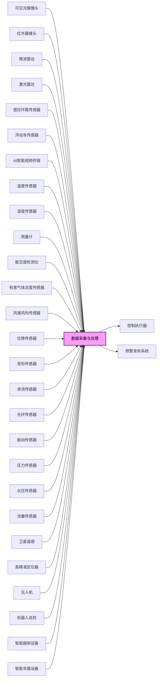
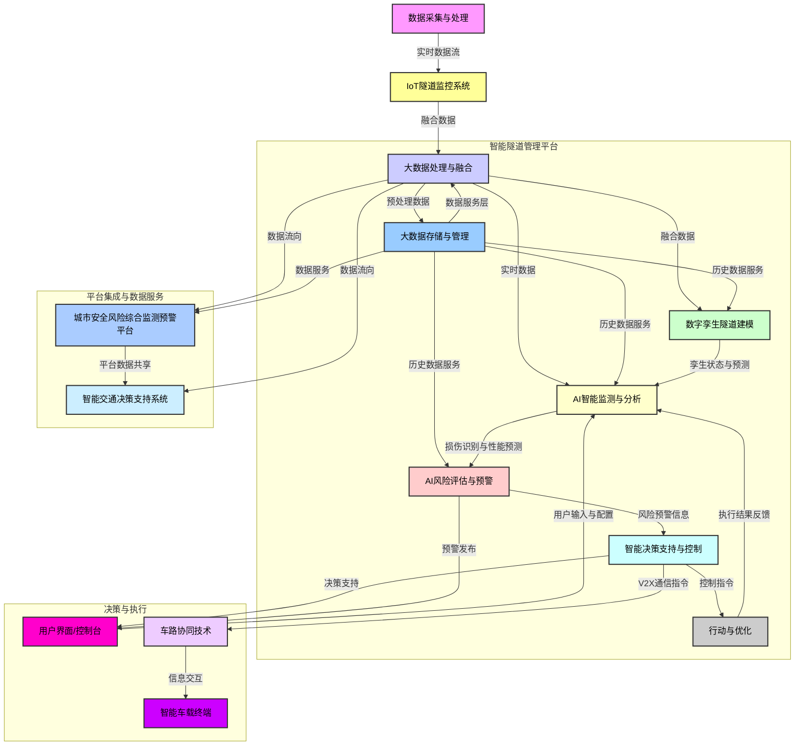

# **隧道风险预警系统**

- [**隧道风险预警系统**](#隧道风险预警系统)
  - [**I. 引言**](#i-引言)
    - [**1.1 隧道概述与分类**](#11-隧道概述与分类)
    - [**1.2 隧道交通安全挑战与风险预警系统的重要性**](#12-隧道交通安全挑战与风险预警系统的重要性)
  - [**II. 隧道特有风险分析**](#ii-隧道特有风险分析)
    - [**2.1 交通事件风险**](#21-交通事件风险)
    - [**2.2 火灾风险**](#22-火灾风险)
    - [**2.3 地质与结构风险**](#23-地质与结构风险)
    - [**2.4 环境与运营风险**](#24-环境与运营风险)
  - [**III. 隧道风险预警系统架构与功能**](#iii-隧道风险预警系统架构与功能)
    - [**3.1 系统目标与意义**](#31-系统目标与意义)
    - [**3.2 系统总体架构**](#32-系统总体架构)
    - [**3.3 核心功能模块**](#33-核心功能模块)
  - [**IV. 关键技术与传感器应用**](#iv-关键技术与传感器应用)
    - [**4.1 交通流与事件检测技术**](#41-交通流与事件检测技术)
    - [**4.2 环境监测技术**](#42-环境监测技术)
    - [**4.3 结构健康监测技术**](#43-结构健康监测技术)
    - [**4.4 机器人巡检与智能运维**](#44-机器人巡检与智能运维)
    - [**4.5 数字孪生与车路协同**](#45-数字孪生与车路协同)
  - [**V. 隧道风险预警系统建设与运营管理**](#v-隧道风险预警系统建设与运营管理)
    - [**5.1 相关设计与运营规范**](#51-相关设计与运营规范)
    - [**5.2 应急预案与演练**](#52-应急预案与演练)
    - [**5.3 智能运维与发展趋势**](#53-智能运维与发展趋势)
  - [**VI. 结论与展望**](#vi-结论与展望)
    - [**6.1 结论**](#61-结论)
    - [**6.2 展望**](#62-展望)
      - [**引用的资料**](#引用的资料)

**变更历史**
| 日期时间     | 类型   | 作者   | 描述                  |
| ----------- | ------ |------- | --------------------- |
| 2025-06-20  | 增     | Capric | 分类、传感器、参考资料  |
| 2025-06-23  | 增     | Capric | 相关国标、产品目录、图表 |

**产品目录**
| 参数                 | 类型           | 关键特性                                           | 厂商                                                                               |
| :------------------- | :------------- | :------------------------------------------------- | :--------------------------------------------------------------------------------- |
| 交通流状态检测       | 可见光摄像头   | 目标检测、追踪；AI分析；低照度适应性               | 微创、海康、大华、宇视、天地通、华为                                               |
| 交通流状态检测       | 红外摄像头     | 目标检测、测温；烟雾识别；恶劣能见度穿透性好       | 海康、高德、大恒、Allied Vision、Blue Vision、Xenics                               |
| 交通流状态检测       | 微波雷达       | 车流检测、测距；恶劣天气穿透性好                   | 博世、大陆、海拉、德尔福、富士通天、电装                                           |
| 交通流状态检测       | 激光雷达       | 车流检测、测距；远距离、高精度探测                 | 禾赛科技、速腾聚创、Luminar、法雷奥                                                |
| 交通流状态检测       | 感应环路传感器 | 车辆存在、流量、速度检测                           | 安森美、意法、德仪、博世、科锐、TE、村田、多维                                     |
| 交通流状态检测       | 浮动车传感器   | 实时路况信息；大范围、动态交通流数据               | 博世、森萨塔、恩智浦、英飞凌、TDK                                                |
| 交通流状态检测       | AI智能视频终端 | 智能算法与前端设备结合；设备端数据解算、处理、分析 | 微创、商汤、海康、大华                                                             |
| 环境条件监测         | 温度传感器     | 监测隧道结构内外温度；热胀冷缩效应                 | TE Connectivity、纳芯微（Novos）                                                   |
| 环境条件监测         | 湿度传感器     | 监测隧道内外湿度；材料耐久性影响                   | Vaisala（维萨拉）、SmartSolo Scientific（面元科学仪器）                          |
| 环境条件监测         | 雨量计         | 实时监测隧道出入口降雨量；评估积水风险             | 北京华益瑞、万象环境、天泽科技、北京精诚华泰、云蓝风汇、Hach（哈希）               |
| 环境条件监测         | 能见度检测仪   | 监测隧道内部能见度；雾、烟雾、灰尘影响             | 山东天格光电、潍坊瑞格、富奥通、Campbell、Enviro、Young、Belfort                 |
| 环境条件监测         | 有害气体浓度传感器 | 监测CO、NOx、PM2.5、CH4等气体浓度；通风系统联动    | 深传感、格林杜尔、博纳德、汉威、炜盛、Honeywell、西门子、MSA、City、FIGARO、安费诺 |
| 环境条件监测         | 风速风向传感器 | 监测隧道内风向风速；优化通风控制                   | SmartSolo Scientific（面元科学仪器）、DEIF（丹控电气）                             |
| 基础设施结构健康监测 | 位移传感器     | 监测衬砌、围岩位移；变形早期预警                   | MTS、科陆电子、炜衡、航天科技、TE、巴鲁夫、施克、倍加福                         |
| 基础设施结构健康监测 | 变形传感器     | 监测结构变形、裂缝扩展                             | 柯力传感、中航电测、威世、HBM、梅特勒-托利多、富林泰克、NMB                      |
| 基础设施结构健康监测 | 渗流传感器     | 监测隧道渗水、排水系统状态                         | Honeywell、西克、倍加福、艾默生、WIKA、ABB                                         |
| 基础设施结构健康监测 | 光纤传感器     | 空间连续监测（分布式）；抗干扰、耐腐蚀、寿命长     | 基恩士、松下、欧姆龙、西克、邦纳、倍加福、劳易测、理工光科                       |
| 基础设施结构健康监测 | 振动传感器     | 监测结构振动；早期发现异常                         | 上海振动器厂、上海航振、上海瑞鸿、北京华兴、泰隆电子                               |
| 基础设施结构健康监测 | 压力传感器     | 监测围岩压力、衬砌受力状态；智能螺母预警           | 麦克传感、华天科技、苏州明皜、中航电测、上海芯敏、东方万和、Honeywell、西克、博世 |
| 基础设施结构健康监测 | 水压传感器     | 监测排水管网水压；评估爆管、塌陷风险               | 佛山普量、佛山天华、佛山贺迪、深圳泰科芯元、格林福                               |
| 基础设施结构健康监测 | 流量传感器     | 监测排水管网流量；评估水患风险                     | 川仪、威尔泰、E+H、艾默生、科隆、西门子、ABB、OMEGA、Honeywell、欧姆龙           |
| 基础设施结构健康监测 | 卫星遥感       | 毫米级形变监测（InSAR）；大范围、非接触、高精度      | 中国航天、中国空间技术研究院、上海航天技术研究院、中国东方红卫星、中国卫星、四维图新、中科星图、航天宏图、北京揽宇方圆、长光卫星 |
| 基础设施结构健康监测 | 高精准定位器   | 隧道结构毫米级高精度定位监测；基于北斗/GNSS技术    | 司南导航、和芯星通、北方华创、南方测绘、六分科技、u-blox、世导通、大疆D-RTK      |
| 辅助监测与巡检       | 无人机         | 高效率、高分辨率视觉检查；AI算法识别               | 大疆、Parrot、昊翔、道通、亿航、航天彩虹、中科遥感                               |
| 辅助监测与巡检       | 机器人巡检     | 自动化巡检；高效率、高安全性；可达人工难触及区域   | 主流机器人厂商、智能巡检系统集成商                                                 |
| 智能系统与平台       | AI智能体分析   | 分析传感器数据、图片、文本报告；自动评估结构健康状态；预测寿命；生成警报 | 中交路桥科技、扣子、文心智能、司马诸葛、智谱清言、腾讯元器、LinkAI             |
| 智能系统与平台       | IoT隧道监控系统 | 整合设备和传感器；构建互联交通监控系统；提高流动性和安全性 | Digi International、研华、华为、中兴、海康、大华                                   |
| 智能系统与平台       | 城市安全风险综合监测预警平台 | 风险监测感知层；全方位、立体化感知城市生命线、公共安全、生产安全和自然灾害等风险 | 赛飞特、辰安科技、泰策科技、万宾科技                                               |
| 智能系统与平台       | 数据服务层     | 各行业领域监测感知数据汇聚、处理；数据存储、治理、计算；城市安全专题数据库建设 | 数据库厂商                                                                         |
| 智能系统与平台       | 智能交通决策支持系统 | 汇集多种高新技术；实时和预测交通状况发布；优化交通流量 | 华为、商汤、久其软件、北京京东世纪                                                   |
| 智能系统与平台       | 车路协同技术   | 道路端传感器补充车载感知能力；提升自动驾驶效率和安全性 | 百度、大唐高鸿、北京千方、北京万集、华为、江苏雷科防务、深圳金溢、图达通智能、海康、中国汽车工程研究院 |
| 智能系统与平台       | 智能路侧设备   | 实现车路之间可靠的高速数据通信                     | 同车路协同技术厂商                                                                 |
| 智能系统与平台       | 智能车载设备   | 提供辅助驾驶和V2X应用功能                          | 新能源汽车厂商、辅助驾驶厂商                                                       |
| 智能系统与平台       | 数字孪生隧道   | 隧道基础设施全要素、全周期数字化；虚拟模型与实体映射；模拟、预测、运维决策 | 超图软件、神州数码、亚信、GIS厂商                                                  |

**数字孪生隧道 —— 智能监测、预警、决策系统**

**产品目录**

## **I. 引言**

### **1.1 隧道概述与分类**

隧道作为交通基础设施的重要组成部分，是供汽车和行人通行的封闭或半封闭通道 1<color>。本报告主要关注公路隧道，但鉴于铁路隧道和城市隧道在安全挑战上的共通性与独特性，亦将适时提及。公路隧道根据其等级和类型进行划分，例如高速公路、一级、二级、三级和四级公路隧道，以及钻爆隧道、盾构隧道、沉管隧道和明挖隧道等 1<color>。铁路隧道的设计则强调以人为本、服务运输、技术先进、经济耐久和便于养护维修的理念，主要适用于新建标准轨距铁路 3<color>。城市隧道在城市道路工程设计中占据重要地位，其景观设计旨在为使用者提供良好的体验，涵盖光环境、声环境和空气环境设计，并注重与周边环境的美学融合 6<color>。

过去几十年，中国在铁路、公路隧道、水工隧洞、城市地铁隧道和综合管廊隧道建设方面取得了显著进展，涌现出大量特长、超深埋、超大断面、高海拔等重大工程 10<color>。这些重大工程的建设不仅推动了中国在隧道修建技术上的巨大进步，也为勘察、设计、施工、装备以及安全运维带来了巨大的技术挑战 10<color>。

中国隧道建设的巨大规模和多样性，从高速铁路的特长隧道到城市地下管廊，表明风险预警系统不能采用一刀切的模式。这种规模和多样性，特别是不同类型隧道之间可能存在的相互关联或地理接近性（例如，城市区域内的公路隧道与地铁隧道），意味着单一隧道的安全事件可能在更广泛的交通基础设施网络中引发连锁反应。因此，将“道路风险预警系统”应用于隧道时，必须超越单个隧道的边界，考虑整个隧道网络或交通走廊内的系统性风险和相互依赖性。这要求预警系统具备更高的集成度和可扩展性，以实现一种网络化的安全管理模式。这种模式的实施意味着未来的预警系统需要重点关注数据共享、互操作性以及跨不同隧道类型和行政边界的协调响应，而非孤立的部署。

### **1.2 隧道交通安全挑战与风险预警系统的重要性**

隧道与开放道路环境存在显著差异，其封闭或半封闭的特性极大地改变了交通流、环境条件和应急响应的复杂性。隧道内部空间有限，横断面狭窄，一旦发生火灾等事故，车辆难以向前行驶，导致人员疏散和救援面临巨大困难 12<color>。烟雾和热量在隧道内迅速积聚，严重影响能见度，并对人员健康构成威胁 12<color>。此外，隧道内外光照强度差异显著，可能导致驾驶员出现“黑洞”或“白洞”效应，暂时性视觉障碍，从而增加事故风险，尤其是在进出洞口区域 17<color>。与开放道路相比，隧道内事故的伤害严重性通常更高 20<color>。事故高发区域通常集中在隧道接近段和入口段 20<color>。

为了有效降低这些风险，及时、准确的预警信息至关重要。预警系统应能够通过广播、电子显示屏等多种方式，及时向行车上游的驾驶员发布相关信息 17<color>。这使得驾驶员能够提前采取减速、规避等措施，从而减少交通事故的发生 17<color>。此类系统对于根据实时行车环境动态调整限速并提供预警具有决定性作用 17<color>。

隧道固有的危险性，如烟雾的快速蔓延、事故的严重性以及有限的逃生路径，要求安全管理从被动响应向主动风险预测和预警转变。系统的价值不仅仅在于事件发生后发出警报，更在于通过早期干预来预防事故的发生或最小化其初始影响。隧道近似密闭空间的特性意味着一旦事故发生，其影响（烟雾、高温、拥堵、被困车辆）会迅速升级且难以控制。因此，隧道风险预警系统的首要目标必须是预防和早期干预，而非仅仅是事后响应。系统需要通过实时交通异常检测、环境变化监测等手段，预判风险并及时发出预警，从而最大程度地减少事故的初始影响，并有效避免二次事故的发生。这种转变推动了对先进传感技术、预测分析能力以及快速、自动化预警信息发布的需求，超越了简单的交通监控，迈向全面的风险评估。

**表1：隧道与开放道路交通特性对比**

| 特性 | 开放道路 | 隧道 |
| :---- | :---- | :---- |
| 空间/环境 | 开放，通风良好 | 封闭/半封闭，通风受限，烟雾/热量易积聚 12 |
| 事故严重性 | 相对较低 | 伤害严重性更高 20 |
| 事故高发区域 | 分布广泛 | 接近段、入口段、转换段频率更高 20 |
| 能见度 | 通常良好，受天气影响 | 洞内外光照差异大（“黑洞/白洞效应”）17，烟雾影响 12 |
| 疏散与救援 | 相对容易，路径多样 | 疏散困难，避难空间有限，救援复杂 12 |
| 危险品运输风险 | 相对较低，易于疏散 | 火灾蔓延快，浓烟高温，扑救困难，对结构损害大 14 |
| 交通拥堵 | 原因多样，影响范围广 | 容量有限，易回堵，影响紧急响应 21 |
| 运营管理 | 相对独立 | 涉及多部门协调，管理责任需明确 14 |

## **II. 隧道特有风险分析**

### **2.1 交通事件风险**

隧道内常见的交通事故类型包括连环相撞和车辆侧滑 22<color>。这些事故的发生与多种因素紧密相关。驾驶员行为是主要原因之一，例如超速、超载、超宽、违章超车、爆胎以及与前车距离过近 22<color>。疲劳驾驶在重大事故中也扮演了重要角色 23<color>。此外，驾驶员操作不当，如进入隧道不减速、不开启车灯、随意变道超车等，也是事故频发的重要原因 22<color>。环境因素同样构成风险，例如进入隧道时因光线骤变产生的“黑洞”效应，可能导致驾驶员暂时性视力受损并失去对车辆的控制 18<color>。路面湿滑或结冰也是导致车辆失控的因素 17<color>。部分事故也与隧道设计缺陷有关，例如隧道口形成“断头路”的不良设计 23<color>。

隧道内能见度差，极大地增加了二次事故的风险。如果初次事故未能及时清理或设置警示标志，后方来车因车速过快或注意力不集中，极易引发二次碰撞 14<color>。这些二次事故往往危害性更大，涉及更多车辆和人员，造成严重的交通堵塞，带来巨大的经济损失和人员伤亡 14<color>。此外，隧道因其容量有限、设计缺陷（如互通立交过多）以及外部因素（如施工、自然灾害或事故导致的封路）而极易发生严重拥堵 21<color>。拥堵不仅增加了通勤时间，还导致驾驶员压力增大、燃料浪费和空气污染，并严重阻碍紧急救援 21<color>。

在隧道内运输危险品或易燃化学品时发生事故，其危害性尤为突出。火势蔓延迅速，难以控制，并产生大量高温有毒浓烟，难以疏散，严重阻碍救援工作，并对隧道结构造成巨大损害 14<color>。

由驾驶员行为（如超速、疲劳驾驶、操作不当）以及“黑洞效应”导致的事故频发，揭示了人机界面存在的关键挑战。其根本问题在于，在隧道这种快速变化和受限的环境中，人类的感知和反应时间往往不足。因此，先进的预警系统不仅需要检测风险，还必须以直观、及时的方式将这些风险有效传达给驾驶员，甚至在未来通过智能车路协同来弥补或纠正人为失误。这种对人机交互的关注，意味着预警系统需要超越简单的视觉提示，采用更复杂、多模态（视觉、听觉、触觉）且情境感知的通信策略，以应对驾驶员的认知负荷和反应时间限制。最终，这可能推动车辆与基础设施之间的V2X通信、车载预警系统以及自适应控制系统的发展，从而更有效地引导或干预驾驶行为。

### **2.2 火灾风险**

隧道火灾具有独特的危险特性。由于隧道内部空间狭小，近似密闭，火灾发生后火势蔓延迅速，且难以控制 12<color>。车辆本身携带的燃油以及可能运输的可燃物、化学品、危险品，都可能导致火势迅速扩大 14<color>。火灾产生的浓烟和热气不易散发，导致能见度极低，温度迅速升高，并因不完全燃烧产生大量有害气体和缺氧环境 12<color>。浓烟会遮蔽视频监控设备，使其无法发挥灾情监控功能 12<color>。高温使得灭火人员难以靠近火源，延长了灭火时间 14<color>。在双向交通隧道或特长隧道中，救援路线可能与烟气流动路线交叉，救援面和途径有限，极大地增加了扑救难度 14<color>。

高温对隧道结构造成严重破坏。当衬砌混凝土中的水分受热汽化膨胀时，可能导致混凝土在短时间内爆裂、崩落（如200°C下10-15分钟内），严重损坏隧道主体结构，进一步增加人员避难逃生的困难 12<color>。隧道内部横断面狭窄，车辆前后紧密，火灾发生时人员和车辆疏散极其困难，即使设有车行联络隧道也难以有效疏散火点后方的车辆 12<color>。此外，隧道坡度对火灾烟气蔓延和温度分布有显著影响，可能形成“烟囱效应”加剧灾情 16<color>。

隧道火灾不仅是事故，更具有迅速升级为灾难的独特潜力，导致严重的次生灾害（如毒烟、结构坍塌、救援受阻）。这表明火灾预警系统必须优先考虑超高速检测和自动化、集成化的响应机制（例如，通风系统启动、应急照明、交通管制），以防止初始事件演变为重大灾难。单纯的人工干预往往反应迟缓，难以应对这种快速变化的局面。隧道火灾的“灾难性升级潜力”意味着有效干预的时间窗口极其狭窄。因此，火灾预警系统必须具备极高的检测速度，并能触发自动化、预编程和集成化的缓解措施，例如激活特定的通风模式（纵向、横向或半横向）、部署消防系统以及实施实时交通封闭和疏散引导。系统的有效性将取决于其阻止火灾达到最大破坏潜力的能力。这要求高度可靠和冗余的火灾探测传感器（如线型光纤感温火灾探测器、红外火焰探测器）、智能化的通风和交通控制系统，以及预定义且可快速部署的应急场景。

### **2.3 地质与结构风险**

隧道工程极易受到地质灾害的影响，尤其是在中国西南和西北等山区 25<color>。滑坡和崩塌是常见的自然灾害，它们可能摧毁农田、房屋和基础设施，造成巨大的经济损失和人员伤亡 25<color>。这些灾害可以直接威胁隧道洞口和隧道本体的安全，甚至堵塞河流，引发洪水和进一步的灾害链 27<color>。泥石流则具有突发、凶猛和迅速的特点，兼具崩塌、滑坡和洪水的破坏力，其危害程度往往更为广泛和严重 25<color>。泥石流可以掩埋基础设施、中断交通，甚至导致运行中的列车或汽车倾覆 25<color>。这些地质灾害的成因复杂，包括复杂的地质条件、气候变暖导致的极端强降雨、破坏性地震以及不科学的工程活动，这些因素都可能改变地表原有稳定状态，从而诱发新的地质灾害 26<color>。

隧道衬砌结构在修建和运营过程中，由于设计施工不良、侵蚀环境影响、突发自然灾害和事故等原因，容易出现不同类型和程度的劣化和病害 28<color>。常见的损害包括衬砌劣化、剥落、错台和渗漏水 28<color>。隧道开挖会导致围岩应力调整和转移，伴随变形和破坏。围岩变形通常经历缓慢变形、急剧变形（易发生坍塌）、变形减缓和变形稳定四个阶段 29<color>。初期支护失效可能导致大范围坍塌 29<color>。

渗漏水是隧道常见的病害，例如盾尾密封或铰接密封漏水漏砂，可能导致洞内泥浆堆积、密封失效、隧道被淹、地表沉降甚至坍塌 30<color>。排水系统堵塞会显著减少隧道排水量，增加结构外部水压力，并导致仰拱隆起 31<color>。地震对隧道造成的破坏也十分严重，包括隧道坍塌、衬砌开裂错位和轨道系统扭曲 28<color>。断层附近或跨断层区域的交通结构震害通常更为严重 32<color>。具体的震害表现包括线位错动、剥落掉块和挤压裂缝 33<color>。

地质灾害（如滑坡、泥石流）通常是其他环境因素（如极端降雨、地震活动）的触发因素或次生效应。这些外部事件进而直接影响隧道的结构完整性（如变形、渗漏、坍塌）。这揭示了一个复杂的多因素因果链。因此，隧道风险预警系统必须整合多灾害监测（地质、水文、地震）与结构健康监测，以预测和预警级联故障，强调了建立全面环境和地质数据库的必要性。数据表明，地质灾害与更广泛的环境因素之间存在关键的相互关联性。例如，极端降雨可能增加滑坡风险，进而影响隧道稳定性或排水系统，导致渗漏水和进一步的结构应力。因此，一个强大的隧道风险预警系统必须超越对单一风险类型的孤立监测，转而进行多灾害融合分析，将环境数据与结构响应关联起来，以预测和预警级联故障。这种方法要求建立高度集成的数据平台、复杂的分析模型（如岩土、水文、结构模型），并可能利用预测性人工智能算法来识别模式并在故障变得临界之前进行预测。

### **2.4 环境与运营风险**

隧道，特别是长隧道，容易受到空气质量问题的影响。这主要源于车辆排放物（如一氧化碳CO、氮氧化物NOx、PM2.5）以及地质构造中可能逸出的有害气体，例如瓦斯（甲烷CH4）34。通风不足会导致这些污染物积聚，对驾驶员健康构成威胁并降低能见度。除了“黑洞/白洞效应”外，隧道内普遍能见度可能因烟雾、灰尘、雾气或照明不足而降低，从而增加事故风险 12<color>。极端温度（例如寒冷地区的路面结冰 17）和高湿度会影响路面状况、设备性能以及驾驶员的舒适度和安全。

运营管理方面的不足也构成了显著风险。隧道管理方主体安全责任不明确，可能导致对隧道通行环境、各类设备设施的养护、交通监控和消防设备完好性等环节管理不善 14<color>。在事故救援过程中，消防、机电、交管、监控等各部门之间缺乏有效协调，会严重阻碍救援工作的开展 14<color>。此外，事故发生后未能及时撤离现场或设置危险警告标志，极易引发二次事故 14<color>。

尽管技术解决方案至关重要，但运营风险（如责任不清、维护不善、协调不足）揭示了仅靠技术无法完全解决的系统性脆弱性。这表明即使拥有先进的预警系统，人为和组织因素仍然是重要的薄弱环节。因此，一个全面的隧道风险预警系统必须与健全的运营管理规程、明确的问责框架以及定期的多机构应急演练相结合，以确保技术的有效利用和协调一致的人员响应。运营管理方面的不足代表了可能削弱最先进预警系统效益的“系统性盲点”或“瓶颈”。例如，火灾的快速检测如果救援团队协调不力或设备维护不善，将变得毫无意义。这表明“隧道风险预警系统”不仅应被视为一个技术产物，更应被视为一个社会技术系统，其中人工流程、培训、机构间协调和明确的问责制与传感器和算法同样重要。因此，报告必须强调需要集成培训计划、跨部门演练、明确的标准操作程序（SOP），以及对人工操作员和管理团队的绩效评估指标，与技术部署并行推进。

**表2：隧道主要风险类型与特点**

| 风险类别 | 具体风险类型 | 隧道内特点 |
| :---- | :---- | :---- |
| **交通事件风险** | 追尾、多车连撞、侧滑 | 驾驶员行为影响大，光线骤变效应，易发二次事故 18 |
|  | 交通拥堵 | 空间狭小，容量有限，影响紧急救援 21 |
|  | 危险品运输事故 | 火势蔓延快，浓烟高温，结构损害大 14 |
| **火灾风险** | 火势快速蔓延 | 密闭空间，易燃物多，难以控制 12 |
|  | 浓烟高温与有毒气体 | 烟雾积聚，能见度低，散热慢，威胁生命 12 |
|  | 结构破坏 | 高温导致混凝土剥落、崩塌 12 |
|  | 疏散与救援困难 | 空间狭窄，车辆堵塞，救援通道受阻 12 |
| **地质与结构风险** | 滑坡、崩塌、泥石流 | 威胁洞口及本体，可引发次生灾害链 25 |
|  | 围岩变形与失稳 | 应力调整，急剧变形阶段易坍塌 29 |
|  | 渗漏水 | 导致泥浆积聚、结构受损、地面沉降 30 |
|  | 地震破坏 | 衬砌开裂错位，结构坍塌，轨道扭曲 28 |
| **环境与运营风险** | 空气质量恶化 | 车辆排放及瓦斯逸出，影响健康与能见度 34 |
|  | 能见度降低 | 烟雾、灰尘、照明不足等 12 |
|  | 温度与湿度异常 | 影响路面状况、设备性能及驾驶安全 17 |
|  | 运营管理缺陷 | 责任不清，维护不善，部门协调不足 14 |

## **III. 隧道风险预警系统架构与功能**

### **3.1 系统目标与意义**

隧道风险预警系统的首要目标是减少交通事故及其严重程度，通过及时发布预警信息来实现 17<color>。系统旨在使驾驶员能够提前采取减速、规避等措施 17<color>。同时，它能够根据实时行车条件动态调整限速并提供预警 17<color>。最终，该系统致力于实现隧道的“全寿命周期安全运维” 10<color>。

该系统的意义在于显著提升隧道的行车安全性，特别是在出入口等关键区域 17<color>。它有助于改善交通流，减少拥堵，并最大程度地降低事故造成的经济损失和人员伤亡。此外，该系统支持智能交通的发展，推动交通运输向综合化、协作化和自动化方向迈进 17<color>。

系统的目标超越了简单的“预警”，而是主动引导驾驶员行为，并可能在未来影响车辆的自主行动。这标志着从被动信息传播模式向主动干预、最终实现预测性和规范性安全管理系统的转变。其重要性不仅在于预防单一事故，更在于优化整个隧道运营的安全性和效率。系统的目标不仅仅是发出静态“警告”，而是提供智能、自适应的引导，主动塑造驾驶员行为（例如，动态限速、具体的避让指令），并长期与自动驾驶车辆直接交互。这代表着从“检测-警报”模式向“感知-预测-规定-控制”模式的转变。预警成为更广泛智能交通管理策略的一部分，旨在实现最佳和安全的隧道运营，而不仅仅是避免事故。这种未来愿景需要与V2X（车路协同）通信、用于预测建模的先进人工智能以及可能与联网车辆直接控制接口的无缝集成，从而实现真正的“智能隧道”环境。

### **3.2 系统总体架构**

现代隧道风险预警系统普遍采用“端边云”分层架构，将分散的机电设备整合起来，实现全面的管理和控制 39<color>。

在**边缘层**，主要负责本地数据采集和初步处理，包括各类传感器和本地控制单元。这确保了数据的实时性和初步响应能力。

在**云端层**，则进行集中存储、高级处理、数据融合分析以及平台级预警 39<color>。这种分层设计使得系统既能快速响应本地事件，又能进行宏观分析和决策。

一个统一的平台对于管理多样化的数据源和功能至关重要。该平台提供**隧道概览**，包括隧道分布、基础信息统计、运行状态和通行统计，从而全面掌握隧道整体情况 39<color>。

**资产管控**功能实现设备资产的集中管理、统一维护、状态数据管理和采集数据管理 39<color>。

**智能监测**模块能够实时监测交通、视频、事件、火灾、照明、环境、能耗和电力等运营动态，主动发现异常情况 39<color>。

**智慧管控**功能则支持“一键管控”，远程控制照明、交通设备、风机、卷帘门和电力，实现所有设备的联网联控 39<color>。在

**应急处置**方面，系统支持事件检测、上报、应急资源管理、应急处理和可视化调度，实现各类事件的协同处置 39<color>。

系统的核心技术包括基于物联网平台，实现广泛的设备接入和远程控制 39<color>。通过一体化超融合设备，实现宽环境部署，集成了存储、计算、网络、安全和人工智能的全栈能力，部署简便，开箱即用，并支持远程自动运维 40<color>。此外，系统基于OpenHarmony操作系统和边缘物联网关，实现机电设备的统一接入、纳管、状态实时监控和统一业务操作，打破了系统壁垒 40<color>。

采用“端边云”架构和集成平台，标志着系统从碎片化、孤立的系统（例如，独立的交通、消防、通风系统）向整体、统一的智能框架转变。这意味着系统旨在实现所有隧道子系统之间的互操作性和数据融合，从而能够进行更复杂的分析、协调响应，并最终形成隧道的“数字孪生”表示。这种架构的采用和统一平台的建立，预示着从管理单个、孤立的隧道子系统向创建统一、智能生态系统的根本性转变。这种架构促进了来自不同来源数据的无缝融合，从而能够进行跨领域分析（例如，将交通拥堵与空气质量关联起来，或将轻微结构异常与近期地震活动关联起来）。这种集成对于识别孤立系统可能遗漏的复杂、多因素风险至关重要，并能协调和优化所有隧道设施的响应。这种架构的演进是实现数字孪生和人工智能驱动的预测性维护等高级应用的前提，因为它为这些复杂功能提供了必要的数据骨干和计算能力。

### **3.3 核心功能模块**

隧道风险预警系统的核心功能模块旨在全面感知环境信息并高效发布预警。

**环境信息感知**是系统的基础，能够全面感知影响隧道行车安全的各种因素，包括车流量、车速、路面状况（如结冰或积水）、光照强度和能见度 17<color>。这通过部署多种传感器实现，例如磁阻传感器、温湿度传感器和光照传感器，以采集多样化数据，而非仅仅依赖单一信息 17<color>。

**车流量和车速检测**采用磁阻传感器实现。通过探测车辆经过传感器附近时产生的磁场畸变，系统能够监测车辆的存在，并通过在50米范围内部署的多个传感器采集的信息，推导出车辆的速度和一段时间内的流量 17<color>。此外，人工智能视觉技术和激光雷达（LiDAR）也可用于实时图像处理、目标检测和跟踪（例如轨道上的异物），进一步提升检测精度 41<color>。

**预警信息发布**是系统的关键输出。系统能够根据实时环境状态，必要时生成预警信息，并通过广播、电子显示屏等多种形式向驾驶员发布 17<color>。预警信息来源于外部交通状态数据和气象数据，也包括系统内部生成的预警，例如隧道口车流量大、拥堵导致的追尾风险，洞口两侧光照强度差异大导致的“白洞/黑洞”效应，以及路面湿滑或结冰导致的车辆失控风险 17<color>。

**用户接口和数据访问**为管理人员提供了便捷的交互方式。系统通过管理服务端和网页提供用户接口，允许用户访问传感器实时采集的最新信息，并进行调控设置 17<color>。处理后的数据可以通过公安专用网接口传输到交通指挥中心，也可通过互联网提供系统用户接口 17<color>。

对预警信息发布“多种形式”的强调（广播、显示屏、车载系统）以及利用“全面的环境信息”生成“更有指导意义的限速值及预警信息”，表明系统正朝着多模态和情境感知预警发布方向发展。这意味着系统不仅检测威胁，还会根据特定条件（如光照条件、交通密度、危险类型）和驾驶员当前状态，调整预警内容和传递方式，从而最大限度地提高有效性并减少信息过载。系统核心功能模块的设计旨在实现多模态和情境感知的预警发布。这意味着系统会根据具体的危险、环境条件（例如光线、能见度）、交通密度，甚至驾驶员可能存在的认知状态，调整预警的类型、内容和传递机制。例如，“黑洞效应”预警可能涉及特定的照明调整和视觉提示，而火灾预警则会触发响亮的音频警报和清晰的疏散指示。目标是确保预警不仅被发出，而且被驾驶员有效地接收并采取行动，减少模糊性并提高响应时间。这需要复杂的算法进行实时风险评估、动态内容生成和智能选择预警通道，并可能与车载系统集成以实现个性化警报。

## **IV. 关键技术与传感器应用**

### **4.1 交通流与事件检测技术**

隧道风险预警系统的有效性依赖于先进的交通流与事件检测技术。

**磁阻传感器**被用于检测车辆的存在，并通过分析磁场畸变来推断交通流量和车速 17<color>。这种方法实施简单、成本低廉，其关键在于对磁信号的模式识别算法 17<color>。

**视频和热成像传感器**，如FLIR交通传感器，是传统地感线圈检测器的高度可靠替代方案 42<color>。它们能够检测汽车、自行车和行人，从而实现交叉路口的智能控制和交通流优化 42<color>。热成像传感器通过探测热量而非光线工作，使其在极端照明条件（如刺眼阳光或潮湿路面反射的车前灯）下也能保持鲁棒性，从而减少误报和漏报，并提供更出色的信号时序 42<color>。在隧道内，这些传感器能够快速检测烟雾、抛洒物、行人和其他交通事件，有助于挽救生命并避免二次事故 42<color>。

**激光雷达（LiDAR）技术**提供了远距离检测能力，探测距离可达200米，具有99%的检测准确率和45°×25°的视场角 41<color>。它能够输出隧道入口的三维建模数据和图像数据，包括物体的大小、速度、方向和形状等信息 41<color>。激光雷达与摄像头结合，辅以上位机，通过5G无线通信或光纤通信与服务器交互，实现全面的隧道入口安全监控和预警服务 41<color>。

**人工智能视觉技术**利用深度神经网络算法，对视觉传感器采集的实时图像进行处理，智能识别轨道上的异物，并进行目标检测、边界回归和分类 41<color>。系统还能够智能识别铁轨，并采用卡尔曼滤波算法对障碍物的实时位置进行跟踪和补偿 41<color>。实时点云数据和图像数据可通过5G无线通信能力传输至云端服务器，进行平台级预警 41<color>。

整合磁阻、热成像、激光雷达和人工智能视觉等多种传感技术，标志着系统正朝着多传感器融合的方向发展。这不仅仅是增加传感器数量，更是将它们互补的优势结合起来（例如，热成像适用于低能见度环境，激光雷达提供精确的三维数据，人工智能视觉擅长智能目标识别），从而在复杂的隧道环境中创建更稳健、准确和全面的实时态势感知能力，克服单一技术的局限性。多种不同传感器技术（磁阻、热成像、激光雷达、人工智能视觉）的部署，是实现多传感器数据融合的战略性举措。每种技术都有其固有的优势和劣势（例如，热成像在低光/烟雾条件下表现出色，但缺乏精确距离；激光雷达提供准确的三维数据，但可能受大雨/雾影响；人工智能视觉在目标识别方面强大，但需要清晰的视觉）。通过融合来自这些互补来源的数据，系统可以实现显著更高的准确性、鲁棒性和全面的态势感知能力，特别是在隧道这种动态且充满挑战的环境中，条件可能迅速变化（例如，突然的烟雾、眩光）。这种融合减轻了单个传感器的局限性，并为预警算法提供了更可靠的输入。这种趋势要求先进的数据处理能力，包括实时数据同步、校准和融合算法，通常利用人工智能/机器学习从组合数据流中提取有意义的信息。

### **4.2 环境监测技术**

环境监测技术是隧道风险预警系统不可或缺的一部分，它确保了隧道内部环境的安全性与舒适性。

**空气质量传感器**用于监测隧道内有害气体，如一氧化碳（CO）、氮氧化物（NOx）、PM2.5、二氧化硫（SO）和臭氧（O3）的浓度 35<color>。系统能够根据空气质量传感器和CO传感器的输出数据，自动进入补充氧气、CO2吸收/PM2.5清除和/或空气净化模式 35<color>。有害气体报警模块具备浓度超标报警功能 35<color>。

**能见度传感器**对于评估隧道内部能见度状况和驾驶员安全至关重要，尤其是在烟雾、灰尘或照明不足的情况下。

**温度和湿度传感器**用于监测路面状况（例如结冰或积水风险）和隧道整体环境 17<color>。在寒冷地区，监测隧道内部温湿度以及围岩温度对于预防路面结冰和结构安全至关重要 38<color>。

**风速和风向传感器**对于通风系统的控制至关重要。它们测量隧道内特定点的风速，控制器根据风速检测值及其历史数据计算出的变化率来控制射流风机的启停，以实现节能通风和烟雾控制 43<color>。

各种环境传感器（空气质量、温度、湿度、风速）的集成，实现了环境的动态自适应。这不仅仅是警报不良条件，更是积极管理隧道环境（例如，根据CO/NOx水平调整通风，根据能见度调整照明，预警结冰路面）。这种主动的环境控制直接有助于安全和运营效率，在风险显现为事故之前将其降低。对环境监测（空气质量、温度/湿度、风速）的全面覆盖，表明系统正朝着动态环境自适应方向发展。这意味着系统不仅仅是被动地报告环境条件；它正在积极地管理这些条件，以维持安全的运行参数。例如，高CO水平会触发通风增加，或低温会触发关于结冰路面的警告。这种对隧道内部环境的主动控制是风险缓解的关键组成部分，可以防止条件恶化到危险状态，并优化通风和照明的能源消耗。这需要复杂的控制算法，将实时环境数据与交通状况和能源效率目标相结合，从而实现隧道的“智能气候控制”系统。

### **4.3 结构健康监测技术**

结构健康监测技术旨在持续监测隧道结构的完整性，及时发现劣化并预测潜在故障。

**分布式光纤传感器**被嵌入在二次衬砌混凝土内部或粘贴在结构物表面，用于获取初始应力场，实现隧道结构的在线、动态、实时健康监测 45<color>。这种技术能够提供连续的、高精度的结构状态数据。

**位移和变形传感器**对于监测围岩变形和结构位移至关重要 29<color>。监测内容包括地表水平位移、竖向位移以及净空收敛变形，特别是在高边仰坡或存在冲刷滑移风险的区域 38<color>。

**渗流和水压传感器**在岩溶隧道和富水隧道中必不可少，用于监测排水量和地下水压力等指标 38<color>。温度传感器也可以通过测量隧道壁温差来间接检测渗漏水 46<color>。

**振动传感器**虽然在提供的资料中未详细说明其在结构健康监测中的具体应用，但在全面的结构健康监测系统中，特别是在地震活跃区或交通量大的区域，振动监测通常是一个重要组成部分。

结构健康监测系统的特点包括：应稳定可靠、经济实用、安全联网，并且便于维护和升级扩容 38<color>。系统应具备与外部系统互联互通、数据共享以及实时展示监测结果的功能 38<color>。在隧道施工期预埋的监测仪器和传感器，如果符合监测要求，应继续使用 38<color>。系统还应提供科学的预警判断、告警和响应机制，以最大程度地减少虚警或漏警 47<color>。

对连续、实时结构健康监测（光纤、位移、渗漏）以及能够“综合评估和预测隧道结构长期性能”的能力的强调，表明系统正在从被动修复转向预测性维护和全生命周期管理。这意味着预警系统不仅用于应对即时安全威胁，还用于长期资产管理，优化维护计划，并延长隧道的运营寿命。持续、实时结构健康监测（光纤、位移、渗流）以及“综合评估和预测长期性能”的能力，表明系统正从被动修复转向预测性维护和全生命周期管理。这意味着预警不仅关乎迫在眉睫的坍塌，更关乎需要关注的劣化状况，以防止未来发生灾难性事件。这需要复杂的数据分析，包括用于异常检测和预测的机器学习模型，并与建筑信息模型（BIM）或数字孪生平台集成，以实现全面的实时结构健康概览。

### **4.4 机器人巡检与智能运维**

**机器人巡检**技术为地下隧道巡检提供了创新的解决方案，尤其适用于存在有毒有害气体等危险环境的隧道，有效降低了人工巡检的风险 48<color>。

巡检机器人具备多项关键能力，包括在线平稳运动、无线数据传输（包括图像信息）、设备发热和有毒气体检测、越障功能以及防火、防水功能 48<color>。与人工巡检相比，机器人巡检显著提升了运维效率，增加了巡检频次，并提高了巡检质量，能够发现人类肉眼不易察觉的异常，例如细微的水渍、裂缝或温度异常 48<color>。例如，新加坡能源集团已成功部署机器狗（如SPock）进行自主隧道巡检，这些机器狗配备视频摄像头和热成像仪，能够识别缺陷并记录报告 49<color>。在紧急情况下，它们甚至可以作为第一响应者，在无需人员进入的情况下评估情况并提供实时更新 50<color>。

\*\*智能运营与维护（O\&M）\*\*是隧道建设和运营行业的发展趋势，正朝着“绿色低碳、智能高效”方向迈进，这得益于人工智能、云计算、大数据等新一代信息技术的深度赋能 51<color>。

其主要驱动力包括：**国家战略**，智能建造是推动互联网、大数据、人工智能与实体经济深度融合的关键举措 52<color>。

**技术进步**，智能传感技术（高精度测量、高分辨率识别、高环境适应性）、5G、物联网和云计算的显著发展为智能运维奠定了基础 52<color>。

**大数据**，隧道工程大数据基础逐步形成，涵盖多源数据稳定采集传输、可靠存储、融合分析和多场景应用 52<color>。

**机器人技术**，巡检机器人及其他专用机器人的开发和应用，实现了危险或重复性任务的自动化，提高了效率和安全性 10<color>。

**云计算**，为海量数据处理和“隧道”大模型构建提供了良好的硬件基础 52<color>。

未来的发展方向包括：实现基础设施与装备一体化、多种运输装备继承设计、运营调度与服务一体化等**综合交通智能化协同与服务** 17<color>。通过无线通信、传感器和智能计算等技术，实现车与车、车与路信息交互和共享的

**合作式智能交通和自动驾驶** 17<color>。在隧道全寿命周期内实现建造和运维的

**机械化、信息化、自动化、少人化或无人化** 10<color>。此外，\*\*数字孪生和BIM（建筑信息模型）\*\*将用于实时监测、预测分析和智能维护规划 52<color>。

巡检机器人日益普及，标志着隧道运营维护正朝着人机协作的战略方向发展。这不仅仅是自动化，更是利用机器人执行危险、重复性或超出人类感官能力的任务（例如，检测渗漏的细微温度异常）。这种协作通过将人类从危险环境中解放出来，提高效率，并增加检查的质量和频率，从而更早地发现潜在风险，增强了安全性。机器人巡检的兴起不仅仅是自动化人工任务；它代表着风险缓解方面人机协作的战略转变。机器人可以进入危险区域，以更高的一致性执行重复性任务，并利用先进传感器（例如热成像仪）检测人类检查员难以察觉的异常（例如指示渗漏的细微温度下降）。这意味着人类可以专注于更高层次的分析和决策，而机器人则从隧道最危险和难以接近的部分提供连续、高保真的数据。预警系统受益于更频繁、客观和详细的输入，提高了风险识别的准确性和及时性。这种趋势将推动更自主和智能的机器人、机器人传感器数据的高级分析以及用于有效协作和远程控制的新型人机界面设计，最终实现“无人化”或“少人化”的隧道运营。

### **4.5 数字孪生与车路协同**

数字孪生技术在隧道风险预警系统中扮演着越来越重要的角色。  
其核心概念是一个可视化应用系统，它将高精地图和三维模型相结合，对交通实景和事件信息进行数字重构，提供与真实场景时空基准一致的数字化映射 54<color>。  
数字孪生系统具备多项关键功能：通过对接隧道视频系统和智能感知设备，实现对隧道内交通、车辆和环境状况的**实时运行监测** 53<color>。它能够精准识别隧道交通事故、交通违章、火灾、隧道病害等事件，以及温湿度、风速、照明、烟雾等异常指标，并及时发布预警 53<color>。在

**应急联动指挥**方面，平台能够自动匹配预先设置的应急预案，并在人工审核确认事件类型和级别后，启动应急联动，实现设施设备“一键”联动控制，提升应急事件处置效率和通行安全 53<color>。此外，平台还支持

**辅助决策分析**，包括交通运行分析、历史事故分析、隧道环境分析和隧道安全风险判别，为制定合理限速值、事故预防策略、风机/照明动态工作以及应急救援预案等提供决策支撑 53<color>。在

**智能养护管理**方面，系统实现对隧道内所有机电设施和智能感知设备的可视化管控，实时监测设备运行状态，并进行节能管控和智能巡检养护，对路面异物、墙壁渗漏水等异常情况进行检测预警，并预测隧道病害趋势 53<color>。

车路协同（V2X）技术是实现隧道智能化安全管理的关键。  
其概念是将无线通信、传感器和智能计算等技术综合应用于车辆和道路基础设施，通过车与车（V2V）、车与路（V2I）之间的信息交互和共享，实现交通系统的整体优化 17<color>。  
车路协同的发展需求在于支撑自动驾驶从单车智能向协同感知、协同决策和协同控制的技术路径发展 55<color>。它还需要兼顾更广泛的用户需求，包括智能网联车辆和现有普通车辆 55<color>。车路协同系统通常由交通参与者通过直连无线通信或5G通信与路侧子系统、云端子系统相连，路侧子系统再通过光纤有线通信或5G通信与中心子系统相连 55<color>。

在隧道中的应用方面，车路协同系统可以为个体智能车辆提供重点区域交通参与者信息、建议路径和车速引导等辅助决策服务 55<color>。在无GNSS信号或弱GNSS信号的隧道等区域，通过加设路侧单元（RSU）设施，确保V2X设备间的正常通信 55<color>。它还可用于危险场景预警、连续信号灯下的绿波通行、路侧智能感知、高精度地图下载和5G视频直播等 56<color>。长安汽车和景驰科技的自动驾驶车辆已成功穿越隧道，展示了车路协同在该场景下的应用潜力 56<color>。

数字孪生和车路协同技术融合，代表了主动安全管理的最高水平。数字孪生创建了用于预测分析和场景模拟的虚拟副本，而车路协同则实现了基础设施与车辆之间的实时协作智能。这种协同作用使系统能够从检测风险转变为高精度预测风险，并通过智能引导和自动化控制协同预防风险，最终目标是实现“零事故”环境。数字孪生和车路协同（V2X）技术的融合，代表了主动安全的顶峰。数字孪生提供了隧道的高保真、实时虚拟表示，从而能够进行复杂的预测建模、场景模拟（例如，火灾如何蔓延，拥堵如何形成）和全面的风险评估。V2X则充当“行动层”，实现了智能隧道基础设施（由数字孪生提供信息）与单个车辆之间的实时直接通信。这使得高度精细、个性化和主动的安全干预成为可能，例如根据数字孪生预测的风险，对联网/自动驾驶车辆进行动态速度调整、车道引导，甚至是自动制动/转向指令。这超越了单纯的“警告”，转变为“协同预防”事件。这种融合预示着隧道将成为自我感知、自我优化并积极参与驾驶任务的实体，从根本上将隧道安全管理从以人为中心、被动响应的模式转变为智能、主动和协作的系统，为在受限环境中实现完全自动驾驶铺平道路。

**表3：隧道风险预警系统关键传感器与监测内容**

| 传感器类别 | 特定传感器类型 | 监测内容 |
| :---- | :---- | :---- |
| **交通流与事件** | 磁阻传感器 | 车辆存在、车速、流量、拥堵 17 |
|  | 视频摄像头（可见光） | 交通流、事件（事故、违章、抛洒物、行人）42 |
|  | 热成像摄像头 | 烟雾、抛洒物、行人、设备异常发热、渗漏水温度异常 42 |
|  | 激光雷达（LiDAR） | 障碍物大小、速度、方向、形状，三维建模数据 41 |
|  | 人工智能视觉 | 轨道异物、目标检测、分类、跟踪 41 |
| **环境监测** | CO/NOx/PM2.5传感器 | 有害气体浓度、空气质量 34 |
|  | 能见度传感器 | 隧道内部能见度 17 |
|  | 温湿度传感器 | 路面状况（结冰/积水），隧道内部温湿度，围岩温度 17 |
|  | 风速风向传感器 | 风速、风向，用于通风系统控制 43 |
| **结构健康** | 分布式光纤传感器 | 结构应力场、变形、裂缝 38 |
|  | 位移/变形传感器 | 围岩变形、结构位移、收敛变形 29 |
|  | 渗流/水压传感器 | 排水量、地下水压力、渗漏水位置 31 |
| **机器人巡检** | 巡检机器人（含视频、热成像） | 设备运行状况、潜在安全隐患（发热、毒气），水渍、裂缝 48 |
| **高级集成** | 数字孪生平台 | 实时隧道数字映射，交通、车辆、环境、病害监测，应急联动，辅助决策，智能养护 53 |
|  | 车路协同（V2X）模块 | 车辆与基础设施信息交互，协同感知、决策、控制 17 |

## **V. 隧道风险预警系统建设与运营管理**

### **5.1 相关设计与运营规范**

中国已建立一套全面的国家和行业标准体系，用于指导隧道的设计和运营，并根据隧道类型进行分类。

**公路隧道**方面，主要依据《公路隧道设计细则》（JTG/T D70-2010）、《公路隧道施工技术规范》（JTG/T3660-2020）以及《公路隧道运营技术规范》等 1<color>。这些规范涵盖了抗震设计、通用设计原则、施工方法（如钻爆法、盾构法、沉管法）、结构类型（如复合式衬砌、喷锚支护）以及运营环境、交通和安全设施要求 1<color>。此外，还有针对照明（JTG/T D70/2-01-2014）和通风（JTG/T D70/2-02-2014）的专门细则 19<color>。

**铁路隧道**的设计遵循《铁路隧道设计规范》（TB 10003-2016），该规范强调以人为本、服务运输、技术先进、经济耐久和便于养护维修的设计理念 3<color>。整体安全管理则由《铁路安全管理条例》规范，涉及施工安全、保护区设置等 61<color>。

**城市隧道**的设计和运营则参考《城市道路工程设计规范》（CJJ37-2012）以及城市隧道景观设计和运营安全管理的相关指导文件 6<color>。这些规范涵盖了照明、声环境、空气环境、防火、疏散通道、通风排烟和火灾探测等多个方面 6<color>。

在**结构健康监测**方面，相关指南明确了监测内容、方法、传感器要求（如可靠性、稳定性、耐久性和使用寿命）以及系统特点（如稳定性、可靠性和互操作性）38。

尽管存在广泛的国家标准，但人工智能、物联网、数字孪生和机器人等技术的快速发展，可能导致“监管滞后”。这意味着需要持续、敏捷地更新标准，以将新的智能技术和运营模式（如预测性维护、车路协同集成）纳入官方指导方针，确保预警系统始终处于安全和效率的前沿。现有全面监管框架与智能技术快速发展并存，表明可能存在“监管演进滞后”。虽然现有标准确保了基本安全和质量，但它们可能未能完全涵盖或强制要求人工智能驱动的预测分析、多传感器融合、机器人巡检或数字孪生应用等最新进展。这意味着为了使隧道风险预警系统真正利用尖端能力，需要持续且紧迫地进行敏捷标准开发和更新。这些更新不仅应整合新技术，还应重新定义操作最佳实践，以应对智能系统引入的能力和复杂性。这要求研究机构、行业和监管机构之间更紧密的合作，以确保标准与技术进步同步发展，从而促进下一代隧道安全系统的安全有效部署。

**表4：中国隧道相关设计与运营规范**

| 隧道类型 | 标准类别 | 标准名称/代码 | 关键关注点/范围 |
| :---- | :---- | :---- | :---- |
| **公路隧道** | 设计 | 《公路隧道设计细则》（JTG/T D70-2010） | 抗震设计、通用设计原则、结构类型、平纵线位 1 |
|  | 施工 | 《公路隧道施工技术规范》（JTG/T3660-2020） | 施工安全、环保、质量保证措施 58 |
|  | 运营与维护 | 《公路隧道运营技术规范》 | 运营环境、交通管理、安全设施、应急预案 59 |
|  | 专用设施 | 《公路隧道照明设计细则》（JTG/T D70/2-01-2014） | 照明亮度、均匀度、眩光、诱导性 19 |
|  |  | 《公路隧道通风设计细则》（JTG/T D70/2-02-2014） | 通风方式、风速、空气质量 19 |
| **铁路隧道** | 设计 | 《铁路隧道设计规范》（TB 10003-2016） | 人本、服务运输、技术先进、经济耐久 3 |
|  | 运营与安全 | 《铁路安全管理条例》 | 铁路安全管理、施工安全、保护区 61 |
| **城市隧道** | 设计 | 《城市道路工程设计规范》（CJJ37-2012） | 交通功能、设计速度、建筑限界、防灾标准 7 |
|  | 景观与设施 | 《城市隧道景观设计规范》 | 光环境、声环境、空气环境、防火、疏散 6 |
|  | 运营与安全 | 《城市轨道交通运营安全风险分级管控和隐患排查治理管理办法》 | 设施监测养护、设备运行维修、行车组织、客运组织、运行环境风险 63 |
| **通用** | 结构健康监测 | 《隧道结构监测技术指南》 | 监测内容、方法、传感器要求、系统功能 38 |

### **5.2 应急预案与演练**

隧道运营管理企业必须根据管辖公路隧道突发事件的类型和特点，制定详细的应急演练计划 59<color>。定期组织开展应急演练，包括实战演练和桌面演练等多种形式，以确保人员广泛参与、处置联动性强、形式多样且高效节约 59<color>。应急演练的频率应根据公路等级和隧道长度确定 59<color>。

在事故工况下，应立即采取多项关键行动：利用沿线可变情报板、可变限速标志、广播、声光警报器、栏杆和车道指示器等设施，或通过现场人员指挥，禁止车辆进入发生火灾的隧道及对向隧道 59<color>。同时，引导火灾点下游车辆快速有序地驶离隧道，并禁止已进入隧道但处于火灾点上游的车辆继续前进 59<color>。组织隧道内司乘人员迅速逃离危险区域也是当务之急 59<color>。若火灾发生区域的照明设施尚未接触火源，应开启该区域的全部照明 59<color>。此外，应将监控图像切换至相应位置，确认火灾情况，并对从事故发生到处理完毕的全过程进行录像 59<color>。

应急预案和演练虽然是强制性的，但隧道事故的日益复杂性（特别是火灾的快速蔓延）和现代预警系统（实时监控、数字孪生）的能力，表明需要从静态的、预定义计划转向动态的、人工智能辅助的应急响应。这意味着预警系统不仅应触发警报，还应根据不断演变的事件场景，实时主动建议甚至自动化最佳响应策略（例如，通风调整、交通改道、资源分配）。应急响应的演变正从僵硬的预定义计划转向动态、人工智能辅助和自适应的响应策略。虽然演练对于人员熟练度至关重要，但隧道事故（特别是火灾）的极快速度和复杂性要求实时优化。预警系统与数字孪生集成，应能够不仅“匹配预设计划”，而且根据实时事件参数（火灾规模、烟雾移动、交通密度）“模拟并推荐”最有效的行动方案（例如，优化通风风机操作以控制烟雾，精确的交通分流，资源部署）。这从“基于计划”的响应转向“情景自适应”响应。这需要数字孪生内部的先进模拟能力、能够评估多种响应场景的人工智能驱动决策支持系统，以及能够以最少人工干预执行这些优化策略的自动化控制接口，从而有效地充当“智能事件指挥官”。

### **5.3 智能运维与发展趋势**

隧道建设和运营行业正迅速朝着自动化、数字化和智能化方向发展，这主要得益于人工智能、云计算和大数据等新一代信息技术的驱动 10<color>。

这一趋势的关键驱动因素包括：**国家战略**，智能建造是中国推动互联网、大数据和人工智能与实体经济深度融合的关键举措 52<color>。

**技术进步**，智能传感（高精度、高分辨率、环境适应性）、5G、物联网和云计算的显著进步为智能运维提供了坚实基础 52<color>。

**大数据**，隧道工程大数据基础正在形成，涵盖多源数据采集、存储、融合分析和多场景应用 52<color>。

**机器人技术**，巡检机器人和其他专用机器人的开发和部署，实现了危险或重复性任务的自动化，提高了效率和安全性 10<color>。

未来的发展方向包括：实现基础设施与装备一体化、多种运输装备继承设计、运营调度与服务一体化等**综合交通智能化协同与服务** 17<color>。通过无线通信、传感器和智能计算等技术，实现车与车、车与路信息交互和共享的

**合作式智能交通和自动驾驶** 17<color>。在隧道全寿命周期内实现建造和运维的

**机械化、信息化、自动化、少人化或无人化** 10<color>。此外，\*\*数字孪生和BIM（建筑信息模型）\*\*将用于实时监测、预测分析和智能维护规划 52<color>。

“智能运维”的总体趋势表明，维护模式正从被动响应、故障修复转变为预测性、自我优化的系统。这意味着隧道风险预警系统将演变为全面的智能管理平台，不仅警告即时危险，还会持续分析运营数据以预测设备故障，优化能源消耗（例如，通风、照明），并自主调整隧道参数以实现最佳安全和效率，从而迈向能够自我管理的“智能隧道”。智能运维的普遍趋势代表着从被动、人工密集的维护模式向预测性、自我优化系统的范式转变。这意味着隧道风险预警系统将与更广泛的运营维护平台融合，超越简单的危险警报。它将持续分析海量数据（来自传感器、交通、环境、结构健康），以预测潜在的设备故障（例如，通风系统、照明），优化运行参数（例如，通风的能源消耗、动态照明调整），甚至自主调整隧道设置，以防止风险或提高效率。这里的“预警”被整合到一个持续的反馈循环中，旨在使隧道始终保持在最佳、安全运行状态。这种未来需要强大的人工智能模型进行异常检测和预测，用于自主运行的先进控制系统，以及高度弹性且安全的IT/OT（信息技术/运营技术）基础设施，以支持复杂的数据流和决策过程。

## **VI. 结论与展望**

### **6.1 结论**

隧道与开放道路相比，具有独特的、被放大的安全挑战，因此需要专门且全面的风险预警系统。这些系统必须能够应对多方面的风险，包括复杂的交通事件、迅速升级的火灾、固有的地质和结构脆弱性，以及动态的环境和运营因素。隧道风险预警系统的发展特点是向多传感器融合、人工智能驱动的分析、预测能力以及集成平台（如端边云架构、数字孪生）的转变。机器人技术和车路协同正在成为提高巡检效率、保障人员安全和实现协作式风险预防的关键组成部分。同时，遵守并持续更新国家设计和运营标准，是确保这些先进系统安全性和可靠性的根本保障。

### **6.2 展望**

未来，隧道风险预警系统将朝着更深层次的集成和智能化方向发展。人工智能、物联网和大数据技术将更广泛地应用于所有隧道子系统，从而实现更自主和自我优化的运营。增强的预测建模能力将使系统能够更准确地预判风险，从单纯的预警转向提供具有指导性的预防措施。

人机协作的角色将进一步演变，人类操作员将从直接控制转向监督和战略决策，由智能系统和机器人辅助完成具体任务。系统将变得更具韧性，能够应对不可预见的事件，并更具适应性，能够灵活应对不断变化的环境条件和交通需求。随着系统互联互通和智能化程度的提高，网络安全将成为设计和运营中日益关键的方面，以防止恶意攻击或系统被破坏。

此外，持续的标准化工作将是必要的，以确保规范与技术进步同步，从而促进尖端解决方案的安全有效部署。中国在隧道建设和智能运维方面的丰富经验和快速发展，使其在开发下一代隧道风险预警系统方面处于领先地位，为全球应用提供了宝贵的经验和借鉴。

#### **引用的资料**

1. JTG/T D70-2010 \- 甘肃省交通工程建设监理有限公司, 访问时间为 六月 23, 2025， [http://api.cms.gsjtjl.com/books/1618733670265.pdf](http://api.cms.gsjtjl.com/books/1618733670265.pdf)  
2. 公路隧道抗震设计规范 \- 中华人民共和国交通运输部, 访问时间为 六月 23, 2025， [https://xxgk.mot.gov.cn/2020/jigou/glj/202006/P020200623699371979434.pdf](https://xxgk.mot.gov.cn/2020/jigou/glj/202006/P020200623699371979434.pdf)  
3. 国家铁路局发布《铁路隧道设计规范》 \- 中国政府网, 访问时间为 六月 23, 2025， [https://www.gov.cn/xinwen/2016-11/23/content\_5136338.htm](https://www.gov.cn/xinwen/2016-11/23/content_5136338.htm)  
4. 《铁路隧道设计规范》（TB10003-2016）【全文附高清无水印PDF+DOC/Word版下载】, 访问时间为 六月 23, 2025， [https://www.waizi.org.cn/bz/154535.html](https://www.waizi.org.cn/bz/154535.html)  
5. 国家铁路局关于发布〈铁路隧道设计规范〉等2项工程建设标准英文译本的公告, 访问时间为 六月 23, 2025， [https://www.waizi.org.cn/doc/23631.html](https://www.waizi.org.cn/doc/23631.html)  
6. 城市桥梁隧道景观设计技术标准（征求意见稿） \- 福建省住房和城乡建设厅, 访问时间为 六月 23, 2025， [https://zjt.fujian.gov.cn/itp/interface/download/download.action?appFile=AD2020112716095124.pdf](https://zjt.fujian.gov.cn/itp/interface/download/download.action?appFile=AD2020112716095124.pdf)  
7. 城市道路工程设计规范 \- 北京市交通委员会, 访问时间为 六月 23, 2025， [http://jtw.beijing.gov.cn/csdlyh/zlybz/202111/P020211109557720142032.pdf](http://jtw.beijing.gov.cn/csdlyh/zlybz/202111/P020211109557720142032.pdf)  
8. 城市道路隧道消防设计标准 \- 深圳市住房和建设局, 访问时间为 六月 23, 2025， [http://zjj.sz.gov.cn/attachment/1/1442/1442386/11212338.pdf](http://zjj.sz.gov.cn/attachment/1/1442/1442386/11212338.pdf)  
9. 城市道路工程设计规范CJJ 37-2012（2016年版） \- 白银区人民政府, 访问时间为 六月 23, 2025， [https://www.baiyinqu.gov.cn/XZJDBMDW/bmdw/szgcglc/fdzdgknr/lzyj/zcfg/art/2024/art\_7d91e0ba44df49c9a6b22372574249e0.html](https://www.baiyinqu.gov.cn/XZJDBMDW/bmdw/szgcglc/fdzdgknr/lzyj/zcfg/art/2024/art_7d91e0ba44df49c9a6b22372574249e0.html)  
10. 中国隧道建设面临的若干挑战与技术突破 \- 中国公路学报, 访问时间为 六月 23, 2025， [https://zgglxb.chd.edu.cn/CN/10.19721/j.cnki.1001-7372.2020.12.001](https://zgglxb.chd.edu.cn/CN/10.19721/j.cnki.1001-7372.2020.12.001)  
11. 建成铁路隧道和公路隧道超五万公里中国隧道穿山越海, 访问时间为 六月 23, 2025， [http://www.sasac.gov.cn/n2588025/n2588119/c31180650/content.html](http://www.sasac.gov.cn/n2588025/n2588119/c31180650/content.html)  
12. 北宜高速公路隧道火災避難模擬分析之研究 \- 臺灣警察專科學校, 访问时间为 六月 23, 2025， [https://educate.tpa.edu.tw/var/file/4/1004/img/390/710998044.pdf](https://educate.tpa.edu.tw/var/file/4/1004/img/390/710998044.pdf)  
13. 雪山隧道通車後火燒車事件及籲請注意事項 \- 交通部高速公路局, 访问时间为 六月 23, 2025， [https://www.freeway.gov.tw/Publish.aspx?cnid=610\&p=1152](https://www.freeway.gov.tw/Publish.aspx?cnid=610&p=1152)  
14. 行业标准《公路隧道运营企业安全生产标准化基本规范》 \- 交通运输部, 访问时间为 六月 23, 2025， [https://www.mot.gov.cn/yijianzhengji/201610/P020161019373537389493.pdf](https://www.mot.gov.cn/yijianzhengji/201610/P020161019373537389493.pdf)  
15. 隧道火灾烟气温度及蔓延速度衰减特性-【维普期刊官网】, 访问时间为 六月 23, 2025， [https://lib.cqvip.com/Qikan/Article/Detail?id=7109275163](https://lib.cqvip.com/Qikan/Article/Detail?id=7109275163)  
16. 坡度对特长公路隧道火灾烟气蔓延特性影响研究-学位, 访问时间为 六月 23, 2025， [https://d.wanfangdata.com.cn/thesis/Y1916512](https://d.wanfangdata.com.cn/thesis/Y1916512)  
17. 高速公路隧道口环境感知与预警系统-教务处 \- 长沙理工大学, 访问时间为 六月 23, 2025， [https://www.csust.edu.cn/jwc/info/1083/1165.htm](https://www.csust.edu.cn/jwc/info/1083/1165.htm)  
18. 隧道里的这些紧急避险知识一定要知道！ \- 绍兴市公安局, 访问时间为 六月 23, 2025， [https://ga.sx.gov.cn/art/2017/4/27/art\_1488125\_17797532.html](https://ga.sx.gov.cn/art/2017/4/27/art_1488125_17797532.html)  
19. 公路隧道照明设计细则 \- 政府信息公开, 访问时间为 六月 23, 2025， [https://xxgk.mot.gov.cn/jigou/glj/202006/P020240611527382429645.pdf](https://xxgk.mot.gov.cn/jigou/glj/202006/P020240611527382429645.pdf)  
20. 山区高速公路隧道路段与开放路段的事故影响因素分析 \- 交通信息与安全, 访问时间为 六月 23, 2025， [http://www.jtxa.net/cn/article/doi/10.3963/j.jssn.1674-4861.2022.03.002](http://www.jtxa.net/cn/article/doi/10.3963/j.jssn.1674-4861.2022.03.002)  
21. 交通堵塞- 维基百科，自由的百科全书, 访问时间为 六月 23, 2025， [https://zh.wikipedia.org/zh-cn/%E4%BA%A4%E9%80%9A%E5%A0%B5%E5%A1%9E](https://zh.wikipedia.org/zh-cn/%E4%BA%A4%E9%80%9A%E5%A0%B5%E5%A1%9E)  
22. 穿越“黑洞”——牛岭界隧道事故频发调查 \- 梧州零距离, 访问时间为 六月 23, 2025， [http://www.wzljl.cn/node\_5661.htm](http://www.wzljl.cn/node_5661.htm)  
23. “8·10”西汉高速陕西段重大事故 \- 维基百科, 访问时间为 六月 23, 2025， [https://zh.wikipedia.org/zh-cn/%E2%80%9C8%C2%B710%E2%80%9D%E8%A5%BF%E6%B1%89%E9%AB%98%E9%80%9F%E9%99%95%E8%A5%BF%E6%AE%B5%E9%87%8D%E5%A4%A7%E4%BA%8B%E6%95%85](https://zh.wikipedia.org/zh-cn/%E2%80%9C8%C2%B710%E2%80%9D%E8%A5%BF%E6%B1%89%E9%AB%98%E9%80%9F%E9%99%95%E8%A5%BF%E6%AE%B5%E9%87%8D%E5%A4%A7%E4%BA%8B%E6%95%85)  
24. 高速隧道车祸频发驾驶员需要掌握一些技巧, 访问时间为 六月 23, 2025， [https://jtgl.beijing.gov.cn/jgj/94220/aqcs/134666/index.html](https://jtgl.beijing.gov.cn/jgj/94220/aqcs/134666/index.html)  
25. 地质灾害防治知识 \- 攀枝花市自然资源和规划局, 访问时间为 六月 23, 2025， [http://zgj.panzhihua.gov.cn/ztzl/kxpj/1077683.shtml](http://zgj.panzhihua.gov.cn/ztzl/kxpj/1077683.shtml)  
26. 我国地质灾害隐患识别精度如何？防灾减灾效果如何？| 中国网《中国访谈》 \- 甘肃省人民政府, 访问时间为 六月 23, 2025， [http://zrzy.gansu.gov.cn/zrzy/c051103/202412/174043182.shtml](http://zrzy.gansu.gov.cn/zrzy/c051103/202412/174043182.shtml)  
27. 川藏交通廊道滑坡崩塌灾害对道路工程的危害方式分析 \- 工程地质学报, 访问时间为 六月 23, 2025， [http://www.gcdz.org/article/id/12541](http://www.gcdz.org/article/id/12541)  
28. 水下隧道衬砌结构服役安全及其保障对策思考, 访问时间为 六月 23, 2025， [https://www.engineering.org.cn/sscae/CN/10.15302/J-SSCAE-2017.06.007](https://www.engineering.org.cn/sscae/CN/10.15302/J-SSCAE-2017.06.007)  
29. 隧道及地下工程的基本问题及其研究进展1) \- 力学学报, 访问时间为 六月 23, 2025， [https://lxxb.cstam.org.cn/cn/article/pdf/preview/10.6052/0459-1879-16-348.pdf](https://lxxb.cstam.org.cn/cn/article/pdf/preview/10.6052/0459-1879-16-348.pdf)  
30. 隐患识别图集(轨道交通之隧道工程部分), 访问时间为 六月 23, 2025， [http://zfcxjst.gd.gov.cn/download/%E9%9A%90%E6%82%A3%E8%AF%86%E5%88%AB%E5%9B%BE%E9%9B%86%EF%BC%88%E8%BD%A8%E9%81%93%E4%BA%A4%E9%80%9A%E4%B9%8B%E9%9A%A7%E9%81%93%E5%B7%A5%E7%A8%8B%E9%83%A8%E5%88%86%EF%BC%89.pdf](http://zfcxjst.gd.gov.cn/download/%E9%9A%90%E6%82%A3%E8%AF%86%E5%88%AB%E5%9B%BE%E9%9B%86%EF%BC%88%E8%BD%A8%E9%81%93%E4%BA%A4%E9%80%9A%E4%B9%8B%E9%9A%A7%E9%81%93%E5%B7%A5%E7%A8%8B%E9%83%A8%E5%88%86%EF%BC%89.pdf)  
31. 排水管堵塞引起的高铁隧道结构变形与渗流场特征模拟试验研究, 访问时间为 六月 23, 2025， [https://www.cgejournal.com/cn/article/pdf/preview/10.11779/CJGE202104014.pdf](https://www.cgejournal.com/cn/article/pdf/preview/10.11779/CJGE202104014.pdf)  
32. 2022年青海门源6.9级地震交通系统震害与启示, 访问时间为 六月 23, 2025， [https://pubs.cstam.org.cn/data/article/eeed/preview/pdf/20220402.pdf](https://pubs.cstam.org.cn/data/article/eeed/preview/pdf/20220402.pdf)  
33. 青海门源M6.9地震典型隧道破坏特征分析与启示PDF, 访问时间为 六月 23, 2025， [http://dzgcxb.ijournals.cn/xbdz/article/html/20220319?st=article\_issue](http://dzgcxb.ijournals.cn/xbdz/article/html/20220319?st=article_issue)  
34. 隧道工程质量及环境检测技术规范 \- 广西壮族自治区交通运输厅, 访问时间为 六月 23, 2025， [http://jtt.gxzf.gov.cn/ztzl/jtkjybzh/P020201208693070466797.pdf](http://jtt.gxzf.gov.cn/ztzl/jtkjybzh/P020201208693070466797.pdf)  
35. CN203375549U \- 能补充氧气、吸收二氧化碳的多功能空气净化器 \- Google Patents, 访问时间为 六月 23, 2025， [https://patents.google.com/patent/CN203375549U/zh](https://patents.google.com/patent/CN203375549U/zh)  
36. CN111830210A \- 空气质量监测方法、装置、系统和计算机设备 \- Google Patents, 访问时间为 六月 23, 2025， [https://patents.google.com/patent/CN111830210A/zh](https://patents.google.com/patent/CN111830210A/zh)  
37. 车辆进入山区时应该如何防范和应对滑坡、泥石流等自然灾害 \- 汕尾市人民政府, 访问时间为 六月 23, 2025， [https://www.shanwei.gov.cn/swsgaj/gkmlpt/content/1/1155/post\_1155267.html](https://www.shanwei.gov.cn/swsgaj/gkmlpt/content/1/1155/post_1155267.html)  
38. 广东省公路隧道结构监测技术指南（试行）, 访问时间为 六月 23, 2025， [https://td.gd.gov.cn/attachment/0/570/570893/4657284.pdf](https://td.gd.gov.cn/attachment/0/570/570893/4657284.pdf)  
39. 高速公路智慧隧道系统 \- 中国电子云, 访问时间为 六月 23, 2025， [https://cecloud.com/product/7037723246971588608.html](https://cecloud.com/product/7037723246971588608.html)  
40. 高速智能隧道解决方案-智慧隧道-华为企业业务, 访问时间为 六月 23, 2025， [https://e.huawei.com/cn/industries/road-traffic/highway-tunnel/intelligent-tunnel](https://e.huawei.com/cn/industries/road-traffic/highway-tunnel/intelligent-tunnel)  
41. 轨道交通解决方案的激光雷达技术与人工智能视觉技术（第二部分 \- Neuvition, 访问时间为 六月 23, 2025， [https://www.neuvition.com/zh-CN/media/lidar-technology-and-ai-vision-technology-for-railway-transportation-solution-part-2-technical-part.html](https://www.neuvition.com/zh-CN/media/lidar-technology-and-ai-vision-technology-for-railway-transportation-solution-part-2-technical-part.html)  
42. 智能交通系统(ITS), 访问时间为 六月 23, 2025， [http://www.flirmedia.com/MMC/CVS/Traffic/IT\_0004\_CN.pdf](http://www.flirmedia.com/MMC/CVS/Traffic/IT_0004_CN.pdf)  
43. CN107288673B \- 一种基于风速的公路隧道节能通风控制方法 \- Google Patents, 访问时间为 六月 23, 2025， [https://patents.google.com/patent/CN107288673B/zh](https://patents.google.com/patent/CN107288673B/zh)  
44. 隧道风速智能超声检测系统- CN202002939U \- Google Patents, 访问时间为 六月 23, 2025， [https://patents.google.com/patent/CN202002939U/zh](https://patents.google.com/patent/CN202002939U/zh)  
45. CN101713691A \- 分布式传感光纤隧道健康监测系统 \- Google Patents, 访问时间为 六月 23, 2025， [https://patents.google.com/patent/CN101713691A/zh](https://patents.google.com/patent/CN101713691A/zh)  
46. CN104236827B \- 一种基于温度梯度的隧道渗漏水检测方法及装置 \- Google Patents, 访问时间为 六月 23, 2025， [https://patents.google.com/patent/CN104236827B/zh](https://patents.google.com/patent/CN104236827B/zh)  
47. “全智云”隧道结构智能监测预警系统 \- 浙江交通, 访问时间为 六月 23, 2025， [http://jtyst.zj.gov.cn/module/download/downfile.jsp?classid=0\&filename=52ed2b3c33744e329a85853f3e66343c.pdf](http://jtyst.zj.gov.cn/module/download/downfile.jsp?classid=0&filename=52ed2b3c33744e329a85853f3e66343c.pdf)  
48. 隧道巡检机器人创业项目, 访问时间为 六月 23, 2025， [http://gjcxcy.bjtu.edu.cn/UpLoadFileCGZB\_TJ/%E5%A4%A7%E8%BF%9E%E7%90%86%E5%B7%A5%E5%A4%A7%E5%AD%A6-cy-%E9%9A%A7%E9%81%93%E5%B7%A1%E6%A3%80%E6%9C%BA%E5%99%A8%E4%BA%BA\_nh10141652419.pdf](http://gjcxcy.bjtu.edu.cn/UpLoadFileCGZB_TJ/%E5%A4%A7%E8%BF%9E%E7%90%86%E5%B7%A5%E5%A4%A7%E5%AD%A6-cy-%E9%9A%A7%E9%81%93%E5%B7%A1%E6%A3%80%E6%9C%BA%E5%99%A8%E4%BA%BA_nh10141652419.pdf)  
49. 云深处隧道巡检机器狗首度交付新加坡电网, 访问时间为 六月 23, 2025， [https://www.deeprobotics.cn/robot/wap/article/id/265.html](https://www.deeprobotics.cn/robot/wap/article/id/265.html)  
50. 云深处X30 四足机器人助力新加坡电力隧道巡检革新 \- 低碳网, 访问时间为 六月 23, 2025， [https://www.ditan.com/news/hot/6323.html](https://www.ditan.com/news/hot/6323.html)  
51. 我国隧道建造迈入数字化智能化 \- 新华网, 访问时间为 六月 23, 2025， [http://www.news.cn/digital/20241121/42086679619144ad9730ca8ba792a204/c.html](http://www.news.cn/digital/20241121/42086679619144ad9730ca8ba792a204/c.html)  
52. 目录 \- 中国铁道学会, 访问时间为 六月 23, 2025， [https://crs.org.cn/u/cms/www/202412/31153505ponf.pdf](https://crs.org.cn/u/cms/www/202412/31153505ponf.pdf)  
53. 数字孪生隧道推动基础设施安全风险管控 \- 四维图新, 访问时间为 六月 23, 2025， [https://www.navinfo.com/gongsixinwen/137](https://www.navinfo.com/gongsixinwen/137)  
54. 浙江首个数字孪生隧道全息感知平台正式上线, 访问时间为 六月 23, 2025， [http://zj.people.com.cn/n2/2023/0921/c370990-40579736.html](http://zj.people.com.cn/n2/2023/0921/c370990-40579736.html)  
55. 面向无驾驶人的路侧车路协同系统分阶段建设导则, 访问时间为 六月 23, 2025， [https://www.lingang.gov.cn/upload/1/cms/content/editor/1674105925358.pdf](https://www.lingang.gov.cn/upload/1/cms/content/editor/1674105925358.pdf)  
56. 车路协同自动驾驶系统（车路云一体化系统） 协同发展框架 \- 中国通信学会, 访问时间为 六月 23, 2025， [https://www.china-cic.cn/upload/202301/17/db3ee55551bd4fb2b2d978db86b90160.pdf](https://www.china-cic.cn/upload/202301/17/db3ee55551bd4fb2b2d978db86b90160.pdf)  
57. 公路隧道辅助通道设计细则, 访问时间为 六月 23, 2025， [https://dbba.sacinfo.org.cn/attachment/downloadStdFile?pk=451a3c1f5ebeb78b1bc0c66c0aef7a1e86e88b2180b840516d0011b38c1303ec](https://dbba.sacinfo.org.cn/attachment/downloadStdFile?pk=451a3c1f5ebeb78b1bc0c66c0aef7a1e86e88b2180b840516d0011b38c1303ec)  
58. 《公路隧道施工技术规范》（JTG/T3660-2020）【全文附PDF版下载】 \- 郑州外资企业服务中心, 访问时间为 六月 23, 2025， [https://www.waizi.org.cn/bz/86131.html](https://www.waizi.org.cn/bz/86131.html)  
59. 《公路隧道运营技术规范》 \- 中华人民共和国交通运输部, 访问时间为 六月 23, 2025， [https://www.mot.gov.cn/yijianzhengji/201705/P020170512323395056654.pdf](https://www.mot.gov.cn/yijianzhengji/201705/P020170512323395056654.pdf)  
60. 公路隧道安全设施设置技术规范 \- 北京市市场监督管理局, 访问时间为 六月 23, 2025， [https://scjgj.beijing.gov.cn/hdjl/myzj/bzzxdyjzj/202504/P020250416605535259602.pdf](https://scjgj.beijing.gov.cn/hdjl/myzj/bzzxdyjzj/202504/P020250416605535259602.pdf)  
61. 铁路安全管理条例\_国家铁路局, 访问时间为 六月 23, 2025， [https://www.nra.gov.cn/xxgk/gkml/ztjg/gfzd/xzzf/202111/t20211111\_261218.shtml](https://www.nra.gov.cn/xxgk/gkml/ztjg/gfzd/xzzf/202111/t20211111_261218.shtml)  
62. 铁路安全管理条例\_中国政务, 访问时间为 六月 23, 2025， [http://zw.china.com.cn/2016-05/13/content\_38447674.htm](http://zw.china.com.cn/2016-05/13/content_38447674.htm)  
63. 交通运输部关于印发《城市轨道交通运营安全风险分级管控和隐患排查治理管理办法》的通知 ... \- 中国政府网, 访问时间为 六月 23, 2025， [https://www.gov.cn/gongbao/2024/issue\_11746/202412/content\_6991645.html](https://www.gov.cn/gongbao/2024/issue_11746/202412/content_6991645.html)  
64. 城市轨道交通运营技术规范, 访问时间为 六月 23, 2025， [https://www.mot.gov.cn/yijianzhengji/201710/P020171024479432660729.pdf](https://www.mot.gov.cn/yijianzhengji/201710/P020171024479432660729.pdf)